https://dojang.io/mod/page/view.php?id=2170


### 컴퓨테이셔널 씽킹과 알고리즘의 차이점

컴퓨테이셔널 씽킹은 4가지로 되어 있습니다.

* 분해: 복잡한 문제를 작은 문제로 나눕니다.
* 패턴 인식: 문제 안에서 유사성을 발견합니다.
* 추상화: 문제의 핵심에만 집중하고, 부차적인 것은 제외합니다.
* 알고리즘: 이렇게 정의한 문제를 해결하는 절차입니다.
(일반화와 모델링은 여기에 포함됩니다.)

복잡한 문제를 해결하는 것은 어렵지만, 작은 문제를 해결하는 것은 비교적 쉽습니다. 작은 문제를 해결하다 보면 복잡한 문제를 해결하게 됩니다. 컴퓨터 공학에서 배우는 알고리즘은 대부분 정형화된 문제에 대해 검증된 해법을 제시하는 과목입니다.

현실에서 컴퓨터로 해결하려는 문제는 정형화된 문제가 아니라 비정형화된 문제가 더 많습니다. 그래서 비정형화된 문제를 컴퓨터로 해결하는 과정, 즉, 문제를 이해하고 분해, 패턴 인식, 추상화, 알고리즘 작성까지를 컴퓨테이셔널 씽킹이라고 합니다.


계산 결과를 정수, 실수로 만들기

* int에 ( )괄호를 붙이고 값 또는 계산식을 넣으면 결과를 정수로 만들며, float ( )에 값을 넣으면 실수로 만듭니다.

```python
# 실수 2.5를 정수 2로 만듦
int(5 / 2)
2
# 정수 3을 실수 3.0으로 만듦
float(1 + 2)
3.0
```


### 나눗셈 후 소수점 이하를 버리는 // 연산자

//은 버림 나눗셈(floor division)이라고 부르며 나눗셈의 결과에서 소수점 이하는 버립니다.

```python
>>> 5 // 2
2
>>> 5 / 2
2.5
```

실수에 // 연산자를 사용하면 결과는 실수가 나오며 소수점 이하는 버립니다. 따라서 결과는 항상 .0으로 끝납니다.

```python
>>> 5.5 // 2
2.0
>>> 4 // 2.0
2.0
>>> 4.1 // 2.1
1.0
```


### 나눗셈 후 나머지를 구하는 % 연산자

```python
>>> 5 % 2
1
```


### 거듭제곱을 구하는 ** 연산자

```python
>>> 5 ** 2
25
# a를 b번 곱한 후 결과를 a에 할당
a = 5
b = 2
a **= b
print(a)
```


### 행렬 곱셈

```python
# 행렬 a와 b를 곱함
a @ b
# 행렬 a와 b를 곱한 후 결과를 a에 할당
a @= b
```


* 행렬 곱셈 연산자는 파이썬 3.5 이상부터 사용할 수 있으며 numpy 모듈을 설치해야 합니다.

* bash에서 pip install numpy로 numpy 모듈을 설치한다.

```python
# numpy 모듈을 가져옴
import numpy as np
# 3x3 행렬 생성
a = np.array([[1, 2, 3], [4, 5, 6], [7, 8, 9]])
# 3x3 행렬 생성
b = np.array([[1, 2, 3], [4, 5, 6], [7, 8, 9]])
# 행렬 곱셈
c = a @ b
print(c)
# 곱셈 결과
[[ 30  36  42]
 [ 66  81  96]
 [102 126 150]]
```


### 객체의 자료형 알아내기

```python
>>> type(10)
<class 'int'>
>>> type(10.5)
<class 'float'>
>>> y = 'Hello, world!'
>>> type(y)
<class 'str>'
```


### 몫과 나머지를 함께 구하기

```python
>>> divmod(5, 2) # 몫은 2 나머지는 1
(2, 1)
>>> type(divmod(5, 2))
<class 'tuple'>
>>> quotient, remainder = divmod(7, 3)
>>> print(quotient, remainder)
2 1
```

* 튜플(tuple): 값을 괄호로 묶은 형태. 여러 개를 모아서 표현할 때 사용합니다.

* 스크립트 파일에서 계산 결과를 출력하려면 print 함수를 사용해야 한다.


### 2진수, 8진수, 16진수(base 2,  base 8, base 16)

* 2진수: 숫자 앞에 0b를 붙이며 0과 1을 사용합니다.
* 8진수: 숫자 앞에 0o를 붙이며 0부터 7까지 사용합니다.
* 16진수: 숫자 앞에 0x 또는 0X를 붙이며 0부터 9, A부터 F까지 사용합니다.

(소문자 a부터 f도 가능하다.)

```python
>>> 0b1110
14
>>> 0o11
9
>>> 0xF
15
```


### 실수 덧셈, 뺄셈, 곱셈, 나눗셈, 그리고 정수와 덧셈

```python
>>> 3.5 + 2.1
5.6
>>> 4.3 - 2.7
1.5999999999999996
>>> 1.5 * 3.1
4.65
>>> 5.5 / 3.1
1.7741935483870968
>>> 4.2 + 5
9.2
```


### 복소수(complex number)

* 실수부와 허수부로 이루어짐. 이때 허수부는 숫자 뒤에 j를 붙입니다.

```python
>>> complex(1.2, 1.3)
(1.2+1.3j)
```


### 연습문제: 아파트에서 소음이 가장 심한 층수 출력하기

국립환경과학원에서는 아파트에서 소음이 가장 심한 층수를 구하는 계산식을 발표했습니다. 소음이 가장 심한 층은 0.2467 * 도로와의 거리(m) + 4.159입니다. 다음 소스 코드를 완성하여 소음이 가장 심한 층수가 출력되게 만드세요. 단, 층수를 출력할 때는 소수점 이하 자리는 버립니다(**정수로 출력**).

* 도로와의 거리: 12m

```python
# 소음이 가장 심한 층 =  0.2467 * 도로와의 거리(m) + 4.159
print(int(0.2467 * 12 + 4.159))
7
```


### 심사문제: 스킬 공격력 출력하기

L이라는 게임에서 "왜곡"이라는 스킬이 AP * 0.6 + 225의 피해를 입힙니다. 참고로 이 게임에서 AP(Ability Power, 주문력)는 마법 능력치를 뜻합니다. 다음 소스 코드를 완성하여 스킬의 피해량이 출력되게 만드세요.

* AP: 102

```python
print(102 * 0.6 + 225)
286.2
```


### 변수 만들기

* 영문 문자와 숫자를 사용할 수 있습니다.
* 대소문자를 구분합니다.
* 문자부터 시작해야 하며 숫자부터 시작하면 안 됩니다.
* _(밑줄 문자)로 시작할 수 있습니다.
* 특수 문자(+, -, *, /, $, @, &, % 등)는 사용할 수 없습니다.

* 파이썬의 키우드(if, for, while, and, or 등)는 사용할 수 없습니다.

```python
_53A
z
_hello3
y1
```


### 변수 여러 개를 한 번에 만들기

* 변수이름1, 변수이름2, 변수이름3 = 값1, 값2, 값3
* 변수와 값의 개수는 동일하게 맞춰주어야 하며 나열된 순서대로 값이 할당됩니다.

```python
x, y, z = 10, 20, 30
x
10
y
20
z
30
```

* 변수 여러 개를 만들 때 값이 모두 같아도 된다면 다음과 같은 방식도 사용할 수 있습니다.

```python
x = y = z = 10
x
10
y
10
z
10
```

* 두 변수의 값을 바꾸려면 변수를 할당할 때 서로 자리를 바꿔주면 됩니다.

```python
x, y = 10, 20
x, y = y, x
x
20
y
10
```

* 변수 삭제는 del을 사용합니다.

```python
x = 10
del x
```

* 빈 변수를 만들때는 None을 할당해주면 됩니다.

```python
x = None
print(x)
None
x
(아무것도 출력되지 않음)
```

* 계산을 하다가 부호를 붙여야 하는 경우, 값이나 변수 앞에 양수, 음수 부호를 붙이면 됩니다.

```python
x = -10
+x
-10
-x
10
```


### Input 함수의 결과를 변수에 할당하기

```python
x = input()
Hello, world! (입력)
print(x)
'Hello, world!'
# 입력을 받는 상태인지 출력이 없는 상태인지 알기 위해 input 함수 안에 문자열을 지정해준다.
x = input('문자열을 입력하세요: ')
문자열을 입력하세요: Hello, world! (입력)
x
'Hello, world!'
```


### 두 숫자의 합 구하기

input에서 입력받은 값은 항상 문자열 이기 때문에 '1020' 이 나오게 됩니다. 따라서 입력받은 문자열을 숫자로 변환해주고 더해줘야 합이 나옵니다.

```python
a = input('첫 번째 숫자를 입력하세요: ')
b = input('두 번째 숫자를 입력하세요: ')

print(a + b)
# 실행 결과
첫 번째 숫자를 입력하세요: 10(입력)
두 번째 숫자를 입력하세요: 20(입력)
1020
# input 입력 값은 항상 문자열이기 때문에 '1020' 값이 나온다.
# 따라서 입력 받은 문자열을 정수로 변환 후 더하기 계산
a = int(input('첫 번째 숫자를 입력하세요: '))
b = int(input('두 번째 숫자를 입력하세요: '))
print(a + b)
# 실행 결과
첫 번째 숫자를 입력하세요: 10(입력)
두 번째 숫자를 입력하세요: 20(입력)
30
```


### 입력 값을 변수 두 개에 저장하기

```markdown
# 한 번에 값을 여러 개 입력받으려면 input에서 split을 사용한 변수 여러 개에 저장해주면 됩니다. (각 변수는 콤마로 구분해 줍니다.)
변수1, 변수2 = input().split()
변수1, 변수2 = input().split('기준문자열')
변수1, 변수2 = input('문자열').split()
변수1, 변수2 = input('문자열').split('기준문자열')
```

* 위 split은 분리하다, 나누다라는 뜻입니다.

```python
# 입력받은 값을 공백을 기준으로 분리해 변수 두 개에 저장하기
a, b = input('문자열 두 개를 입력하세요: ').split()
print(a)
print(b)
# 실행 결과
문자열 두 개를 입력하세요: Hello Python (입력)
Hello
Python
```

* 숫자 두 개를 한 번에 입력받아 두 숫자의 합 구하려면 변수를 정수로 변환한 뒤 다시 저장해야 합니다.

```python
# 입력받은 값을 공백을 기준으로 분리
a, b = input('숫자 두 개를 입력하세요: ').split()
a = int(a) # 변수를 정수로 변환한 뒤 다시 저장
b = int(b) # 변수를 정수로 변환한 뒤 다시 저장
print(a + b)
# 실행 결과
숫자 두 개를 입력하세요: 10 20
30
```


### map을 사용하여 정수로 변환하기

```python
# split의 결과를 매번 int로 변환해주려니 귀찮습니다. 이때는 map에 int와 input().split()을 넣으면 split의 결과를 모두 int로 변환해줍니다.(실수로 변환할 때는 int 대신 float를 넣습니다.)
변수1, 변수2 = map(int, input().split())
변수1, 변수2 = map(int, input().split('기준문자열'))
변수1, 변수2 = map(int, input('문자열').split())
변수1, 변수2 = map(int, input('문자열').split('기준문자열'))
```


* 매번 각 변수마다  int로 변환 해주던 입력문자열을  map 함수를 사용해  한 번에 변환해줍니다.

```python
# 입력받은 값을 공백을 기준으로 분리
a, b = map(int, input('숫자 두 개를 입력하세요: ').split())
print(a + b)
# 실행 결과
숫자 두 개를 입력하세요: 10 20
30
```

* 입력된 값을 실수로 변환하여 변수 두 개에 저장하는 방법

```python
# 입력받은 값을 공백을 기준으로 분리
a, b = map(float, input('실수를 입력하세요: ').split())
print(a, b, sep=', ')
print(a + b)
# 실행 결과
실수를 입력하세요: 1.5 2.7
1.5, 2.7
4.2
```


### 입력받은 값을 콤마를 기준으로 분리하기

```python
# 입력받은 값을 콤마를 기준으로 분리
a, b = map(int, input('숫자 두 개를 입력하세요: ').split(','))
print(a, b, sep=', ')
print(a + b)
# 실행 결과
숫자 두 개를 입력하세요: 60, 20
60, 20    
80
```


### 연습문제: 정수 세 개를 입력받고 합계 출력하기

```python
# 입력받은 값을 공백을 기준으로 분리
a, b, c = map(int, input('숫자 세 개를 입력하세요: ').split())
print(a + b + c)
# 실행 결과
숫자 세 개를 입력하세요: -10 20 30
40    
```


### 심사문제: 변수 만들기

```python
# 첫 번째 방법
a = int(50)
b = int(100) # 또는 b = 2*a
c = None
print(a)
print(b)
print(c)
# 두 번째 방법: 세 변수 한 번에 만들면서 값을 할당
a, b, c = int(50), int(100), None
print(a, b, c, sep='\n')
```


###  평균 점수 구하기

* 표준 입력으로 국어, 영어, 수학, 과학 점수가 입력 되었을 때 평균 점수를 출력하는 프로그램을 만드세요.(input에서 안내 문자열을 출력하지 않아여 합니다. 또 평균 점수를 출력할 때에는 소수점 이하 자리는 버립니다.)

```python
# 국어, 영어, 수학, 과학 점수 입력받고 평균점수 출력 프로그램
# Korean, English, Mathematics, Science Score
a, b, c, d = map(int, input().split())
# 첫 번재 방법
print(int((a+b+c+d)/4))
# 두 번째 방법
print((a+b+c+d)//4)
# 실행 결과 1
83 92 87 90
88
# 실행 결과 2
32 53 22 95
50
```


### 값을 여러 개 출력하기

* print에는 변수나 값 여러 개를,  (콤마)로 구분하여 넣을 수 있고, 각 값이 `공백`으로 띄워져서 한 줄로 출력됩니다.

print(값1, 값2, 값3)

print(변수1, 변수2, 변수3)

```python
print(1, 2, 3)
1 2 3
print('Hello', 'Python')
Hello Python
```


### sep로 값 사이에 문자 넣기

* print에 값 여러 개를 출력할 때,  값 사이에 공백이 아닌 다른 문자를 넣고 싶을 수도 있습니다. 이때는 print의 sep 옵션에 문자 또는 문자열을 지정해주면 됩니다. (sep는 구분자라는 뜻의 separator에서 따왔습니다.)
  * print(값1, 값2, sep='문자 또는 문자열')
  * print(변수1, 변수2, sep='문자 또는 문자열')

```python
# sep에 콤마와 공백을 지정
print(1, 2, 3, sep=', ')
# sep에 콤마만 지정
print(4, 5, 6, sep=',')
# sep에 빈 문자열을 지정
print('Hello', 'world!', sep='')
# sep에 공백과 x를 지정
print(1920, 1080, sep=' x ')
# sep에 줄바꿈을 지정
print(1, 2, 3, sep='\n')
# 문자열 안에 \n을 사용하여 줄바꿈
print('1\n2\n3')
# sep에 줄바꿈을 지정
print(1, 2, 3, sep='\n')
# 16:9 출력하는 방법
print(16, 9, sep=':')
# 'Hello'와 'Python'을 두 줄로 출력하는 방법 3가지
print('Hello\nPython')
print('Hello', 'Python', sep='\n')
print('Hello', '\n', 'Python', sep='')
# 실행 결과
Hello
Python
```

 ```markdown
* 제어 문자
제어 문자는 화면에 출력되지는 않지만 출력 문자를 제어합니다. 제어 문자는 \로 시작하는 이스케이프 시퀀스입니다.
\n: 다음 줄로 이동하며 개행이라고도 부릅니다.
\t: 탭 문자, 키보드와 Tab 키와 같으며 여러 칸을 띄웁니다.
\\: \ 문자 자체를 출력할 때는 \를 두 번 써야 합니다.
\r: 캐리지 리턴(Carriage Return, CR)
 ```


### end 사용하기

* end 사용해 한 줄에 여러 개의 값을 출력

```markdown
print(값, end='문자 또는 문자열')
print(변수, end='문자 또는 문자열')
```

* print의 end에 빈 문자열이나 문자를 지정해 한 줄에 출력해준다.

```python
# end에 빈 문자열을 지정하면 다음 번 출력이 바로 뒤에 오게 된다.
print(1, end='')
print(2, end='')
print(3)
# end에 공백 한 칸 지정
print(1, end=' ')	# 1을 출력한 뒤 공백 출력
print(2, end=' ')	# 2가 이어서 출력되도 공백 출력
print(3)			# 3이 이어서 출력됨
```


#### 연습 & 심사문제: 날짜와 시간 출력하기

```python
# 변수에 날짜와 시간 입력 받아 출력되데 만들 것
year = 2000
month = 10
day = 27
hour = 11
minute = 43
second = 59
print(year, month, day, sep='/', end=' ')
print(hour, minute, second, sep=':')
# 실행 결과
2000/10/27 11:43:59
# 입력된 날짜와 시간을 년-월-일T시:분:초 형식으로 출력되게 만들어 줄 것
# 날짜와 시간 사이에 Tend 'T'를 지정합니다.
year, month, day, hour, minute, second = input().split()
print(year, month, day, sep='-', end='T')
print(hour, minute, second, sep=':')
# 실행 결과 1
1999 12 31 10 37 21
1999-12-31T10:37:21
# 실행 결과 2
2017 10 27 11 43 59
2017-10-27T11:43:59
```


### 불(boolean)과 비교 연산자 알아보기

* 비교 결과가 맞의면 True, 아니면 False 입니다.

```python
print(3 > 1)
True
```


### 숫자가 같은지 다른지 비교하기

* 두 숫자가 같은지 비교할 때는 ==(equal), 다른지 비교할 때는 !=(not equal)을 사용합니다.

```python
# 10과 10이 같은지 비교
print(10 == 10)
# 10과 5가 다른지 비교
print(10 != 5)
# 실행 결과
True
True
```


### 문자열이 같은지 다른지 비교하기

* 문자열도 ==와 !=연산자로 비교할 수 있습니다.
* 문자열은 비교할 때 대소문자를 구분합니다. 그래서 단어가 같아도 대소문자가 다르면 다른 문자열로 판단합니다.

```python
print('Python' == 'Python')
print('Python' == 'python')
print('Python' != 'python')
# 실행 결과
True
False
True
```


### 부등호 사용하기

* 부등호를 사용해 큰지, 작은지, 크거나 같은지, 작거나 같은지를 판단해봅니다.

```python
# 10이 20보다 큰지 비교
print(10 > 20)
# 10이 20보다 작은지 비교
print(10 < 20)
# 10이 10보다 크거나 같은지 비교
print(10 >= 10)
# 10이 10보다 작거나 같은지 비교
print(10 <= 10)
# 실행 결과
False
True
True
True
```


### 객체가 같은지 다른지 비교하기

* ==, !=는 값 자체를 비교하지만 is, is not은 객체(object)를 비교합니다.

* 1은 정수 객체, 1.0은 실수 객체이므로 두 객체는 서로 다르기에 is로 비교하면 False, is not으로 비교하면 True가 나옵니다.

```python
print(1 == 1.0)
print(1 is 1.0)
print(1 is not 1.0)
# 실행 결과
True
False
True
```


### 논리 연산자 사용하기

* 논리 연산자는 and, or, not 이 있다.

```python
print(not True)
print(not False)
# 실행 결과
False
True
# and, or, not 논리 연산자가 식 하나에 들어있으면 not, and, or 순으로 판단합니다.
print(not True and False or not False)
# 이 식을 괄호로 표현하면 다음과 같은 모양이 된다.
((not True) and False) or (not False)
True
```


### 논리 연산자와 비교 연산자를 함께 사용하기

```python
# True and True
print(10 == 10 and 10 != 5)
# True or False
print(10 > 5 or 10 < 3)
# not True
print(not 10 > 5)
# not False
print(not 1 is 1.0)
# 실행 결과
True
True
False
True
```


### 정수, 실수, 문자열을 불(bool)로 만들기

* 이때 정수 1은 True, 0은 False입니다. 문자열의 내용 자체는 판단하지 않으며 값이 있으면 True입니다. 정수 0, 실수 0.0 이외의 모든 숫자는 True이고, 빈 문자열 ' ', " "를 제외한 모든 문자열은 True입니다.

```python
# bool(값)
print(bool(2))
print(bool(0.0))
print(bool(1.5))
print(bool('False'))
print(bool(''))
print(bool(0))
#실행 결과
True
False
True
True
False
False
```


### 단락 평가(Short-Circuit Evaluation)

* 단락 평가는 첫 번째 값만으로 결과가 확실할 때, 두 번째 값은 확인(평가)하지 않는 방법을 말합니다.
* `and 연산자`는 두 값이 모두 참이어야 참이므로 첫 번째 값이 거짓이면 두 번째 값은 확인하지 않고 바로 거짓으로 결정

```python
# 첫 번째 값이 거짓이므로 두 번째 값은 확인하지 않고 거짓으로 결정
print(False and True)
print(False and False)
# 실행 결과
False
False
```

* `or 연산자`는 두 값 중 하나만 참이라도 참이므로 첫 번째 값이 참이면 두 번째 값은 확인하지 않고 바로 참으로 결정합니다.

```python
# 첫 번째 값이 참이므로 두 번째 값은 확인하지 않고 참으로 결정
print(True or True)
print(True or False)
# 실행 결과
True
True
```

* 문자열 'Python'도 불로 따지면 True라서  True  and True가 되어 True가 나올 것 같지만, 논리 연산자는 마지막으로 단락 평가를 실시한 값을 그대로 반환하기 때문에 'Python'이 나왔습니다. 따라서 논리 연산자는 무조건 불을 반환하지 않습니다.

```python
# and 연산자
print(True and 'Python')
print('Python' and True)
print('Python' and False)
print(False and 'Python')
print(0 and 'Python')
# 실행 결과
'Python'
True
False
False
0
# or 연산자
print(True or 'Python')
print('Python' or True)
print(False or 'Python')
print(0 or False)
# 실행 결과
True
'Python'
'Python'
False
```


* 연산자의 결과를 구하시오. 

```python
# 연산 후 비교 연산자를 비교한다.
print(6 == 2 * 3)
print(4 != 2 + 2)
print(2 * 3 is 3 + 3)
print(8 is 4 * 2.0)
print(5 is 6 - 1.1)
# 실행 결과
True
False
True
False
False
# 비교 연산자와 논리 연산자의 결과
# and, or, not 논리 연산자가 식 하나에 들어있으면 not, and, or 순으로 판단
a = 10
b = 20
print(a == 10 or b == 10)
print(a >= 10 and b < 30)
print(not a == 10)
print(b != 20 or a != 10)
print(not b != 20 and a > 5)
# 실행 결과
True
True
False
False
True
```


### 연습문제: 합격 여부 출력하기

```python
# 국어, 영어, 수학, 과학 점수가 있을 때 한 과목이라도 50점 미만이면 불합격이다.
korean = 92
english = 47
mathematics = 86
science = 81
print(korean >= 50 and english >= 50 and mathematics >= 50 and science >= 50)
# 실행 결과
False
```


### 심사문제: 합격 여부 출력하기

* 국어는 90점 이상, 영어는 80점 초과, 수학은 85점 초과, 과학은 80점 이상일 때 합격이다.

(한 과목이라도 조건에 만족하지 않으면 불합격이다.)

```python
korean, english, mathematics, science = map(int, input().split())
print(korean >= 90 and english > 80 and mathematics > 85 and science >= 80)
# 실행 결과
90 81 86 80
True
90 80 85 80
False
```


### 문자열 사용하기

* 문자열은 영문 문자열 뿐만 아니라 한글 문자열도 사용할 수 있습니다.

* 파이썬에서는  ' '(작은따옴표), " "(큰따옴표)로 묶거나, 또 '''(작은따옴표 3개)로 묶거나 """(큰따옴표 3개)로 묶을 수도 있습니다.

```python
hello = 'Hello, world!'
print(hello)
hello1 = '안녕하세요'
print(hello1)
hello2 = "Hello, Program"
print(hello2)
hello3 = '''Hello, Python!'''
print(hello3)
python = """Python Programming"""
print(python)
# 실행 결과
Hello, world!
안녕하세요
Hello, Program
Hello, Python!
Python Programming
```


### 여러 줄로 된 문자열(multiline string) 사용하기

```python
hello = '''Hello, world!
안녕하세요.
Python입니다.'''
print(hello)
# 실행 결과
Hello, world!
안녕하세요.
Python입니다.
```

* 따옴표 세 개로 묶지 않고 여러 줄로 된 문자열을 사용할 수 있다.

```python
print('Hello\nPython')
# 실행 결과
Hello
Python
```


### 문자열 안에 작은따옴표나 큰따옴표 포함하기

* 문자열 안에 ' (작은따옴표)를 넣고 싶다면 문자열을 " (큰따옴표)로 묶어줍니다.
* 작은따옴표 안에 작은따옴표를 넣거나 큰따옴표 안에 큰따옴표를 넣을 수는 없습니다.

```python
s = 'He said "Python is easy".'
s1 = "Python isn't difficult."
s2 = """"Hello", Python"""
s3 = """Hello, 'Python'"""
print(s, s1, s2, s3, sep='\n')
# 실행 결과
He said "Python is easy".
Python isn't difficult.
"Hello", Python
Hello, 'Python'
```

* 작은따옴표 안에 작은따옴표를 넣기 위해서는 작은따옴표 앞에 \\(역슬래시)를 붙이면 됩니다.

```python
s = 'Python isn\'t difficult.'
s1 = 'Hello, \'Python\''
print(s, s1, sep='\n')
# 실행 결과
Python isn't difficult.
Hello, 'Python'
```

* 파이썬 셸에서는 문자열이나 변수를 그대로 입력하면 출력 결과가 문자열이라는 것을 정확하게 표현하기 위해 작은따옴표로 묶인 문자열이 출력된다. 

```python
# 파이썬 셸
>>> 'Hello, world!'
'Hello, world!'
# 스크립트
print('Hello, world!')
# 실행 결과
Hello, world!
```

* 한글 문자열 출력이 안 될 때

```bash
C:\project>python string_multiline_quote.py
  File "string_multiline_quote.py", line 1
SyntaxError: Non-UTF-8 code starting with '\xbe' in file string_multiline_quote.py on line 1, but no encoding declared; see http://python.org/dev/peps/pep-0263/ for details
```

에러가 나는 이유는 .py 파일을 UTF-8이 아닌 기본 인코딩인 CP949로 저장했기 때문입니다. 이때 스크립트 파일을 UTF-8로 저장하면 됩니다. UTF-8로 저장하려면 파일(F) > 다른 이름으로 저장(save as)(A) > 인코딩(E)에서 UTF-8을 선택한 뒤 저장하면 됩니다. 이런 인코딩 문제를 예방하려면 기본 인코딩이 UTF-8인 파이썬 IDLE, PyCharm 등  파이썬 전용 편집기나 개발 도구를 사용하면 됩니다.   


### 연습문제: 여러 줄로 된 문자열 사용하기

```python
s = '''Python is a programming language that lets you work quickly
and
integrate systems more effectively.'''
# 다른 방법
s = """Python is a programming language that lets you work quickly
and
integrate systems more effectively."""
print(s)
# 실행 결과
Python is a programming language that lets you work quickly
and
integrate systems more effectively.
```


### 심사문제: 여러 줄로 된 문자열 사용하기

```python
s = """'Python' is a "programming language"
that lets you work quickly
and
integrate systems more effectively."""
# 다른 방법
s = '''\'Python\' is a "programming language"
that lets you work quickly
and
integrate systems more effectively.'''
print(s)
# 실행 결과
'Python' is a "programming language"
that lets you work quickly
and
integrate systems more effectively.
```


## 리스트와 튜플 사용하기

### 리스트 만들기

* 리스트 = [값, 값, 값]
* 리스트에 저장된 각 값 요소(element)라고 부릅니다.

```python
a = [38, 21, 53, 62, 19]
# 실행 결과
a
[38, 21, 53, 62, 19]
# 리스트에 여러 가지 자료형 저장하기
person = ['james', 17, 175.3, True]
# 실행 결과
person
['james', 17, 175.3, True]
```


### 빈 리스트 만들기

* 리스트 = []
* 리스트 = list()

```python
a = []
print(a)
[]
b = list()
print(b)
[]
```


### range를 사용하여 리스트 만들기

* range(0, 10)이라고 나와서 10까지 생성될 것 같지만 10은 포함되지 않습니다.
  * range(횟수)

```python
>>> range(10)
range(0, 10)
```
* 다음에 같이 list에 range(10)을 넣어보면 0부터 9까지 들어있는 리스트가 생성됩니다.
  * 리스트 = list(range(횟수))

```python
a = list(range(10))
print(a)
[0, 1, 2, 3, 4, 5, 6, 7, 8, 9]
```

* range는 시작하는 숫자와 끝나는 숫자를 지정할 수도 있습니다. 이때도 끝나는 숫자는 생성되는 숫자에 포함되지 않습니다. 즉, list에 range(5, 12)를 넣으면 5부터 11까지 들어있는 리스트가 생성됩니다.
  * 리스트 = list(range(시작, 끝))

```python
b = list(range(5, 12))
print(b)
[5, 6, 7, 8, 9, 10, 11]
```

* range에 증가폭을 지정하면 해당 값만큼 증가하면서 숫자를 생성합니다.
  * 리스트 = list(range(시작, 끝, 증가폭))

```python
c = list(range(-4, 10, 2))
print(c)
[-4, -2, 0, 2, 4, 6, 8]
```

* 만약 증가폭을 음수로 지정하면 해당 값만큼 숫자가 감소합니다.

```python
d = list(range(10, 0, -1))
print(d)
[10, 9, 8, 7, 6, 5, 4, 3, 2, 1]
```


### 튜플 사용하기

튜플은 리스트처럼 요소를 일렬로 저장하지만, 안에 저장된 요소를 변경, 추가, 삭제를 할 수 없습니다. 보통 튜플은 요소가 절대 변경되지 않고 유지되어야 할 때 사용합니다.

* 튜플 = (값, 값, 값)
* 튜플 = 값, 값, 값

```python
a = (38, 21, 53, 62, 19)
# 실행 결과
print(a)
(38, 21, 53, 62, 19)
# 괄호를 사용하지 않아도 튜플을 만들 수 있습니다.
a = 38, 21, 53, 62, 19
print(a)
(38, 21, 53, 62, 19)
```

* 튜플도 리스트처럼 여러 자료형을 섞어서 저장해도 됩니다.

```python
person = ('james', 17, 175.3, True)
print(person)
('james', 17, 175.3, True)
```


### 요소가 한 개 들어있는 튜플 만들기

* 요소가 한 개인 튜플을 만들 때는 ( ) (괄호)안에 값 한 개를 넣고, (콤마)를 붙입니다. 또는, 괄호를 묶지 않고 값 한 개에 ,(콤마)를 붙여도 됩니다.
  * 튜플 = (값, )
  * 튜플 = 값,

```python
# 값 한 개를 괄호로 묶으면 튜플이 아니라 그냥 값이 됩니다.
a = (38)
print(a)
# 실행 결과
38
# 요소가 한 개인 튜플을 만들 때는 괄호 안에 값 한 개를 넣고 ,(콤마)를 붙입니다.
b1 = (38, )
print(b1)
# 실행 결과
(38,)
# 또는 괄호를 묶지 않고 값 한 개에 ,(콤마)를 붙여도 됩니다.
b2 = 38,
print(b2)
# 실행 결과
(38,)
```


### range를 사용하여 튜플 만들기

* tuple(튜플)안에 range를 넣으면 튜플이 생성됩니다.
  * 튜플 = tuple(range(횟수))

```python
a = tuple(range(10))
print(a)
(0, 1, 2, 3, 4, 5, 6, 7, 8, 9)
```

* range에 시작하는 숫자와 끝나는 숫자를 지정해서 튜플을 만들 수도 있습니다.
  * 튜플 = tuple(range(시작, 끝))

```python
b = tuple(range(5, 12))
print(b)
(5, 6, 7, 8, 9, 10, 11)
```

* range에 증가폭을 지정하는 방법도 가능합니다.
  * 튜플 = tuple(range(시작, 끝, 증가폭))

```python
c = tuple(range(-4, 10, 2))
print(c)
(-4, -2, 0, 2, 4, 6, 8)
```

* range(-4, 10, 2)는 -4부터 2씩 증가하며 10은 포함되지 않으므로 8까지 들어있는 튜플을 만듭니다.


### 튜플을 리스트로 만들고 리스트를 튜플로 만들기

* 튜플과 리스트는 요소를 변경, 추가, 삭제할 수 있는지 없는지만 다를 뿐 기능과 형태는 같습니다. 따라서 튜플을 리스트로 만들거나 리스트를 튜플로 만들 수도 있습니다.

```python
# tuple안에 리스트를 넣으면 새 튜플이 생성됩니다.
a = [1, 2, 3]
print(tuple(a))
# 실행 결과
(1, 2, 3)
# 반대로 list 안에 튜플을 넣으면 새 리스트가 생성됩니다.
b = (4, 5, 6)
print(list(b))
# 실행 결과
[4, 5, 6]
```


* list와 tuple안에 문자열을 넣으면?

→ 다음과 같이 list와 tuple에 문자열을 넣으면 문자 리스트, 문자 튜플이 생성됩니다.

```python
print(list('Hello'))
['H', 'e', 'l', 'l', 'o']
print(tuple('Hello'))
('H', 'e', 'l', 'l', 'o')
```


### 리스트와 튜플로 변수 만들기

* 리스트와 튜플을 사용하면 변수 여러 개를 한 번에 만들 수 있습니다. 이때 변수의 개수와 리스트(튜플)의 요소 개수는 같아야 합니다.

```python
a, b, c = [1, 2, 3]
print(a, b, c)
1 2 3
d, e, f = (4, 5, 6)
print(d, e, f)
4 5 6
```

* 리스트와 튜플 변수로도 변수 여러 개를 만들 수 있습니다. 다음과 같이 리스트와 튜플의 요소를 변수 여러 개에 할당하는 것을 리스트 언패킹(list unpacking), 튜플 언패킹(tuple unpacking)이라고 합니다.

```python
x = [1, 2, 3]
a, b, c = x
print(a, b, c)
1 2 3
y = (4, 5, 6)
d, e, f = y
print(d, e, f)
4 5 6
```

* `입력 값을 변수 두 개에 저장하기`에서 사용한 input( ).split( )은 리스트를 반환합니다. 그래서 리스트 언패킹 형식으로 입력 값을 변수 여러 개에 저장할 수 있었습니다. 

```python
print(input().split())
10 20
['10', '20']
x = input().split()
print(x)
10 20
a, b = x		# a, b = input().split()과 같음
print(a, b)
10 20
```

* 리스트 패킹(list packing)과 튜플 패킹(tuple packing)은 변수에 리스트 또는 튜플을 할당하는 과정을 뜻합니다.

```python
a = [1, 2, 3]	# 리스트 패킹
b = (1, 2, 3)	# 튜플 패킹
c = 1, 2, 3		# 튜플 패킹
```


### 연습문제: range로 리스트 만들기

* 리스트 [5,  3, 1, -1, -3, -5, -7, -9]가 출력되게 만드세요. 리스트를 만들 때는 range를 사용해야 합니다.

```python
a = list(range(5, -10, -2))
# 또는
a = list(range(-5, -11, -2))
```


### 심사문제: range로 튜플 만들기

* range의 시작하는 숫자는 -10, 끝나는 숫자는 10이며 입력된 정수만큼 증가하는 숫자가 들어가도록 튜플을 만들고, 해당 튜플을 출력하는 프로그램을 만드세요(input에서 안내 문자열은 출력하지 않아야 합니다.)

```python
a = int(input())
b = tuple(range(-10, 10, a))
print(b)
```


## 시퀀스 자료형 활용하기

* 파이썬에서는 리스트, 튜플, range, 문자열처럼 값이 연속적으로 이어진 자료형을 시퀀스 자료형(sequence types)이라고 부릅니다.
* 이 시퀀스 자료형 중에서 list, tuple, range, str을 주로 사용하며 byte, bytearray라는 자료형도 있습니다.

### 특정 값이 있는지 확인하기

* `in 연산자`는 시퀀스 객체 안에 특정 값이 `있는지` 확인합니다.

```python
a = [0, 10, 20, 30, 40, 50, 60, 70, 80, 90]
# 값 in 시퀀스객체
print(30 in a)
True
print(100 in a)
False
# 값 not in 시퀀스객체
print(100 not in a)
True
print(30 not in a)
False
```

* 튜플, range, 문자열도 같은 방법으로 활용할 수 있습니다.

```python
print(43 in (38, 76, 43, 62, 19))
True
print(1 in range(10))
True
print('P' in 'Hello, Python')
True
```


### 시퀀스 객체 연결하기

* 시퀀스 객체는 `+ 연산자`를 사용하여 객체를 서로 연결하면 `새 시퀀스 객체`를 만들 수 있습니다.
  * 시퀀스 객체1 + 시퀀스 객체2

```python
a = [0, 10, 20, 30]
b = [9, 8, 7, 6]
a + b
[0, 10, 20, 30, 9, 8, 7, 6]
```


* 시퀀스 자료형 중에는 range는 연산자로 객체를 연결할 수 없습니다.

```python
range(0, 10) + range(10, 20)
Traceback (most recent call last):
  File "<pyshell#1>", line 1, in <module>
    range(0, 10) + range(10, 20)
TypeError: unsupported operand type(s) for +: 'range' and 'range'
```

* 이때는 range를 리스트 또는 튜플로 만들어서 연결하면 됩니다.

```python
list(range(0, 10)) + list(range(10, 20))
[0, 1, 2, 3, 4, 5, 6, 7, 8, 9, 10, 11, 12, 13, 14, 15, 16, 17, 18, 19]
tuple(range(0, 10)) + tuple(range(10, 20))
(0, 1, 2, 3, 4, 5, 6, 7, 8, 9, 10, 11, 12, 13, 14, 15, 16, 17, 18, 19)
```

* 문자열은 + 연산자로 여러 문자열을 연결할 수 있습니다.

```python
'Hello,' + 'world!'
'Hello, world!'
```


### 문자열에 숫자 연결하기

* 문자열에 정수를 연결하려고 하면 정수를 문자열로 변환할 수 없어서 에러(TypeError)가 발생합니다. 이 문제를 해결하려면 str을 사용해 숫자(정수, 실수)를 문자열로 변환하면 됩니다.
  * '문자열' + str(정수, 실수)

```python
'Hello,' + str(10)
'Hello, 10'
'Hello,' + str(1.5)
'Hello, 1.5'
```


### 시퀀스 객체 반복하기

* \* 연산자는 시퀀스 객체를 특정 횟수만큼 반복하여 새 시퀀스 객체를 만듭니다(0 또는 음수를 곱하면 빈 객체가 나오며 실수는 곱할 수 없습니다).

  * 시퀀스 객체 * 정수

  * 정수 * 시퀀스 객체

```python
[0, 10, 20, 30] * 3
[0, 10, 20, 30, 0, 10, 20, 30, 0, 10, 20, 30]
```

* range는 * 연산자를 사용해 반복할 수 없습니다.

```python
range(0, 5, 2) * 3
Traceback (most recent call last):
  File "<pyshell#3>", line 1, in <module>
    range(0, 5, 2) * 3
TypeError: unsupported operand type(s) for *: 'range' and 'int'
```

* range를 리스트 또는 튜플로 만들어서 반복하면 됩니다.

```python
print(list(range(0, 5, 2)) * 3)
[0, 2, 4, 0, 2, 4, 0, 2, 4]
tuple(range(0, 5, 2)) * 3
(0, 2, 4, 0, 2, 4, 0, 2, 4)
```

* 문자열은 * 연산자를 사용하여 반복할 수 있습니다.

```python
'Hello, ' * 3
'Hello, Hello, Hello, '
```


## 시퀀스 객체의 요소 개수 구하기

* 요소의 개수(길이)를 구할 때는 len 함수를 사용합니다(len은 길이를 뜻하는 length에서 따왔습니다).
  * len(시퀀스 객체)

### 리스트와 튜플의 요소 개수 구하기

```python
a = [0, 10, 20, 30, 40, 50, 60 ,70 ,80 ,90]
print(len(a))
10
b = (38, 76, 43, 62, 19)
print(len(b))
5
```


### range의 숫자 생성 개수 구하기

* 실무에서 range 등을 사용하여 리스트(튜플)를 생성하거나, 다양한 방법으로 요소를 추가, 삭제, 반복하므로 요소의 개수가 한눈에 보이지 않습니다. 그래서요소의 개수를 구하는 len함수를 자주 활용하게 됩니다.

```python
print(len(range(0, 10, 2)))
5
```


### 문자열의 길이 구하기

* 여기서 문자열의 길이는 공백까지 포함합니다. 단, 문자열을 묶은 따옴표는 제외합니다(문자열 안에 포함된 작은따옴표, 큰따옴표는 포함됨).

```python
hello = 'Hello, world!'
len(hello)
13
```

#### UTF-8 문자열의 바이트 수 구하기

* 한글, 한자, 일본어 등은 UTF-8 인코딩으로 저장하는데 문자열이 차지하는 실제 바이트 수를 구하는 방법은 다음과 같습니다. 

```python
hello = '안녕하세요'
len(hello.enconde('utf-8'))
15
```

 → UTF-8에서 한글 글자 하나는 3바이트로 표현하므로 '안녕하세요' 가 차지하는 실제 바이트 수는 15바이트입니다.


### 인덱스 사용하기

* 시퀀스 객체의 각 요소는 순서가 정해져 있으며, 이 순서를 인덱스라고 부릅니다. 시퀀스 객체에 \[ ](대괄호)를 붙이고 [ ]안에 각 요소의 인덱스(index)를 지정하면 해당 요소에 접근할 수 있습니다.
  * 시퀀스 객체[인덱스]

※ 여기서 주의할 점은 시퀀스 객체의 인덱스는 항상 0부터 시작한다는 점입니다(대대수의 프로그래밍 언어는 인덱스가 0부터 시작합니다).

* 시퀀스 객체에 인덱스를 지정하지 않으면 해당 객체 전체를 뜻하므로 리스트 전체가 출력됩니다.

```python
a = [38, 21, 53, 62, 19]
a[0]	# 리스트의 첫 번째(인덱스 0) 요소 출력
38
a[2]	# 리스트의 세 번째(인덱스 2) 요소 출력
53
a[4]	# 리스트의 다섯 번째(인덱스 4) 요소 출력
19
a		# 시퀀스 객체에 인덱스를 지정하지 않으면 시퀀스 객체 전체를 뜻함
[38, 21, 53, 62, 19]
# 마지막 요소에 접근하려면 길이 len(a)에서 1을 빼줘야 인덱스 범위를 벗어나지 않습니다.
a[len(a) - 1]
19
```

* 시퀀스 객체에서 \[ ](대괄호)를 사용하면 실제로는 \__getitem__ 메서드를 호출하여 요소를 가져옵니다.
* 시퀀스객체.\__getitem__(인덱스)

```python
a = [38, 21, 53, 62, 19]
a.__getitem__(1)
21
```


* 튜플, range, 문자열도 [ ]에 인덱스를 지정하면 해당 요소를 가져올 수 있습니다.

```python
b = (38, 21, 53, 62, 19)
b[0]		# 튜플의 첫 번째(인덱스 0) 요소 출력
38
r = range(0, 10, 2)
r[2]		# range의 세 번째(인덱스 2) 요소 출력
4
hello = 'Hello, world!'
hello[7]	# 문자열의 여덟 번째(인덱스 7) 요소 출력
'w'
```


### 음수 인덱스 지정하기

* 시퀀스 객체를 인덱스를 음수로 지정하면 뒤에서부터 요소에 접근하게 됩니다. -1은 뒤에서 첫 번째, -5는 뒤에서 다섯 번째 요소입니다.

```python
a = [38, 21, 53, 62, 19]
a[-1]	# 리스트의 뒤에서 첫 번째(인덱스 -1) 요소 출력
19
a[-5]	# 리스트의 뒤에서 다섯 번째(인덱스 -5) 요소 출력
38
```

* 튜플, range, 문자열도 음수 인덱스를 지정하면 뒤에서부터 요소에 접근합니다.

```python
b = (38, 21, 53, 62, 19)
b[-1]		# 튜플의 뒤에서 첫 번째(인덱스 -1) 요소 출력
19
r = range(0, 10, 2)
r[-3]		# range의 뒤에서 세 번째(인덱스 -3) 요소 출력
4
hello = 'Hello, world!'
hello[-4]	# 문자열의 뒤에서 네 번째(인덱스 -4) 요소 출력
'r'
```


### 인덱스의 범위를 벗어나면?

```python
a = [38, 21, 53, 62, 19]
a[5]	# 인덱스 5는 범위를 벗어났으므로 에러
Traceback (most recent call last):
  File "<pyshell#1>", line 1, in <module>
    a[5]
IndexError: list index out of range
```

* 리스트 a의 요소 개수는 5개인데 a[5]와 같이 지정하면 리스트의 범위를 벗어나게 되므로 `IndexError`가 발생합니다. 즉 마지막 요소의 인덱스는 시퀀스 객체의 요소 개수보다 1 작습니다.


### 요소에 값 할당하기

* 시퀀스 객체는 \[ ](대괄호)랑 인덱스로 요소에 접근한 뒤 = 로 값을 할당합니다. 
  * 시퀀스객체[인덱스] = 값

```python
a = [0, 0, 0, 0, 0]		# 0이 5개 들어었는 리스트
a[0] = 38
a[1] = 21
a[2] = 53
a[3] = 62
a[len(a)-1] = 19
a
[38, 21, 53, 62, 19]
a[0]
38
a[-2]
62
a[4]
19
```

* 튜플은 안에 저장된 요소를 변경할 수 없기 때문에 다음과 같이 튜플의 [ ]에 인덱스를 지정한 뒤 값을 할당하면 에러가 발생합니다.

```python
b = (0, 0, 0, 0, 0)
b[0] = 38
Traceback (most recent call last):
  File "<pyshell#5>", line 1, in <module>
    b[0] = 38
TypeError: 'tuple' object does not support item assignment
```

* 마찬가지로 range아 문자열도 안에 저장된 요소를  변경할 수 없습니다.

```python
r = range(0, 10, 2)
r[0] = 3
Traceback (most recent call last):
  File "<pyshell#6>", line 1, in <module>
    r[0] = 3
TypeError: 'range' object does not support item assignment
hello = 'Hello, world!'
hello[0] = 'A'
Traceback (most recent call last):
  File "<pyshell#7>", line 1, in <module>
    hello[0] = 'A'
TypeError: 'str' object does not support item assignment
```

※ 즉, 시퀀스 자료형 중에서 튜플, range, 문자열은 읽기 전용입니다.


### del로 요소 삭제하기

* 요소 삭제는 다음과 같이 del 뒤에 삭제할 요소를 지정해주면 됩니다.
  * del 시퀀스객체[인덱스]

```python
a = [38, 21, 53, 62, 19]
del a[2]
[38, 21, 62, 19]
```

* 리스트와는 달리 튜플, range, 문자열은 안에 저장된 요소를 삭제할 수 없습니다.


### 슬라이스 사용하기

* 슬라이스(slice)는 무엇인가의 일부를 잘라낸다는 뜻인데, 시퀀스 슬라이스도 말 그대로 시퀀스 객체의 일부를 잘라냅니다.
* 시퀀스 객체에 슬라이스로 범위를 지정하여 요소에 값을 할당하면 원래 있던 객체가 변경되며 새 객체는 생성되지 않습니다.
  * 시퀀스객체[시작인덱스:끝인덱스]

※ 끝 인덱스는 가져오려는 범위에 포함되지 않습니다. 따라서 끝 인덱스는 실제로 가져오려는 인덱스보다 1을 더 크게 지정해야 합니다.

```python
a = [0, 10, 20, 30, 40, 50, 60, 70, 80, 90]
a[0:4]		# 인덱스 0부터 3까지 잘라서 새 리스트를 만듦
[0, 10, 20, 30]
a[0:10]		# 10개 들어었는 리스트를 처음부터 끝까지 가져오려면 [0:10]이어야 합니다.(인덱스 0부터 9까지 잘라서 새 리스트를 만듦)
[0, 10, 20, 30, 40, 50, 60, 70, 80, 90]
a[1:1]		# 인덱스 1부터 0까지 잘라서 새 리스트를 만듦
[]
a[1:2]		# 인덱스 1부터 1까지 잘라서 새 리스트를 만듦
[10]
```


### 리스트의 중간 부분 가져오기

```python
a = [0, 10, 20, 30, 40, 50, 60, 70, 80, 90]
a[4:7]		# 인덱스 4부터 6까지 요소 3개를 가져옴
[40, 50, 60]
a[4:-1]	# 인덱스 4부터 -2까지 요소 5개를 가져옴
[40, 50, 60, 70, 80]
```


### 인덱스 증가폭 사용하기

* 슬라이스는 인덱스의 증가폭을 지정하여 범위 내에서 인덱스를 건너뛰며 요소를 가져올 수 있습니다.
  * 시퀀스객체[시작인덱스:끝인덱스:인덱스증가폭]

```python
a = [0, 10, 20, 30, 40, 50, 60, 70, 80, 90]
a[2:8:3]	# 인덱스 2부터 3씩 증가시키면서 인덱스 7까지 가져옴
[20, 50]
a[2:9:3]	# 인덱스 2부터 3씩 증가시키면서 인덱스 8까지 가져옴
[20, 50, 80]
```


### 인덱스 생략하기

* 슬라이스를 사용할 때 시작 인덱스와 끝 인덱스를 생략할 수도 있습니다. 인덱스를 생략하는 방법은 시퀀스 객체의 길이를 몰라도 되기 때문에 자주 쓰이는 방식입니다. 주로 시퀀스 객체의 마지막 일부분만 출력할 때 사용합니다.
  * 시퀀스객체[:끝인덱스]
  * 시퀀스객체[시작인덱스:]
* a[ : ]와 같이 시작 인덱스와 끝 인덱스를 둘 다 생략하면 리스트 전체를 가져옵니다.
  * 시퀀스객체[ : ]

```python
a = [0, 10, 20, 30, 40, 50, 60, 70, 80, 90]
a[:7]		# 리스트 처음부터 인덱스 6까지 가져옴
[0, 10, 20, 30, 40, 50, 60]
a[7:]		# 인덱스 7부터 마지막 요소까지 가져옴
[70, 80, 90]
a[ : ]		# 리스트 전체를 가져온다.
[0, 10, 20, 30, 40, 50, 60, 70, 80, 90]
```


### 인덱스를 생략하면서 증가폭 사용하기

* 시퀀스객체[:끝인덱스:증가폭]
* 시퀀스객체[시작인덱스::증가폭]

```python
a = [0, 10, 20, 30, 40, 50, 60, 70, 80, 90]
a[:7:2] # 리스트의 처음부터 인덱스를 2씩 증가시키면서 인덱스 6까지 가져옴
[0, 20, 40, 60]
a[7::2]	# 인덱스 7부터 2씩 증가시키면서 리스트의 마지막 요소까지 가져옴
[70, 90]
a[::2]	# 리스트 전체에서 인덱스 0부터 2씩 증가시키면서 요소를 가져옴
[0, 20, 40, 60, 80]
# 만약 시작 인덱스, 끝 인덱스, 인덱스 증가폭을 모두 생략하면 리스트 전체를 가져온다.
a[::]	# 리스트 전체를 가져온다.
[0, 10, 20, 30, 40, 50, 60, 70, 80, 90]
```

* 슬라이스의 인덱스 증가폭을 음수로 지정하면 요소를 뒤에서부터 가져올 수 있습니다.

※ 인덱스가 감소하므로 끝 인덱스보다 시작 인덱스를 더 크게 지정해야 합니다. 그리고 끝 인덱스는 가져오려는 범위에 포함되지 않으므로 실제로 가져오려는 끝 인덱스보다 1을 더 작게 지정해야 합니다.

```python
a = [0, 10, 20, 30, 40, 50, 60, 70, 80, 90]
a[5:1:-1]
[50, 40, 30, 20]
a[::-1]		# 인덱스를 1씩 감소시키면서 요소를 가져오므로 리스트를 반대로 뒤집습니다.
[90, 80, 70, 60, 50, 40, 30, 20, 10, 0]
```


### len 응용하기

* len을 응용하여 리스트 전체(10개)를 가져와보겠습니다.

```python
a = [0, 10, 20, 30, 40, 50, 60, 70, 80, 90]
a[0:len(a)]	# 시작 인덱스에 0, 끝 인덱스에 len(a) 지정하여 리스트 전체를 가져옴
[0, 10, 20, 30, 40, 50, 60, 70, 80, 90]
a[:len(a)]	# 시작 인덱스 생략, 끝 인덱스에 len(a) 지정하여 리스트 전체를 가져옴
[0, 10, 20, 30, 40, 50, 60, 70, 80, 90]
```


### 튜플, range, 문자열에 슬라이스 사용하기

* 튜플, range, 문자열도 시퀀스 자료형이므로 리스트와 같은 방식으로 슬라이스를 사용할 수 있습니다.
  * 튜플[시작인덱스:끝인덱스]
  * 튜플[시작인덱스:끝인덱스:인덱스증가폭]

```python
b = (0, 10, 20, 30, 40, 50, 60, 70, 80, 90)
b[4:7]	# 인덱스 4부터 6까지 요소 3개를 가져옴
(40, 50, 60)
b[4:]	# 인덱스 4부터 마지막 요소까지 가져옴
(40, 50, 60, 70, 80, 90)
b[:7:2]	# 튜플의 처음부터 인덱스를 2씩 증가시키면서 인덱스 6까지 가져옴
(0, 20, 40, 60)
```

* range는 연속된 숫자를 생성하기 때문에, range에 슬라이스를 사용하면 지정된 범위의 숫자를 생성하는 range 객체를 새로 만듭니다.
  * range 객체[시작인덱스:끝인덱스]
  * range 객체[시작인덱스:끝인덱스:인덱스증가폭]

```python
r = range(10)
r
range(0, 10)
r[4:7]	# 인덱스 4부터 6까지 숫자 3개를 생성하는 range 객체를 만듦
range(4, 7)
r[4:]	# 인덱스 4부터 9까지 숫자 6개를 생성하는 range 객체를 만듦
range(4, 10)
r[:7:2]	# 인덱스 0부터 2씩 증가시키면서 인덱스 6까지 숫자 4개를 생성하는 range 객체를 만듦
range(0, 7, 2)
```

* range는 리스트, 튜플과는 달리 요소가 모두 표시되지 않고 생성 범위만 표시됩니다. 이렇게 잘라낸 range 객체를 리스트로 만들려면 list에 넣으면 됩니다.

```python
r = range(10)
r[:7:2]
range(0, 7, 2)
list(r[:7:2])
[0, 2, 4, 6]
```

* 문자열도 시퀀스 자료형이므로 슬라이스를 사용할 수 있습니다. 문자열은 문자 하나의 요소이므로 문자 단위로 잘라서 새 문자열을 만듭니다.
  * 문자열[시작인덱스:끝인덱스]
  * 문자열[시작인덱스:끝인덱스:인덱스증가폭]

```python
hello = 'Hello, world!'
hello[2:9]	# 인덱스 2부터 인덱스 8까지 잘라서 문자열을 만듦
'llo, wo'
hello[2:]	# 인덱스 2부터 마지막 요소까지 잘라서 문자열을 만듦
'llo, world!'
hello[:9:2]	# 문자열의 처음부터 인덱스를 2씩 증가시키면서 인덱스 8까지 잘라서 문자열을 만듦
'Hlo o'
```


### Slice 객체 사용하기

* 파이썬에서는 slice 객체를 사용하여 시퀀스 객체(시퀀스 자료형으로 만든 변수)를 잘라낼 수도 있습니다.

  * 슬라이스객체 = slice(끝인덱스)
  * 슬라이스객체 = slice(시작인덱스, 끝인덱스)
  * 슬라이스객체 = slice(시작인덱스, 끝인덱스, 인덱스증가폭)

  * 시퀀스객체[슬라이스객체]

  * 시퀀스객체.\__getitem__(슬라이스객체)

```python
range(10)[slice(4, 7, 2)]
range(4, 7, 2)
range(10).__getitem__(slice(4, 7, 2))
```

* 물론 slice 객체를 하나만 만든 뒤 여러 시퀀스 객체에 사용하는 방법도 가능합니다.

```python
a = [0, 10, 20, 30, 40, 50, 60, 70, 80, 90]
s = slice(4, 7)	# 인덱스 4부터 6까지 자르는 slice 객체 생성
a[s]
[40, 50, 60]
r = range(10)
r[s]
range(4, 7)
hello = 'Hello, world!'
hello[s]
'o, '
```


### 슬라이스에 요소 할당하기

* 시퀀스 객체는 슬라이스로 범위를 지정하여 여러 요소에 값을 할당할 수 있습니다.
  * 시퀀스객체[시작인덱스:끝인덱스] = 시퀀스객체

* 할당할 요소 개수가 많으면 그만큼 리스트의 요소 개수도 늘어납니다.
* 요소 개수를 맞추지 않아도 할당할 요소 개수가 적으면 알아서 그만큼 리스트의 요소 개수도 줄어듭니다.

* 인덱스 증가폭을 지정하면 인덱스를 건너뛰면서 할당할 수 있습니다.
  * 시퀀스객체[시작인덱스:끝인덱스:인덱스증가폭] = 시퀀스객체

```python
a = [0, 10, 20, 30, 40, 50, 60, 70, 80, 90]
a[2:5] = ['a', 'b', 'c']			# 인덱스 2부터 4까지 값 할당
a
[0, 10, 'a', 'b', 'c', 50, 60, 70, 80, 90]
a[2:5] = ['a']						# 인덱스 2부터 4까지 값 1개를 할당하여 요소의 개수가 줄어듦
a
[0, 10, 'a', 50, 60, 70, 80, 90]
a[2:5] = ['a', 'b', 'c', 'd', 'e']	# 인덱스 2부터 4까지 값 5개를 할당하여 요소의 개수가 늘어남
a
[0, 10, 'a', 'b', 'c', 'd', 'e', 50, 60, 70, 80, 90]
a[2:8:2] = ['a', 'b', 'c']			# 인덱스 2부터 2씩 증가시키면서 인덱스 7까지 값 할당
a
[0, 10, 'a', 30, 'b', 50, 'c', 70, 80, 90]
```

* 인덱스 증가폭을 지정했을 때는 슬라이스 범위의 요소 개수와 할당할 요소 개수가 정확히 일치해야 합니다.

```python
a = [0, 10, 20, 30, 40, 50, 60, 70, 80, 90]
a[2:8:2] = ['a', 'b']
Traceback (most recent call last):
  File "<pyshell#1>", line 1, in <module>
    a[2:8:2] = ['a', 'b']
ValueError: attempt to assign sequence of size 2 to extended slice of size 3
```

* 튜플, range, 문자열은 슬라이스 범위를 지정하더라도 요소를 할당할 수 없습니다.

```python
b = (0, 10, 20, 30, 40, 50, 60, 70, 80, 90)
b[2:5] = ('a', 'b', 'c')
Traceback (most recent call last):
  File "<pyshell#2>", line 1, in <module>
    b[2:5] = ('a', 'b', 'c')
TypeError: 'tuple' object does not support item assignment
r = range(10)
r[2:5] = range(0, 3)
Traceback (most recent call last):
  File "<pyshell#4>", line 1, in <module>
    r[2:5] = range(0, 3)
TypeError: 'range' object does not support item assignment
hello = 'Hello, world!'
hello[7:13] = 'Python'
Traceback (most recent call last):
  File "<pyshell#6>", line 1, in <module>
    hello[7:13] = 'Python'
TypeError: 'str' object does not support item assignment
```


###  del로 슬라이스 삭제하기

* 슬라이스 삭제는 다음과 같이 del 뒤에 삭제할 범위를 지정해주면 됩니다.
  * del 시퀀스객체[시작인덱스:끝인덱스]

※ del로 요소를 삭제하면 원래 있던 리스트가 변경되며 새 리스트는 생성되지 않습니다.

```python
a = [0, 10, 20, 30, 40, 50, 60, 70, 80, 90]
del a[2:5]		# 인덱스 2부터 4까지 요소를 삭제
a
[0, 10, 50, 60, 70, 80, 90]
del a[2:8:2]	# 인덱스 2부터 2씩 증가시키면서 인덱스 6까지 삭제
a
[0, 10, 30, 50, 70, 80, 90]
```

* 튜플, range, 문자열은 del로 슬라이스를 삭제할 수 없습니다.

```python
b = (0, 10, 20, 30, 40, 50, 60, 70, 80, 90)
del b[2:5]
Traceback (most recent call last):
  File "<pyshell#8>", line 1, in <module>
    del b[2:5]
TypeError: 'tuple' object does not support item deletion
r = range(10)
del r[2:5]
Traceback (most recent call last):
  File "<pyshell#10>", line 1, in <module>
    del r[2:5]
TypeError: 'range' object does not support item deletion
hello = 'Hello, world!'
del hello[2:9]
Traceback (most recent call last):
  File "<pyshell#12>", line 1, in <module>
    del hello[2:9]
TypeError: 'str' object does not support item deletion
```


### 연습문제: 최근 3년간 인구 출력하기

* 리스트 year에 연도, population에 서울시 인구수가 저장되어 있습니다. 이 리스트들을 이용해 최근 3년간 연도와 인구수가 `리스트`로 출력되게 만드세요.

```python
year = [2011, 2012, 2013, 2014, 2015, 2016, 2017, 2018]
population = [10249679, 10195318, 10143645, 10103233, 10022181, 9930616, 9857426, 9838892]
print(year[5:])			# 첫 번째 방법
print(year[-3:])		# 두 번째 방법
print(population[-3:])	# 첫 번째 방법
print(population[5:])	# 두 번째 방법
[2016, 2017, 2018]
[9930616, 9857426, 9838892]
```


### 연습문제: 인덱스가 홀수인 요소 출력하기

* 튜플 n에서 인덱스가 홀수인 요소들이 출력되게 만드세요.

```python
n = -32, 75, 97, -10, 9, 32, 4, -15, 0, 76, 14, 2
print(n[1::2])
print(n[1:12:2])
print(n[1:len(n):2])
(75, -10, 32, -15, 76, 2)
```


### 심사문제: 리스트의 마지막 부분 삭제하기

* 표준 입력으로 숫자 또는 문자열 여러 개가 입력되어 리스트 x에 저장됩니다(입력되는 숫자 또는 문자열의 개수는 정해져 있지 않음). 리스트 x의 마지막 요소 5개를 삭제한 뒤 튜플로 출력되게 만드세요.

```python
x = input().split
del x[-5:]
print(tuple(x))
# 입력
1 2 3 4 5 6 7 8 9 10
# 실행 결과
('1', '2', '3', '4', '5')
# 입력
oven bat pony total leak wreck curl crop space navy loss knee
# 실행 결과
('oven', 'bat', 'pony', 'total', 'leak', 'wreck', 'curl')
```


### 심사문제: 문자열에서 인덱스가 홀수인 문자와 짝수인 문자 연결하기

* 표준 입력으로 문자열 두 개가 각 줄에 입력됩니다(문자열의 길이는 정해져 있지 않음).  첫 번째 문자열에서 인덱스가 홀수인 문자와 두 번째 문자열에서 인덱스가 짝수인 문자를 연결하여 출력하는 프로그램을 만드세요(input에서 안내 문자열은 출력하지 않아야 합니다). 연결 순서는 첫 번째 문자열, 두 번째 문자열 순입니다. 그리고 0은 짝수로 처리합니다. 

```python
x = input()
y = input()
print(x[1::2] + y[0::2])
# 입력
python
python
# 실행 결과
yhnpto
# 입력
apple
strawberry
# 실행 결과
plsrwer
```


## 딕셔너리 사용히기

* 게임 캐릭터의 능력치를 저장해보겠습니다. 리스트 lux에서 인덱스 0은 체력, 인덱스 1은 마나, 인덱스 2는 사거리, 인덱스 3은 방어력이라고 했을 때 리스트만 봐서는 각 값이 어떤 능력치인지 쉽게 알기가 힘듭니다.

```python
lux = [490, 334, 550, 18.72]
```

* 파이썬에서는 연관된 값을 묶어서 저장하는 용도로 딕셔너리라는 자료형을 제공합니다. 게임 캐릭터의 능력치를 딕셔너리에 저장해보겠습니다.

```python
lux = {'health': 490, 'mana': 334, 'melee': 550, 'armor': 18.72}
```

* 이제 딕셔너리만 봐도 lux라는 캐릭터의 체력(health)은 490, 마나(mana)는 334, 사거리(melee)는 550, 방어력(armor)은 18.72라는 것을 쉽게 알 수 있습니다. 이처럼 딕셔너리는  값마다 이름을 붙여서 저장하는 방식입니다.

### 딕셔너리 만들기

* 딕셔너리는 { } (중괄호) 안에 키: 값 형식으로 저장하며 각 키와 값은 ,(콤마)로 구분해줍니다.
  * 딕셔너리 = {키1: 값1, 키2: 값2}

```python
lux = {'health': 490, 'mana': 334, 'melee': 550, 'armor': 18.72}
lux
{'health': 490, 'mana': 334, 'melee': 550, 'armor': 18.72}
```

```markdown
SyntaxError: invalid syntax: { }의 짝이 맞지 않을 때, 키: 값 형식에 맞지 않을 때, 키 문자열의 ' '짝이 맞지 않을 때, 각 키:값을 구분할 때 , 를 넣지 않아서 발생하는 구문 에러입니다. { }, ' ' 짝이 맞는지, 키:값 형식에 맞는지, ,를 빠뜨리지 않았는지 확인해주세요.
```

* 딕셔너리는 키를 먼저 지정하고: (콜론)을 붙여서 값을 표현합니다. 특히 키에는 값을 하나만 지정할 수 있으며 이런 특성을 따서 키-값 쌍(key-value pair)이라 부릅니다.

### 키 이름이 중복되면?

```python
lux = {'health': 490, 'health': 800, 'mana': 334, 'melee': 550, 'armor': 18.72}
lux['health']		# 키가 중복되면 가장 뒤에 있는 값만 사용함
800
lux					# 중복되는 키는 저장되지 않음
{'health': 800, 'mana': 334, 'melee': 550, 'armor': 18.72}
```


### 딕셔너리 키의 자료형

* 딕셔너리의 키는 문자열뿐만 아니라 정수, 실수, 불도 사용할 수 있으며 자료형을 섞어서 사용해도 됩니다. 그리고 값에는 리스트, 딕셔너리 등을 포함하여 모든 자료형을 사용할 수 있습니다.

```python
x = {100: 'hundred', False: 0, 3.5: [3.5, 3.5]}
x
{100: 'hundred', False: 0, 3.5: [3.5, 3.5]}
```

* 단, 키에는 리스트와 딕셔너리를 사용할 수 없습니다.

```python
>>> x = {[10, 20]: 100}
Traceback (most recent call last):
  File "<pyshell#3>", line 1, in <module>
    x = {[10, 20]: 100}
TypeError: unhashable type: 'list'
>>> x = {{'a': 10}: 100}
Traceback (most recent call last):
  File "<pyshell#4>", line 1, in <module>
    x = {{'a': 10}: 100}
TypeError: unhashable type: 'dict'
```


### 빈 딕셔너리 만들기

* 빈 딕셔너리를 만들 때는 { }만 지정하거나 dict를 사용하면 됩니다. 보통은 { }를 주로 사용합니다.
  * 딕셔너리 = {}
  * 딕셔너리 = dict()

```python
x = {}
x
{}
y = dict()
y
{}
```


### dict로 딕셔너리({'키': 값}) 만들기

* dict는 키와 값을 연결하거나, 리스트, 튜플, 딕셔너리로 딕셔너리를 만들 때 사용합니다.

  * 딕셔너리 = dict(키1=값1, 키2=값2)
  * 딕셔너리 = dict(zip([키1, 키2], [값1, 값2]))

  * 딕셔너리 = dict([(키1, 값1), (키2, 값2)])
  * 딕셔너리 = dict({키1: 값1, 키2: 값2})

```python
lux1 = dict(health=490, mana=334, melee=550, armor=18.72)
lux1			# 키=값 형식으로 딕셔너리를 만듦
{'health': 490, 'mana': 334, 'melee': 550, 'armor': 18.72}
lux2 = dict(zip['health', 'mana', 'melee', 'armor'], [490, 334, 550, 18.72])	# zip 함수로
lux2			# 키 리스트와 값 리스트를 묶음
{'health': 490, 'mana': 334, 'melee': 550, 'armor': 18.72}
lux3 = dict([('health', 490), ('mana', 334), ('melee', 550), ('armor', 18.72)])
lux3			# (키, 값) 형식의 튜플로 딕셔너리를 만듦
{'health': 490, 'mana': 334, 'melee': 550, 'armor': 18.72}
lux4 = dict({'health': 490, 'mana': 334, 'melee': 550, 'armor': 18.72})			# dict 안에서 중괄호로 딕셔너리를 만듦
lux4
{'health': 490, 'mana': 334, 'melee': 550, 'armor': 18.72}
```


### 딕셔너리의 키에 접근하고 값 할당하기

* 딕셔너리의 키에 접근할 때는 딕셔너리 뒤에 \[ ](대괄호)를 사용하며 [ ]안에 키를 지정해주면 됩니다.
  * 딕셔너리[키]

```python
lux = {'health': 490, 'mana': 334, 'melee': 550, 'armor': 18.72}
lux['health']
490
lux['armor']
18.72
```


#### 딕셔너리에 키를 지정하지 않으면?

* 딕셔너리에 키를 지정하지 않은 상태는 해당 딕셔너리 전체를 뜻합니다. 따라서 딕셔너리 lux를 출력하면 { }를 포함하여 딕셔너리 전체가 출력됩니다.

```python
lux = {'health': 490, 'mana': 334, 'melee': 550, 'armor': 18.72}
lux		# 딕셔너리에 키를 지정하지 않으면 딕셔너리 전체를 뜻함
{'health': 490, 'mana': 334, 'melee': 550, 'armor': 18.72}
```


### 딕셔너리의 키에 값 할당하기

* 딕셔너리의 키에 값을 할당할 때는 [ ]로 키에 접근한 뒤 값을 할당합니다.
  * 딕셔너리[키] = 값

```python
lux = {'health': 490, 'mana': 334, 'melee': 550, 'armor': 18.72}
lux['health'] = 2037	# 키 'health'의 값을 2037로 변경
lux['mana'] = 1184		# 키 'mana'의 값을 1184로 변경
lux
{'health': 2037, 'mana': 1184, 'melee': 550, 'armor': 18.72}
```

* 딕셔너리는 없는 키에 값을 할당하면 해당 키가 추가되고 값이 할당됩니다.

```python
lux['mana_regen'] = 3.28 # 키 'mana_regen'을 추가하고 값 3.28 할당
lux
{'health': 2037, 'mana': 1184, 'melee': 550, 'armor': 18.72}
```

* 없는 키에서 값을 가져오려고 하면 keyError가 발생합니다.

```python
lux = {'health': 490, 'mana': 334, 'melee': 550, 'armor': 18.72}
lux['attack_speed']    # lux에는 'attack_speed' 키가 없음
Traceback (most recent call last):
  File "<pyshell#3>", line 1, in <module>
    lux['attack_speed']
KeyError: 'attack_speed'
```


### 딕셔너리에 키가 있는지 확인하기

* 딕셔너리에 키가 `있는지` 확인하고 싶다면 in 연산자를 사용하면 됩니다.
  * 키 in 딕셔너리

```python
lux = {'health': 490, 'mana': 334, 'melee': 550, 'armor': 18.72}
'health' in lux
True
'attack_speed' in lux
False
```

* 반대로 in 앞에 not을 붙이면 특정 키가 `없는지` 확인합니다. 
  * 키 not in 딕셔너리

```python
'attack_speed' not in lux
True
'health' not in lux
False
```


#### 해시

딕셔너리는 해시(Hash) 기법을 이용해서 데이터를 저장합니다.  보통 딕셔너리와 같은 키-값 형태의 자료형을 해시, 해시, 맵, 해시테이블 등으로 부르기도 합니다.


### 딕셔너리의 키 개수 구하기

* 딕셔너리의 키와 값을 직접 타이핑할 때는 키의 개수를 알기가 쉽습니다. 하지만 실무에서는 함수 등을 사용해서 딕셔너리를 생성하거나 키를 추가하기 때문에 키의 개수가 눈에 보이지 않습니다. 따라서 키의 개수는 len 함수를 사용해 구합니다(키와 값은 1:1 관계이므로 키의 개수는 곧 값의 개수입니다).
  * len(딕셔너리)

```python
lux = {'health': 490, 'mana': 334, 'melee': 550, 'armor': 18.72}
len(lux)
4
len({'health': 490, 'mana': 334, 'melee': 550, 'armor': 18.72})
4
```


### 연습문제: 딕셔너리에 게임 캐릭터 능력치 저장하기

* 게임 캐릭터의 체력(health)과 이동 속도(movement speed)가 출력되게 만드세요. 

```python
camille = {
    'health': 575.6,
    'health_regen': 1.7,
    'mana': 338.8,
    'mana_regen': 1.63,
    'melee': 125,
    'attack_damage': 60,
    'attack_speed': 0.625,
    'armor': 26,
    'magic_resistance': 32.1,
    'movement_speed': 340
}
print(camille['health'])
print(camille['movement_speed'])
# 실행 결과
575.6
340
```


### 심사문제: 딕셔너리에 게임 캐릭터 능력치 저장하기

```python
key = input().split()
value = map(float, input().split())
lux = dict(zip(key, value))
print(lux)
# 입력
health health_regen mana mana_regen
575.6 1.7 338.8 1.63
# 실행 결과
{'health': 575.6, 'health_regen': 1.7, 'mana': 338.8, 'mana_regen': 1.63}
# 입력
health mana melee attack_speed magic_resistance
573.6 308.8 600 0.625 35.7
# 실행 결과
{'health': 573.6, 'mana': 308.8, 'melee': 600.0, 'attack_speed': 0.625, 'magic_resistance': 35.7}
```


### if 조건문으로 특정 조건일 때 코드 실행하기

* 조건문은 특정 조건일 때 코드를 실행하는 문법이고, 다양한 상황에 대처할 때 사용합니다.

* 실생활에서 세탁기에 빨래를 넣고 돌렸을 때 후속 조치와 날씨에 따라 행동할 수 있는 조건문을 만들 수 있습니다.

```python
if 세탁 완료 소리가 울리면:
    빨래를 꺼내서 말린다.
# 날씨에 따른 행동 결정
if 비가 온다면:
	우산을 가지고 나간다.
if 날씨가 춥다면:
    코트를 입고 나간다.
if 날씨가 덥다면:
	반소매에 얇은 옷을 입고 나간다.
```


### if 조건문 사용하기

* if에 조건식을 지정하고 :(콜론)을 붙이며 다음 줄에 실행할 코드를 구현하는데, 이때 실행할 코드는 반드시 들여쓰기를 해야 합니다.

```python
x = 10
if x == 10:
	print('10입니다.')
# 실행 결과
10입니다.
```


### if 조건문에서 코드를 생략하기

* pass는 아무 일도 하지 않고 그냥 넘어간다는 뜻입니다. 파이썬에서는 if 다음 줄에 아무 코드도 넣지 않으면 에러가 발생하므로 if 조건문의 형태를 유지하기 위해 pass를 사용합니다.
* pass는 아무 일도 하지 않는 코드라서 의미가 없을 것 같지만 나중에 작성해야 할 코드를 표시할 때 사용할 수 있습니다. 다음과 같이 pass만 넣고 나중에 할 일은 주석으로 남겨놓는 방식입니다.

```python
x = 10
if x == 10:
    pass	# TODO: x가 10일 때 처리가 필요함
```

#### TODO

* TODO는 해야 할 일이라는 뜻인데 보통 주석에 넣습니다. 이렇게 TODO를 넣어 두면 검색으로 쉽게 찾을 수 있죠. 그래서 프로그래머들은 주석에 TODO 이외에도 FIXME, BUG, NOTE 등과 같이 코드는 아니지만 일관된 주석을 사용합니다.


### if 조건문과 들여쓰기

```python
x = 10
if x == 10:
    print('x에 들어있는 숫자는')
		print('10입니다.')		# unexpected indent 에러 발생
```

* 실행을 해보면 두 번째 print 부분에서 unexpected indent 에러가 발생합니다. 올바르게 실행하기 위해서는 두 번째 print도 들여쓰기 4칸으로 만들어 줘야 합니다.

```python
x = 10
if x == 10:
    print('x에 들어있는 숫자는')
	print('10입니다.')
# 실행 결과
x에 들어있는 숫자는
10입니다.
```


* 만약 첫 번째 print만 들여쓰기를 하고, 두 번째 print는 들여쓰기를 하지 않으면 의도치 않은 동작이 됩니다.

```python
x = 5			# X에 5를 할당
if x == 10:		# X가 5라서 조건식을 만족하지 않음
    print('x에 들어있는 숫자는')
print('10입니다.')	# 위의 if와는 상관없는 코드
# 실행 결과
10입니다.
```

* x가 5일 때는 아무것도 출력되면 안 되는데 '10입니다.'가 출력됩니다. 이렇기 때문에 :가 나오면 그 다음 줄부터는 무조건 들여쓰기를 한다는 점을 기억합시다!!

#### if와 들여쓰기 칸 수

* if에서 처음부터 들여쓰기를 4칸으로 했다면 계속 4칸으로 유지하고, 2칸으로 했다면 계속 2칸으로 유지합니다. 어떨 땐 4칸 어떨 땐 2칸 이렇게는 안 됩니다.

* 파이썬 코딩 스타일 가이드(PEP8)에서는 공백 4칸으로 규정하고 있으므로 4칸을 권장합니다.


### 중첩 if 조건문 사용하기

```python
x = 15
if x >= 10:
    print('10 이상입니다.')
    if x == 15:
		print('15입니다.')
	if x == 20:
		print('20입니다.')
# 실행 결과
10 이상입니다.
15입니다.
```


### 사용자가 입력한 값에 if 조건문 사용하기

```python
x = int(input())		# 입력받은 값을 변수에 저장
if x == 10:				# x가 10이면
	print('10입니다.')	  # '10입니다.'를 출력
if x == 20:				# x가 20이면
	print('20입니다.')	  # '20입니다.'를 출력
# 실행 결과
10 (입력)
10입니다.
```


### 연습문제: if 조건문 사용하기

* x의 값이 10이 아닐 대 'ok'가 출력되게 만드세요.

```python
x = 5
if x != 10:
	print('ok')
```

* 만약 객체를 비교해야 한다면 if 조건문에서 is, is not 연산자를 사용해도 됩니다.


### 심사문제: 온라인 할인 쿠폰 시스템 만들기

표준 입력으로 가격(정수)과 쿠폰 이름이 각 줄에 입력됩니다. Cash3000 쿠폰은 3,000원, Cash5000 쿠폰은 5,000원을 할인합니다. 쿠폰에 따라 할인된 가격을 출력하는 프로그램을 만드세요(input에서 안내 문자열은 출력하지 않아야 합니다).

```python
price = int(input())
coupon = input()
if coupon == 'Cash3000':
    price -= 3000
if coupon == 'Cash5000':
    price -= 5000
print(price)
# 입력
27000
Cash3000
# 실행 결과
24000
# 입력
72000
Cash5000
# 실행 결과
67000
```


### else 사용하기

* if 조건문은 분기(branch)를 위한 문법입니다. if에 else를 사용하면 조건식이 만족할 때와 만족하지 않을 때 각각 다른 코드를 실행할 수 있습니다. 즉, 프로그램이 두 방향으로 분기하는 것이죠.

```python
# 실생활에서 전화가 왔을 때
if '광고 전화인가?':
    전화를 끊고, 차단 목록에 등록한다.
else:
    계속 통화한다.
```


#### 변수에 값 할당을 if, else로 축약하기

* 변수 x에 10이 들어있으면 y에 x를 할당하고, 아니면 y에 0을 할당하는 코드는 다음과 같이 만들 수 있습니다.

```python
x = 5
if x == 10:
    y = x
else:
    y = 0
# 실행 결과
y
0
```

* 이렇게 if, else에서 변수에 값을 할당할 때는 변수 = 값 if 조건문 else 값 형식으로 축약할 수 있으며 이런 문법을 조건부 표현식(conditional expression)이라고 부릅니다.

```python
x = 5
y = x if x == 10 else 0
y
0
```


### else와 들여쓰기

* else도 코드가 여러 줄일 때는 들여쓰기 깊이가 같게 만들어주어야 합니다. else에서 실행되는 코드는 다음 줄에서 들여쓰기를 해야 한다.

```python
if x == 10:
    print('10입니다.')
else:
	print('x에 들어있는 숫자는')
	print('10이 아닙니다.')
```

* 마찬가지로 else가 여러 줄일 때는 마지막 줄의 들여쓰기를 하지 않으면 의도치 않은 동작이 됩니다.

```python
x = 10
if x == 10:					# X가 10이라 조건식이 참
    print('10입니다.')		  # 출력
else:
	print('x에 들어있는 숫자는')
print('10이 아닙니다.')	 	 # 출력되지 않아야 하는데 출력됨
# 실행 결과
10입니다.
10이 아닙니다.
```

* print('10이 아닙니다.')는 들여쓰기가 없어서 else와는 상관없는 코드가 되었기 때문에 else의 '10이 아닙니다.'도 함께 출력되어버렸다.


### if 조건문의 동작 방식 알아보기

* 이번에는 조건식이 아닌 값으로 if와 else의 코드를 동작시켜 보겠습니다.

```python
if True:
	print('참')	# True는 참
else:
	print('거짓')
    
if False:
    print('참')
else:
	print('거짓')	# False는 거짓
    
if None:
    print('참')
else:
	print('거짓')	# None은 거짓
# 실행 결과
참
거짓
거짓
```

* 특히 None은 False로 취급되므로 else의 코드가 실행됩니다. 실제 코드를 작성할 때 변수에 들어있는 값이나 함수의 결과가 None인 경우가 많으므로 이 부분은 꼭 기억해주세요.


### if  조건문에 숫자 지정하기

* 숫자는 정수(2진수, 10진수, 16진수), 실수와 관계없이 0이면 거짓, 0이 아닌 수는 참입니다.

```python
if 0:
    print('참')
else:
	print('거짓')	# 0은 거짓

if 1:		# 정수
    print('참')	 # 1은 참
else:
	print('거짓')	

if 0x1F:	# 16진수
	print('참')	 # 0x1F은 참
else:
	print('거짓')

if 0b1000:	# 2진수
	print('참')	 # 0b1000은 참
else:
	print('거짓')    

if 13.5:	# 실수
	print('참')	 # 13.5은 참
else:
	print('거짓')
# 실행 결과
거짓 
참
참
참
참
```


### if 조건문에 문자열 지정하기

* 문자열은 내용이 있을 때 참, 빈 문자열은 거짓입니다.

```python
if 'Hello':	# 문자열
	print('참')	# 문자열은 참
else:
    print('거짓')

if '':		# 빈 문자열
    print('참')
else:
    print('거짓')	# 빈 문자열은 거짓
# 실행 결과
참
거짓
```


#### 0, None, 빈 문자열을 not으로 뒤집으면?

* 0, None, 빈 문자열' '을 not으로 뒤집으면 참(True)이 되므로 if를 동작시킬 수 있습니다.  

```python
if not 0:
    print('참')	# not 0은 참
if not None:
    print('참')	# not None은 참
if not '':
    print('참')	# not 빈 문자열은 참
# 실행 결과
참
참
참
```


#### True, False로 취급하는 것들

* 다음은 파이썬 문법 중에서 False로 취급하는 것들입니다.

  * None
  * False
  * 0인 숫자들: 0, 0.0, 0j

  * 비어 있는 문자열, 리스트, 튜플, 딕셔너리, 세트: ' ', " ", [ ], ( ), { }, set( )

* 클래스 인스턴스의 `__bool__( )`,  `__len__( )`메서드가 0 또는 False를 반환할 때 앞에서 나열한 것들을 제외한 모든 요소들은 True로 취급합니다.


### 조건식을 여러 개 지정하기

* 인터넷 포털의 중고나라에 글을 올리려면 먼저 포털 사이트의 회원이면서 중고나라 카페의 회원이라야 합니다. 이 조건을 if  조건문으로 나타내면 다음과 같은 모양이 됩니다.

```python
if '포털 사이트 회원인지? 그리고 중고나라 회원인지?':
    글쓰기 화면 표시
else:
	포털 사이트 또는 중고나라 회원이 아니므로 글을 쓸 수 없다는 경고 문구 표시
```

* if 조건문에는 논리 연산자를 사용해 조건식을 여러 개 지정할 수 있습니다.

```python
x = 10
y = 20
if x == 10 and y == 20:	# x가 10이면서 y가 20일 때
	print('참')
else:
    print('거짓')
# 실행 결과
참
```

* 만약 둘 중 하나라도 만족했을 때 '참'이 출력되도록 하려면 or 논리 연산자를 사용하면 됩니다.

* if에서 조건식을 여러 개 지정하는 방법
  * if x == 10 or y == 20:
  * if x and y:

### 중첩 if 조건문과 논리 연산자

* 여러 조건을 판단할 때 if를 계속 나열해서 중첩 if 조건문(Nested if statement)으로 만드는 경우가 많습니다. 예를 들어 x가 양수이면서 20보다 작은지 판단하려고 합니다.

```python
if x > 0:
    if x < 20:
        print('20보다 작은 양수입니다.')
```

* if로 x가 0보다 큰지 검사하고(0보다 크면 양수), 다시 if로 20보다 작은지 검사했습니다. 이런 중첩 if 조건문은 and 논리 연산자를 사용해서 if 하나로 줄일 수 있습니다.

```python
if x > 0 and x < 20:
	print('20보다 작은 양수입니다.')
# 위 조건식을 더 간단히 하면 아래와 같다.
if 0 < x < 20:
    print('20보다 작은 양수입니다.')
```


### 연습문제: 합격 여부 판단하기

* A기업의 입사 시험은 필기 시험 점수가 80점 이상이면서 코딩 시험을 통과해야 합격이라고 정했습니다(코딩 시험 통과 여부는 True, False로 구분). '합격', '불합격'이 출력되게 만드세요.

```python
written_test = 75
coding_test = True
if written_test >= 80 and coding_test == True:
	print('합격')
else:
   	print('불합격')
# 실행 결과
불합격
```


### 심사문제: 합격 여부 판단하기

* 표준 입력으로 국어, 영어, 수학, 과학 점수가 입력됩니다. 여기서 네 과목의 평균 점수가 80점 이상일 때 합격이라고 정했습니다. 평균 점수에 따라 '합격', '불합격'을 출력하는 프로그램을 만드세요(input에서 안내 문자열은 출력하지 않아야 합니다). 
* 단, 점수는 0점부터 100점까지만 입력받을 수 있으며 범위를 벗어났다면 '잘못된 점수'를 출력하고 합격, 불합격 여부는 출력하지 않아야 합니다.

```python
korean, english, math, science = map(int, input().split())
if (0 <= korean <= 100) and (0 <= english <= 100) and (0 <= math <= 100) and (0 <= science <= 100):
    avg = (korean + english + math + science)/4.0
    if avg >= 80:
        print('합격')
    else:
        print('불합격')
else:
    print('잘못된 점수')
# 입력
89 72 93 82
100 79 68 71
99 85 101 90
# 출력
합격
불합격
잘못된 점수
```


### elif를 사용하여 여러 방향으로 분기하기

* 프로그램을 만들다 보면 참, 거짓으로만 분기하는 것은 한계가 있습니다. 실제로는 두 가지 이상의 다양한 상황이 발생하죠.
* 여러 가지 상황을 처리하는 대표적인 예는 음료수 자판기가 있습니다. 자판기 안에는 각각 다른 종류의 음료수가 들어있고, 버튼을 누르면 해당 버튼에 해당하는 음료수가 나옵니다. 이걸 elif로 만들면 다음과 같은 모양이 됩니다. 

```python
if 콜라 버튼을 눌렀다면:
    콜라를 내보냄
elif 사이다 버튼을 눌렀다면:
	사이다를 내보냄
elif 환타 버튼을 눌렸다면:
	환타를 내보냄
else:
    제공하지 않는 메뉴
```


### if, elif, else를 모두 사용하기

* 만약 elif앞에 else가 오면 잘못된 문법이므로 주의해야 합니다.
* elif는 여러 번 사용할 수 있고, 조건식을 지정할 수 있다. 그리고 else는 elif 앞에 올 수 없고, 단독으로 사용할 수 없으며 else가 없어도 됩니다.

```python
x = 30
if x == 10:		# x가 10일 때
    print('10입니다.')
elif x == 20:	# x가 20일 때
	print('20입니다.')
else:			# 앞의 조건식에 모두 만족하지 않을 때
    print('10도 20도 아닙니다.')
# 실행 결과
10도 20도 아닙니다.
```


### 음료수 자판기 만들기

* 이제 음료수 자판기를 만들어봅시다. 버튼 1번은 '콜라', 2번은 '사이다', 3번은 '환타'이고 각 버튼에 따라 음료수 이름을 출력한다고 하죠(1, 2, 3이외의 숫자는 '제공하지 않는 메뉴' 출력).

```python
button = int(input())
if button == 1:
    print('콜라')
elif button == 2:
	print('사이다')
elif button == 3:
    print('환타')
else:
    print('제공하지 않는 메뉴')
# 실행 결과
1 (입력)
콜라
```


## 연습문제: if, elif, else 모두 사용하기

```python
x = int(input())
if 11 <= x <= 20:
	print('11~20')
elif 21 <= x <= 30:
	print('21~30')
else:
    print('아무것도 해당하지 않음')
# 실행 결과
5 (입력)
아무것도 해당하지 않음
```


### 심사문제: 교통카드 시스템 만들기

* 표준 입력으로 나이(만 나이)가 입력됩니다(입력 값은 7 이상 입력됨). 교통카드 시스템에서 시내버스 요금은 다음과 같으며 각 나이에 맞게 요금을 차감한 뒤 잔액이 출력되게 만드세요(if, elif 사용). 현재 교통카드에는 9,000원이 들어있습니다.

  * 어린이(초등학생, 만 7세 이상 12세 이하): 650원
  * 청소년(중∙고등학생, 만 13세 이상 18세 이하): 1,050원

  * 어른(일반, 만 19세 이상): 1,250원

```python
age = int(input())
balance = 9000		# 교통카드 잔액
if 7 <= age <= 12: 
	balance -= 650
elif 13 <= age <= 18:
    balance -= 1050
elif 19 <= age:
	balance -= 1250
print(balance)
```


### for와 range 사용하기

* 'Hello, world!' 문자열을 100번 출력하려면 어떻게 해야 할까요? 가장 간단한 방법은 print를 100번 사용해서 출력하는 것입니다. 복사 붙여넣기로 어렵지 않게 완성할 수 있습니다. 하지만 1,000번 또는 10,000번을 출력한다면 어떻게 될까요? 코드를 붙여 넣는데 시간이 너무 오래 걸리기도 하고, 프로그래밍 측면에서도 비효율적입니다. 그래서 반복되는 작업을 간단하게 처리하기 위해 반복문이라는 기능을 제공해줍니다. 반복문은 반복 횟수, 반복 및 정지 조건을 자유자재로 제어할 수 있습니다.

* for 반복문은 다양한 사용 방법이 있지만, 먼저 range와 함께 사용하는 방법부터 알아보겠습니다. for 반복문은 range에 반복할 횟수를 지정하고 앞에 in과 변수를 입력합니다. 그리고 끝에 :(콜론)을 붙인 뒤 다음 줄에 반복할 코드를 넣습니다.

```python
for 변수 in range(횟수):
	반복할 코드
```

* for 다음 줄에 오는 코드는 반드시 들여쓰기를 해줍니다(들여쓰기 규칙은 if, elif, else와 같습니다). 이제 for 반복문으로 `Hello, world!`를 100번 출력해볼까요?

```python
for i in range(100):
    print('Hello, world!')
# 실행 결과
Hello, world!
... (생략)
Hello, world!
Hello, world!
Hello, world!
```


* SyntaxError: invalid syntax: for 반복문의 형식을 지키지 않았을 때 발생하는 구문 에러입니다. for 반복문의 형식에 맞는지 확인해주세요. 특히 for 끝에: (콜론)을 빠뜨리지 않았는지 확인해주세요.

* SyntaxError: expected an indented block: for 다음 줄에 오는 반복할 코드의 들여쓰기가 맞지 않아서 발생하는 구문 에러입니다. 반복할 코드에서 들여쓰기 4칸을 했는지 확인해주세요.


### 반복문에서 변수의 변화 알아보기

* 앞에서 'Hello, world!' 문자열만 여러 번 출력했는데 이번에는 range에서 꺼낸 숫자를 눈으로 확인해보겠습니다.

```python
for i in range(100):
    print('Hello, world!', i)
# 실행 결과
Hello, world! 0
Hello, world! 1
Hello, world! 2
... (생략)
Hello, world! 98
Hello, world! 99
```

* 'Hello, world!'에 0부터 99까지 출력되었죠? 즉, range에서 꺼낸 숫자는 변수 i 에 저장되며 반복할 코드에서 사용할 수 있습니다.

#### 반복문의 변수 i

변수 i를 루프 인덱스(index)라고도 부르며 index의 첫 머리글자를 따서 i를 주로 사용합니다.

#### 버전별 range의 차이점

파이썬 2.7과 파이썬 3에서 range는 결과가 조금 다릅니다. 파이썬 2.7에서는 range를 사용하면 실제로 연속된 숫자가 들어있는 리스트를 만들어내지만 파이썬 3에서는 range객체(반복 가능한 객체)를 만들어냅니다.

```python
# 파이썬 2.7
range(10)
# 실행 결과
[0, 1, 2, 3, 4, 5, 6, 7, 8, 9]
```


```python
# 파이썬 3.0
>>> range(10)
# 실행 결과
range(0, 10)
>>> list(range(10))	# range 객체를 리스트로 만듦
[0, 1, 2, 3, 4, 5, 6, 7, 8, 9]
```

* 파이썬 2.7의 range는 리스트를 만들어내므로 아주 큰 숫자를 지정하면 메모리를 많이 사용하게 됩니다. 그래서 보통 파이썬 2.7에서 리스트 대신 객체를 생성할 때는 xrange를 사용합니다. 특히 파이썬 3에서는 range가 객체를 생성하는 방식으로 바뀌었습니다.


## for와 range 응용하기

### 시작하는 숫자와 끝나는 숫자 지정하기

* range에 횟수만 지정하면 숫자가 0부터 시작하지만, 다음과 같이 시작하는 숫자와 끝나는 숫자를 지정해서 반복할 수도 있습니다.
* 아래 출력 결과처럼 마지막 숫자는 range의 끝나는 숫자보다 1이 작습니다(끝나는 숫자는 생성된 숫자에 포함되지 않음).
  * for 변수 in range(시작, 끝)

```python
>>> for i in range(5, 12): # 5부터 11까지 반복
	print('Hello, world!', i)
# 실행 결과
Hello, world! 5
Hello, world! 6
Hello, world! 7
Hello, world! 8
Hello, world! 9
Hello, world! 10
Hello, world! 11
```


### 증가폭 사용하기

* range는 증가폭을 지정해서 해당 값만큼 숫자를 증가시킬 수 있죠? 이번에는 0부터 9까지의 숫자 중에서 짝수만 출력해보겠습니다.
* range에 0, 10, 2를 넣으면 0부터 8까지 2씩 증가합니다. 따라서 숫자는 0, 2, 4, 6, 8이나오고 5번 반복하죠.
  * for 변수 in range(시작, 끝, 증가폭):

```python
>>> for i in range(0, 10, 2):	# 0부터 8까지 2씩 증가
    print('Hello, world!', i)
# 실행 결과
Hello, world! 0
Hello, world! 2
Hello, world! 4
Hello, world! 6
Hello, world! 8
```


### 숫자를 감소시키기

* range는 숫자를 증가하는 기본 값이 양수 1이기 때문에 range(10, 0)을 실행을 해보면 아무것도 출력되지 않습니다.

```python
for i in range(10, 0): # range(10, 0)은 동작하지 않음
	print('Hello, world!', i)
```

* range의 증가폭을 음수로 지정해서 반복해주면 숫자가 감소하는데 끝나는 숫자는 생성되는 숫자에 포함되지 않으므로 range(10, 0, -1)을 설정하면 10부터 1까지 1씩 감소하면서 반복합니다.

```python
for i in range(10, 0, -1):	# 10에서 1까지 1씩 감소
	print('Hello, world!', i)
# 실행 결과
Hello, world! 10
Hello, world! 9
Hello, world! 8
... (생략)
Hello, world! 2
Hello, world! 1
```

* 증가폭을 음수로 지정하는 방법 말고도 reversed를 사용하면 숫자의 순서를 반대로 뒤집을 수 있습니다.

  * for 변수 in reversed(range(횟수))

  * for 변수 in reversed(range(시작, 끝))
  * for 변수 in reversed(range(시작, 끝, 증가폭))

```python
# range에 reversed를 사용하여 숫자의 순서를 반대로 뒤집음
for i in reversed(range(10)):
# 9부터 0까지 10번 반복
	print('Hello, world!', i)
# 실행 결과
Hello, world! 9
Hello, world! 8
Hello, world! 7
... (생략)
Hello, world! 1
Hello, world! 0
```


#### 반복문의 변수 i를 변경할 수 있을까?

```python
for i in range(10):
    print(i, end=' ')
	i = 10
# 실행 결과
0 1 2 3 4 5 6 7 8 9
```

* 반복할 코드에서 변수 i에 10을 할당하여 10이 출력될 것 같은데, 0부터 9까지 출력되었습니다. 왜냐하면 변수 i는 반복할 때마다 다음 값으로 덮어써지기 때문에 값을 할당해도 변수에 영항을 주지 못합니다.


### 입력한 횟수대로 반복하기

```python
count = int(input('반복할 횟수를 입력하세요: '))
for i in range(count):
    print('Hello, world!', i)
# 실행 결과
반복할 횟수를 입력하세요: 3 (입력)
Hello, world! 0
Hello, world! 1
Hello, world! 2
```


### 시퀀스 객체로 반복하기

* for에 range대신 리스트, 튜플, 문자열 등 시퀀스 객체로 반복할 수 있습니다.

* for에 range대신 리스트를 넣으면 리스트의 요소를 꺼내면서 반복합니다.

```python
a = [10, 20, 30, 40, 50]	# 리스트
for i in a:
	print(i)
# 실행 결과
10
20
30
40
50
```

* 튜플도 마찬기지로 튜플의 요소를 꺼내면서 반복합니다.

```python
fruits = ('apple', 'orange', 'grape')	# 튜플
for fruit in fruits:
    print(fruit)
# 실행 결과
apple
orange
grape
```

* 문자열도 시퀀스 객체이기 때문에 for에 문자열을 지정하면 문자를 하나씩 꺼내면서 반복합니다.
* 여기서는 print에 end=' '을 지정했으므로 줄바꿈이 되지 않고, 각 문자가 공백으로 띄워져서 출력됩니다.

```python
for letter in 'Python':
    print(letter, end=' ')
# 실행 결과
P y t h o n
```

* 'Python'을 뒤집어서 문자를 출력하려면 앞에서 배운 reversed를 활용하면 됩니다.
  * reversed(시퀀스객체)

```python
for letter in reversed('Python'):
    print(letter, end=' ')
# 실행 결과
n o h t y P
```


* for로 10번 반복하는 방법으로 올바른 것
  * for i in range(10):
  * for i in range(20, 40, 2):

* 20부터 10까지 출력하는 방법

```python
for i in range(20, 9, -1):
    print(i, end=' ')
for i in reversed(range(10, 21)):
	print(i, end=' ')
```

* 다음 소스 코드에서 잘못된 부분을 모두 고르시오.

```python
a. count = input()
b.
c. for i in range(count)
d.     print('i의 값은', end=' ')
e.     print(i)
```

* 올바른 정답은

  * a. count = int(input( ))

  * c. for i in range(count):

* input으로 입력받은 값은 문자열입니다. 따라서 int를 사용하여 정수로 변환해주어야 합니다. 그리고 for 반복문은 끝에 :(콜론)을 붙여야 합니다.

* for 반복문을 실행했을 때의 출력 결과

```python
for i in reversed('Python'):
    print(i, end='.')
# 실행 결과
n.o.h.t.y.P
```


### 연습문제: 리스트의 요소에 10을 곱해서 출력하기

* 리스트 x에 들어있는 각 숫자(요소)에 10일 곱한 값이 출력되게 만드세요. 모든 숫자는 공백으로 구분하여 한 줄로 출력되어야 합니다.

```python
x = [49, -17, 25, 102, 8, 62, 21]
for i in x:
	print(i * 10, end=' ')
# 실행 결과
490 -170 250 1020 80 620 210
```


### 심사문제: 구구단 출력하기

* 표준 입력으로 정수가 입력됩니다. 입력된 정수의 구구단을 출력하는 프로그램을 만드세요(input에서 안내 문자열은 출력하지 않아야 합니다). 출력 형식은 숫자 * 숫자 = 숫자처럼 만들고 숫자와 *, = 사이는 공백을 한 칸 띄웁니다.

```python
dan = int(input())
for i in range(1, 10):
    print(dan, '*', i, '=', dan*i)

# 입력
2
# 실행 결과
2 * 1 = 2
2 * 2 = 4
2 * 3 = 6
2 * 4 = 8
2 * 5 = 10
2 * 6 = 12
2 * 7 = 14
2 * 8 = 16
2 * 9 = 18
```


### while 반복문으로 Hello, world! 100번 출력하기

* while 반복문은 조건식으로만 동작하며 반복할 코드 안에 조건식에 영향을 주는 변화식이 들어갑니다.

```python
i = 0						# 초기식
while i < 100:				# while 조건식
    print('Hello, world!')	# 반복할 코드
	i += 1					# 변화식
# 실행 결과
Hello, world!
... (생략)
Hello, world!
Hello, world!
Hello, world!
```

* SyntaxError: invalid syntax: while 반복문의 형식을 지키지 않았을 때 발생하는 구문 에러입니다. while 반복문의 형식에 맞는지 확인해주세요. 특히 while 끝에: (콜론)을 빠뜨리지 않았는지 확인해주세요.

* SyntaxError: expected an indented block: while 다음 줄에 오는 반복할 코드의 들여쓰기가 맞지 않아서 발생하는 구문 에러입니다. 반복할 코드에서 들여쓰기 4칸을 했는지 확인해주세요.


### 초깃값을 1부터 시작하기

* i에 1을 넣었으므로 i가 1부터 100까지 증가하므로 100번 반복하게 됩니다. 만약 i가 101이 되면 i <=100은 거짓(False)이므로 반복문을 끝냅니다.

```python
i = 1						# 초기식
while i <= 100:				# while 조건식
    print('Hello, world!', i)	# 반복할 코드
	i += 1					# 변화식
# 실행 결과
Hello, world! 1
Hello, world! 2
Hello, world! 3
...  (생략)
Hello, world! 99
Hello, world! 100
```


### 초깃값을 감소시키기

* 초깃값을 크게 주고, 변수를 감소시키면서 반복할 수도 있습니다. 아래와 같이 식을 작성하면 i가 100부터 1까지 감소하면서 반복합니다. 만약 i가 0이 되면 i > 0은 거짓이므로 반복문을 끝냅니다.

```python
i = 100
while i > 0:
    print('Hello, world!', i)
	i -= 1
Hello, world! 100
Hello, world! 99
Hello, world! 98
... (생략)
Hello, world! 2
Hello, world! 1
```


### 입력한 횟수대로 반복하기

```python
count = int(input('반복할 횟수를 입력하세요: '))
i = 0
while i < count:	# i가 count보다 작을 때 반복
	print('Hello, world!', i)
	i += 1
# 실행 결과
반복할 횟수를 입력하세요: 3 (입력)
Hello, world! 0
Hello, world! 1
Hello, world! 2
```

* 이번에는 초깃값을 받은 뒤 초깃값만큼 출력해보겠습니다.

```python
count = int(input('반복할 횟수를 입력하세요: '))
while count > 0		# count가 0보다 클 때 반복
	print('Hello, world!', count)
	count -= 1		# count를 1씩 감소시킴
# 실행 결과
반복할 횟수를 입력하세요: 3 (입력)
Hello, world! 3
Hello, world! 2
Hello, world! 1
```


### 반복 횟수가 정해지지 않은 경우

* while 반복문은 반복 횟수가 정해지지 않았을 때 주로 사용합니다. 이번에는  난수를 생성해서 숫자에 따라 반복을 끝내 보겠습니다. 난수(random number)란 특정 주기로 반복되지 않으며 규칙 없이 무작위로 나열되는 숫자를 뜻합니다. 현실에서 쉽게 접할 수 있는 난수가 바로 주사위를 굴려서 나온 숫자입니다.

* 파이썬에서 난수를 생성하려면 random 모듈이 필요합니다. 모듈은 다음과 같이 import 키워드를 사용하여 가져올 수 있습니다.
  * import 모듈

```python
import random # random 모듈을 가져옴
```

* 이제 random.random( )으로 random 모듈의 random 함수를 호출해봅니다.

```python
>>> random.random()
0.002383731799935007
>>> random.random()
0.3297914484498006
>>> random.random()
0.6923390064955324
```

* random.random( )을 실행할 때마다 계속 다른 실수가 출력되죠? 바로 이 숫자가 바로 난수입니다. 

* 숫자를 좀 더 알아보기 쉽도록 정수를 생성하는 random 모듈의 randint 함수를 사용해보겠습니다. randint 함수는 난수를 생성할 범위를 지정하며, 범위에 지정한 숫자도 난수에 포함됩니다.
  * random.randint(a, b)

```python
>>> random.randint(1, 6)
4
>>> random.randint(1, 6)
1
>>> random.randint(1, 6)
5
```

* 이제 random모듈의 random.randint함수를 while 반복문에 사용해보겠습니다.

```python
import random	# random 모듈을 가져옴
i = 0
while i != 3:	# 3이 아닐 때 계속 반복
    i = random.randint(1, 6) # randint를 사용하여 1과 6 사이의 난수를 생성
    print(i)
# 실행 결과
5
1
4
1
1
3
```


#### random.choice

* random.choice 함수를 사용하면 시퀀스 객체에서 요소를 무작위로 선택할 수 있습니다. 다음은 1, 2, 3, 4, 5, 6이 들어있는 리스트에서 무작위로 숫자를 선택합니다.
  * random.choice(시퀀스 객체)

```python
>>> dice = [1, 2, 3, 4, 5, 6]
>>> random.choice(dice)
1
>>> random.choice(dice)
4
>>> random.choice(dice)
3
```

* 물론 random.choice 함수는 시퀀스 객체를 받으므로 리스트뿐만 아니라 튜플, range, 문자열 등을 넣어도 됩니다.


### while 반복문으로 무한 루프 만들기

* while 반복문으로 무한 루프를 만들어보겠습니다.

```python
while True:    # while에 True를 지정하면 무한 루프
    print('Hello, world!')
# 실행 결과
... (생략)
Hello, world!
Hello, world!
Hello, world!
Hello, world!
... (계속 반복)
```


#### 에러

NameError: name 'true' is not defined: True는 첫 글자만 대문자입니다. T를 소문자로 입력하지 않았는지, 전부 대문자로 입력하지 않았는지 확인해주세요.

*  while에 조건식 대신 True를 지정하면 무한히 반복하는 무한 루프가 만들어집니다. 따라서 조건식이 항상 참(True)이므로 변화식도 필요 없습니다.

* 이 스크립트 파일을 실행한 상태로 두면 'Hello, world!'는 끝나지 않고 계속 출력됩니다. 따라서 IDLE이나 콘솔(터미널, 명령 프롬프트)에서 Ctrl+C를 입력하여 무한 루프를 끝냅니다.

* while에 True 대신 True로 취급하는 값을 사용해도 무한 루프로 동작합니다.

```python
# 0이 아닌 숫자는 True로 취급하여 무한 루프로 동작
while 1:
    print('Hello, world!')
# 내용이 있는 문자열은 True로 취급하여 무한 루프로 동작
while 'Hello':
	print('Hello, world!')
```


### 연습문제: 변수 두 개를 다르게 반복하기

* 정수 2 5, 4 4, 8 3, 16 2, 32 1이 각 줄에 출력되게 만드세요.

```python
i = 2
j = 5
while i <= 32 or j >= 1:
    print(i, j)
    i *= 2
    j -= 1
```


### 심사문제: 교통카드 잔액 출력하기

* 표준 입력으로 금액(정수)이 입력됩니다. 1회당 요금은 1,350원이고, 교통카드를 사용했을 때마다의 잔액을 각 줄에 출력하는 프로그램을 만드세요(input에서 안내 문자열은 출력하지 않아야 합니다). 단, 최초 금액은 출력하지 않아야 합니다. 그리고 잔액은 음수가 될 수 없으며 잔액이 부족하면 출력을 끝냅니다.

```python
price = int(input())
while price >= 1350:
    price -= 1350
    print(price)
# 입력
10000
# 실행 결과
8650
7300
5950
4600
3250
1900
550
# 입력
13500
# 실행 결과
12150
10800
9450
8100
6750
5400
4050
2700
1350
0
```


## break, continue로 반복문 제어하기

* break은 for와 while문법에서 제어흐름을 벗어나기 위해 사용합니다. break는 제어흐름을 중단하고 빠져 나오지만, continue는 제어흐름(반복)을 유지한 상태에서 코드의 실행만 건너뛰는 역할을 합니다. 마치 카드 게임을 할 때 패가 안 좋으면 판을 포기하고 다음 기회를 노리는 것과 비슷합니다.

  * break: 제어흐름 중단

  * continue: 제어흐름 유지, 코드 실행만 건너뜀


###  while에서 break로 반복문 끝내기

* while 무한 루프(True)에서 숫자를 증가시키다가 변수 i가 100일 때 반복문을 끝내도록 만들어보겠습니다.

```python
i = 0
while True:    # 무한 루프
    print(i)
    i += 1          # i를 1씩 증가시킴
    if i == 100:    # i가 100일 때
        break       # 반복문을 끝냄. while의 제어흐름을 벗어남
# 실행 결과
0
1
2
... (생략)
97
98
99
```

* SyntaxError: invalid syntax: break에는 : (콜론)을 붙이지 않습니다. : 을 붙였는지 확인해 주세요.


### for에서 break로 반복문 끝내기

while뿐만 아니라 for에서도 break의 동작은 같습니다.

```python
for i in range(10000):	# 0부터 9999까지 반복
	print(i)
	if i == 100:		# i가 100일 때
    	break			# 반복문을 끝냄. for의 제어흐름을 벗어남
# 실행 결과
0
1
2
... (생략)
98
99
100
```


### for에서 continue로 코드 실행 건너뛰기

* 다음은 for로 0부터 99까지 반복하면서 홀수만 출력합니다.

```python
for i in range(100):	# 0부터 99까지 증가하면서 100번 반복
	if i % 2 == 0:		# i를 2로 나누었을 때 나머지가 0이면 짝수
		continue		# 아래 코드를 실행하지 않고 건너뜀
	print(i)
# 실행 결과
1
3
5
... (생략)
95
97
99
```

* SyntaxError: invalid syntax: continue에는 : (콜론)을 붙이지 않습니다. : 을 붙였는지 확인해주세요.


### while 반복문에서 continue로 코드 실행 건너뛰기

```python
i = 0
while i < 100:        # i가 100보다 작을 때 반복. 0부터 99까지 증가하면서 100번 반복
    i += 1            # i를 1씩 증가시킴
    if i % 2 == 0:    # i를 2로 나누었을 때 나머지가 0이면 짝수
        continue      # 아래 코드를 실행하지 않고 건너뜀
    print(i)
# 실행 결과
1
3
5
... (생략)
95
97
99
```


#### 반복문과 pass

* for, while의 반복할 코드에서 아무 일도 하지 않지만, 반복문의 형태를 유지하고 싶다면 pass를 사용하면 됩니다.

```python
for i in range(10):    # 10번 반복
    pass               # 아무 일도 하지 않음
while True:    # 무한 루프
    pass       # 아무 일도 하지 않음
```


### 입력한 횟수대로 반복하기

```python
count = int(input('반복할 횟수를 입력하세요: '))
i = 0
while True:	# 무한 루프
	print(i)
	i += 1
    if i == count:	# i가 입력받은 값과 같을 때
		break		# 반복문을 끝냄
# 실행 결과
반복할 횟수를 입력하세요: 3 (입력)
0
1
2
```


### 입력한 숫자까지 홀수 출력하기

```python
count = int(input('반복할 횟수를 입력하세요: '))
for i in range(count + 1):       # 0부터 증가하면서 count까지 반복(count + 1)
    if i % 2 == 0:               # i를 2로 나누었을 때 나머지가 0이면 짝수
        continue                 # 아래 코드를 실행하지 않고 건너뜀
    print(i)
# 실행 결과
반복할 횟수를 입력하세요: 9 (입력)
1
3
5
7
9
```


### 연습문제: 3으로 끝나는 숫자만 출력하기

* 0과 73 사이의 숫자 중 3으로 끝나는 숫자만 출력되게 만드세요.

```python
i = 0
while True:
    if i % 10 != 3:
        i += 1
        continue
    if i > 73:
        break
   	print(i, end=' ')
	i += 1
```


### 심사문제: 두 수 사이의 숫자 중 3으로 끝나지 않는 숫자 출력하기

* 표준 입력으로 정수 두 개가 입력됩니다(첫 번째 입력 값의 범위는 1~200, 두 번째 입력 값의 범위는 10~200이며 첫 번째 입력 값은 두 번째 입력 값보다 항상 작습니다). 다음 소스 코드를 완성하여 첫 번째 정수와 두 번째 정수 사이의 숫자 중 3으로 끝나지 않는 숫자가 출력되게 만드세요. 정답에 코드를 작성할 때는 while True:에 맞춰서 들여쓰기를 해주세요.

```python
start, stop = map(int, input().split())
i = start
while True:
    if i > stop:
    	break
    if i % 10 == 3:
        i += 1
        continue
    print(i, end=' ')
    i += 1
# 입력
1 20
# 실행 결과
1 2 4 5 6 7 8 9 10 11 12 14 15 16 17 18 19 20
# 입력
21 33
# 실행 결과
21 22 24 25 26 27 28 29 30 31 32
```


## 계단식으로 별 출력하기

### 중첩 루프 사용하기

* 2차원 평면이므로 별을 일정한 모양으로 출력하려면 반복문을 두 개 사용하는 것이 편리합니다.

```python
for i in range(5):
    for j in range(5):
        print('j:', j, sep='', end=' ')
    print('i:', i, '\\n', sep='')
# 실행 결과
j:0 j:1 j:2 j:3 j:4 i:0\n
j:0 j:1 j:2 j:3 j:4 i:1\n
j:0 j:1 j:2 j:3 j:4 i:2\n
j:0 j:1 j:2 j:3 j:4 i:3\n
j:0 j:1 j:2 j:3 j:4 i:4\n
# 별 실행 결과
*
**
***
****
*****
```


```python
for i in range(5):          # 5번 반복. 바깥쪽 루프는 세로 방향
    for j in range(5):      # 5번 반복. 안쪽 루프는 가로 방향
        print('j:', j, sep='', end=' ')    # j값 출력. end에 ' '를 지정하여 줄바꿈 대신 한 칸 띄움
    print('i:', i, '\\n', sep='')    # i값 출력, 개행 문자 모양도 출력
                                     # 가로 방향으로 숫자를 모두 출력한 뒤 다음 줄로 넘어감
                                     # (print는 기본적으로 출력 후 다음 줄로 넘어감)
```


### 사각형으로 별 출력하기

```python
for i in range(5):            # 5번 반복. 바깥쪽 루프는 세로 방향
    for j in range(5):        # 5번 반복. 안쪽 루프는 가로 방향
        print('*', end='')    # 별 출력. end에 ''를 지정하여 줄바꿈을 하지 않음
    print()    # 가로 방향으로 별을 다 그린 뒤 다음 줄로 넘어감
               # (print는 출력 후 기본적으로 다음 줄로 넘어감)

# 실행 결과
*****
*****
*****
*****
*****
```


### 사각형 모양 바꾸기

```python
for i in range(4):            # 4번 반복. 세로 방향
    for j in range(7):        # 7번 반복. 가로 방향
        print('*', end='')    # 별 출력. end에 ''를 지정하여 줄바꿈을 하지 않음
    print()    # 가로 방향으로 별을 다 그린 뒤 다음 줄로 넘어감
               # (print는 출력 후 기본적으로 다음 줄로 넘어감)
# 실행 결과
*******
*******
*******
*******
```


### 계단식으로 별 출력하기

* 별의 개수는 세로 방향인 줄의 위치에 비례하므로 조건식도 세로 방향 변수 i에 맞추어 작성해야 합니다.
* if 조건문을 `if j<=i:`와 같이 작성하여 가로 방향(j)으로 별을 출력할 때는 세로 방향(i)의 변수만큼 출력하도록 만듭니다. 따라서 i가 증가하면 i만큼 별이 늘어나게 됩니다.

```python
for i in range(5):        # 0부터 4까지 5번 반복. 세로 방향
    for j in range(5):    # 0부터 4까지 5번 반복. 가로 방향
        if j <= i:                # 세로 방향 변수 i만큼
            print('*', end='')    # 별 출력. end에 ''를 지정하여 줄바꿈을 하지 않음
    print()    # 가로 방향으로 별을 다 그린 뒤 다음 줄로 넘어감
               # (print는 출력 후 기본적으로 다음 줄로 넘어감)
# 실행 결과
*
**
***
****
*****
```


### 대각선으로 별 출력하기

```python
for i in range(5):        # 0부터 4까지 5번 반복. 세로 방향
    for j in range(5):    # 0부터 4까지 5번 반복. 가로 방향
        if j == i:                # 세로 방향 변수와 같을 때
            print('*', end='')    # 별 출력. end에 ''를 지정하여 줄바꿈을 하지 않음
    print()    # 가로 방향으로 별을 다 그린 뒤 다음 줄로 넘어감
               # (print는 출력 후 기본적으로 다음 줄로 넘어감)
# 실행 결과
*
*
*
*
*
```

* IDLE이나 콘솔에서는 문자 출력을 하지 않으면, 다음 문자는 현재 위치에 출력되므로 모두 왼쪽으로 몰리게 됩니다. 따라서 별을 출력하지 않는 부분에서는 print로 공백을 출력해주어야 별이 원하는 위치에 오게 됩니다.

```python
for i in range(5):        # 0부터 4까지 5번 반복. 세로 방향
    for j in range(5):    # 0부터 4까지 5번 반복. 가로 방향
        if j == i:                # 세로 방향 변수와 같을 때
            print('*', end='')    # 별 출력. end에 ''를 지정하여 줄바꿈을 하지 않음
        else:                     # 세로 방향 변수와 다를 때
            print(' ', end='')    # 공백 출력. end에 ''를 지정하여 줄바꿈을 하지 않음
    print()    # 가로 방향으로 별을 다 그린 뒤 다음 줄로 넘어감
               # (print는 출력 후 기본적으로 다음 줄로 넘어감)
# 실행 결과
*
 *
  *
   *
    *
```


### 연습문제: 역삼각형 모양으로 별 출력하기

```python
# 세로방향
for i in range(5):
# 가로방향
    for j in range(5):
        if j < i:
            print(' ', end='')
        else:
            print('*', end='')
    print()
# 실행 결과
*****
 ****
  ***
   **
    *
```


### 심사문제: 산 모양으로 별 출력하기

* 표준 입력으로 삼각형의 높이가 입력됩니다. 입력된 높이만큼 산 모양으로 별을 출력하는 프로그램을 만드세요(input에서 안내 문자열은 출력하지 않아야 합니다). 이때 출력 결과는 예제와 정확히 일치해야 합니다. 모양이 같더라도 공백이나 빈 줄이 더 들어가면 틀린 것으로 처리됩니다.

```python
# 삼각형 높이 입력받기
height = int(input())
# 빈칸 = 높이 - 1
blank = height - 1
# 세로 방향
for i in range(height):
# 가로 방향
    for j in range(height+i):
# 공백 출력. end에 ''를 지정하여 줄바꿈을 하지 않음
        if j < blank:
            print(' ', end='')
# 별 출력. end에 ''를 지정하여 줄바꿈을 하지 않음
        else:
            print('*', end='')
# 가로 방향으로 별을 다 그린 뒤 다음 줄로 넘어감
    print()
# 밑으로 갈 수록 공백이 하나씩 줄어들도록 한다.
    blank-=1
```


## FizzBuzz 문제

* FizzBuzz는 매우 간단한 프로그래밍 문제이며 규칙은 다음과 같습니다.

  * 1에서 100까지 출력
  * 3의 배수는 Fizz 출력

  * 5의 배수는 Buzz 출력

  * 3과 5의 공배수는 FizzBuzz 출력

* 특히 FizzBuzz 문제는 프로그래밍 면접에 자주 등장하는 문제입니다. 문제 조건을 꼼꼼히 따지지 않으면 경력자도 실수하기 쉽고, 면접에서 탈락하기도 합니다. 그만큼 기초실력을 가늠하는 문제이기 때문에 잘 알아두면 좋습니다.

### 1부터 100까지 숫자 출력하기

* FizzBuzz 문제는 반복문, 조건문, 나머지 연산자, 비교 연산자를 모두 동원해야 풀 수 있습니다. 먼저 1부터 100까지 숫자를 출력해보겠습니다.

```python
for i in range(1, 101):	# 1부터 100까지 100번 반복
	print(i)
# 실행 결과
1
2
3
... (생략)
98
99
100
```


### 3의 배수일 때와 5의 배수일 때 처리하기

* 1부터 100까지 숫자 중 3의 배수와 5의 배수일 때 숫자 대신 'Fizz', 'Buzz'를 출력해보겠습니다.

```python
for i in range(1, 101):    # 1부터 100까지 100번 반복
    if i % 3 == 0:         # 3의 배수일 때
        print('Fizz')      # Fizz 출력
    elif i % 5 == 0:       # 5의 배수일 때
        print('Buzz')      # Buzz 출력
    else:
        print(i)           # 아무것도 해당되지 않을 때 숫자 출력
# 실행 결과
1
2
Fizz
... (생략)
97
98
Fizz
Buzz
```


### 3과 5의 공배수 처리하기

* 3과 5의 공배수를 출력하려면 다음과 같이 논리 연산자 and를 사용하면 됩니다. 3과 5의 공배수가 있으면 이때는 print로 'FizzBuzz'를 출력해줍니다.

```python
for i in range(1, 101):              # 1부터 100까지 100번 반복
    if i % 3 == 0 and i % 5 == 0:    # 3과 5의 공배수일 때
        print('FizzBuzz')            # FizzBuzz 출력
    elif i % 3 == 0:                 # 3의 배수일 때
        print('Fizz')                # Fizz 출력
    elif i % 5 == 0:                 # 5의 배수일 때
        print('Buzz')                # Buzz 출력
    else:
        print(i)                     # 아무것도 해당되지 않을 때 숫자 출력
# 실행 결과
1
2
Fizz
... (생략)
FizzBuzz
91
92
Fizz
94
Buzz
Fizz
97
98
Fizz
Buzz
```

* 만약 i가 30인데 if에서 3이 배수를 먼저 검사하면 3과 5의 공배수는 검사를 하지 않고 그냥 넘어가버리므로 주의해야 합니다. 따라서 3과 5의 공배수를 먼저 검사한 뒤 elif로 3의 배수, 5의 배수를 검사해야 합니다.

```python
if i % 3 == 0:				# i가 30이면
    print('Fizz')			# Fizz를 출력하고 그냥 넘어가버린다.
elif i % 5 == 0:
    print('Buzz')
elif i % 3 == 0 and i % 5 == 0: # 3과 5의 공배수는 검사하지 못함
    print('FizzBuzz')
else:
    print(i)
```


### 논리 연산자를 사용하지 않고 3과 5의 공배수 처리하기

* 논리 연산자 and를 사용하지 않고 3과 5의 공배수를 검사하려면 `3*5=15`는 3과 5의 최소공배수이므로 15로 나눴을 때 나머지가 0인 값들은 3과 5의 공배수입니다.

```python
for i in range(1, 101):      # 1부터 100까지 100번 반복
    if i % 15 == 0:          # 15의 배수(3과 5의 공배수)일 때
        print('FizzBuzz')    # FizzBuzz 출력
    elif i % 3 == 0:         # 3의 배수일 때
        print('Fizz')        # Fizz 출력
    elif i % 5 == 0:         # 5의 배수일 때
        print('Buzz')        # Buzz 출력
    else:
        print(i)             # 아무것도 해당되지 않을 때 숫자 출력
# 실행 결과
1
2
Fizz
... (생략)
FizzBuzz
91
92
Fizz
94
Buzz
Fizz
97
98
Fizz
Buzz
```


#### 가독성

```markdown
읽기 쉽고 이해하기 쉬운 코드를 가독성이 좋다고 말합니다. 코드를 복잡하게 작성할 수록 프로그래밍 실력이 뛰어나다고 착각하기 쉽지만 정반대입니다. 즉, 복잡한 로직을 간단하고 쉽게 작성할 수록 프로그래밍 실력이 뛰어나다고 할 수 있습니다.

프로그래밍은 만드는 것으로 끝나지 않고, 항상 유지보수가 뒤따릅니다. 특히 규모가 큰 프로젝트는 여러 사람이 협업하여 기능을 만들고 내가 작성한 코드를 다른 사람이 수정하거나, 내가 다른 사람의 코드를 수정하기도 합니다(실무에서는 내가 다른 사람의 코드를 수정해야 하는 일이 대부분입니다). 따라서 다른 사람이 내 코드를 유지보수하기 쉽도록 코드를 작성해야 하고, 내가 만든 코드를 나중에 내가 봤을 때도 이해하기 쉽도록 작성해야 합니다.
```


### 코드 단축하기(Code Shortening)

* 이번에는 코드를 매우 단축하여 `FizzBuzz` 문제를 풀어보겠습니다.

```python
# 코드를 매우 단축하여 FizzBuzz 문제 풀기
for i in range(1, 101):
    print('Fizz' * (i % 3 == 0) + 'Buzz' * (i % 5 == 0) or i)
    # 문자열 곱셈과 덧셈을 이용하여 print 안에서 처리
# 실행 결과
1
2
Fizz
... (생략)
FizzBuzz
91
92
Fizz
94
Buzz
Fizz
97
98
Fizz
Buzz
```


### 연습문제: 2와 11의 배수, 공배수 처리하기

* 1부터 100까지 숫자를 출력하면서 2의 배수일 때는 'Fizz', 11의 배수일 때는 'Buzz', 2과 11의 공배수일 때는 'FizzBuzz'가 출력되게 만드세요.

```python
for i in range(1, 101):
    if i % 2 == 0 and i % 11 == 0:
        print('FizzBuzz')
    elif i % 2 == 0:
        print('Fizz')
    elif i % 11 == 0:
        print('Buzz')
    else:
        print(i)
print()
```


### 심사문제: 5와 7의 배수 공배수 처리하기

* 표준 입력으로 정수 두 개가 입력됩니다(첫 번째 입력 값의 범위는 1~1000, 두 번째 입력 값의 범위는 10~1000이며 첫 번째 입력 값은 두 번째 입력 값보다 항상 작습니다). 첫 번째 정수부터 두 번째 정수까지 숫자를 출력하면서 5의 배수일 때는 'Fizz', 7의 배수일 때는 'Buzz', 5와 7의 공배수일 때는 'FizzBuzz'를 출력하는 프로그램을 만드세요(input에서 안내 문자열은 출력하지 않아야 합니다).

```python
a, b = map(int, input().split())
for i in range(a, b+1):
    print('Fizz' * (i % 5 == 0) + 'Buzz' * (i % 7 == 0) or i)
```


## 터틀 그래픽스로 그림 그리기

* 이번에는 터틀 그래픽스(Turtle graphics) 모듈을 사용해서 간단한 그림을 그려보겠습니다. 터틀은 어린이 및 초보자가 파이썬을 쉽게 배울 수 있도록 만든 모듈인데, 거북이가 기어가는 모양대로 그림을 그린다고 해서 터틀이라고 합니다.


### 사각형 그리기

* 사각형 그리기

```python
import turtle as t
t = t.Turtle()
t.shape('turtle')
```

#### 에러

```markdown
ModuleNotFoundError:  No module named ... 모듈 이름을 잘못 입력했을 때 발생하는 에러입니다. turtle의 철자가 맞는지 확인해주세요.
TurtleGraphicsError: There is no shape named ... 거북이의 모양을 잘못 지정해서 발생하는 에러입니다. t.shape에 'turtle'로 입력했는지 확인해주세요.
# 그 밖의 Turtle이라는 모듈이 실행이 안 될 때의 에러
ImportError: No module named turtle ... 제일 흔한 오류이다. 'turtle' 이라는 모듈을 제대로 입력하지 않았을 때 보통 발생하는 오류라고 한다. 따라서 import문장에 'turtle'이라는 철자를 한번 확인해보자!
ImportError: No named `_tkinter` ... 리눅스를 사용할 때 처음 사용할 때 나타날 가능성이 높다고 생각한다. 에러를 보면 tkinter라는 패키지가 설치되지 않았을 때 나타날때도 발생할 수 있다.
```

* 터미널에서 다음과 같은 명령어를 쳐보자

```bash
#python 2.X라면 python-tk, python 3.X라면 python3-tk를 설치해주자!
sudo apt-get install python-tk
sudo apt-get install python3-tk
```

* 파이썬 터틀 그래픽스(Turtle graphics) 창을 끄지 않은 상태에서 IDLE의 파이썬 셸(Shell) 창에 다음과 같이 입력합니다.

```python
t.forward(100)
```

* t.forward(100)은 거북이를 100픽셀(pixel)만큼 앞으로(forward) 이동시킵니다. 화면을 보면 거북이가 오른쪽으로 이동하고 검은 색 선이 그려졌습니다.


#### 에러

```markdown
AttributeError: module 'turtle' has no attribute ... : 모듈의 변수나 함수 이름을 잘못 입력했을 때 발생하는 에러입니다(함수는 뒤에서 자세히 설명하겠습니다). t.forward의 철자가 맞는지 확인해주세요.
```

* t.right(90)은 거북이의 방향을 오른쪽(right)으로 90도 회전시킵니다. 여기서는 90을 지정했으므로 90도가 되는데 다른 각도를 입력하면 해당 각도만큼 방향이 바뀝니다.

```python
t.right(90)
```

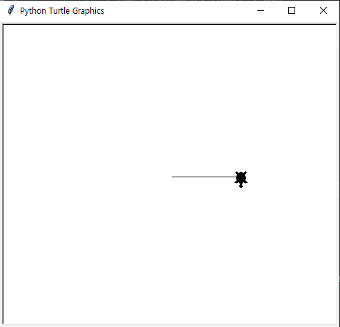

* 다시 거북이를 앞으로 100픽셀 이동시킵니다.

```python
t.forward(100)
```

기역(ㄱ)자 모양이 그려졌습니다.


* 지금까지 했던 것처럼 오른쪽으로 90도 바꾸기, 앞으로 100픽셀 이동을 사각형이 될 때까지 반복합니다.

```python
t.right(90)
t.forward(100)
t.right(90)
t.forward(100)
```

* 드디어 사각형이 만들어졌습니다. 이렇게 거북이를 조정해서 그림을 그릴 수 있습니다.

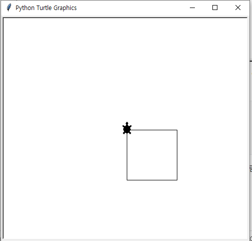


* 터튤 모듈에서 앞으로 이동, 오른쪽 회전 이외에 다른 기능도 있겠죠? backward는 뒤로 이동, left는 왼쪽으로 회전입니다. 특히 forward, backward 등은 짧게 줄여서 입력할 수도 있습니다.

```markdown
# 앞으로 이동: forward, fd
# 뒤로 이동: backward, bk, back
# 왼쪽으로 회전: left, lt
# 오른쪽으로 회전: right, rt
```

* 각자 fd, bk, lt, rt 등을 사용해서 자유롭게 그림을 그려 보세요. 지금까지 그린 사각형을 `fd`와 `rt`로 만들어보면 다음과 같은 코드가 됩니다.

```python
import turtle as t
t = t.Turtle()
t.shape('turtle')
t.fd(100)
t.rt(90)
t.fd(100)
t.rt(90)
t.fd(100)
t.rt(90)
t.fd(100)
```


#### 참고 | 실행하자마자 터틀 창이 사라져요.

* IDLE가 아닌 PyCharm 등의 파이썬 개발 도구를 사용한다면 터틀 창이 유지되지 않고 바로 사라질 수도 있습니다. 이때는 스크립트 파일 마지막 부분에 다음 코드를 넣어줍니다.

```python
t.mainloop()
```

* mainloop는 터틀 창이 종료될 때까지 마우스, 키보드 입력을 대기합니다.


### 다각형 그리기

* forward, right 등을 일일이 입력해서 그림을 그리려고 하니 좀 귀찮습니다. 이번에는 반복문을 사용해서 사각형을 그려보겠습니다.

```python
# 반복 코드로 구현
t.shape('turtle')
for i in range(4):	# 사각형이므로 4번 반복
    t.fd(100)
    t.rt(90)
input()
```


### 오각형 그리기

* 다각형의 외각의 합은 항상 360도 입니다. 그래서 사각형은 90도가 4개 들어있습니다(90 * 4 = 360). 오각형은 360을 5로 나누면 외각을 구할 수 있습니다.

```python
# 반복 코드로 오각형 구현
import turtle as t
t= t.Turtle()
# 오각형이므로 5번 반복
for i in range(5):
    t.fd(100)
    # 360을 5로 나누어서 외각을 구함
    t.rt(360/5)
input()
```


### 다각형 그리기

* 이 소스 코드를 응용해서 사용자가 숫자를 입력하면 해당 숫자에 해당하는 다각형을 그려보겠습니다.

```python
import turtle as t
t = t.Turtle()
t.shape('turtle')
# 사용자의 입력을 받음
n = int(input())
# n번 반복
for i in range(n):
	t.fd(100)
# 360을 n으로 나누어서 외각을 구함
	t.rt(360/n)
input()
```


### 다각형에 색칠하기

* 지금까지 검정색으로만 그림을 그렸습니다. 이번에는 다각형에 색을 칠해보겠습니다. 여기서는 숫자 입력 과정은 생략하고 n에 6을 지정하여 육각형으로 만들겠습니다.

```python
import turtle as t
n = 6				# 육각형
t = t.Turtle()
t.shape('turtle')
t.color('green')	# 펜의 색을 초록색으로 지정
t.begin_fill()		# 색칠할 영역 시작
for i in range(n):	# n번 반복
    t.fd(100)
    t.rt(360/6)		# 360을 n으로 나누어서 외각을 구함
t.end_fill()		# 색칠할 영역 끝
input()
```


#### 참고 | color에 색깔 지정하기

* color에 색깔을 지정할 때 `'red', 'green', 'blue', 'yellow', 'purple', 'brown', 'gray'`등 영어로 색 이름을 지정합니다. 하지만 색 이름만으로는 다양한 색상을 표현하기가 힘듭니다. 이때는 웹 색상(web color)을 사용하면 됩니다.
*  웹 색상은 #으로 시작하며 빨강(R), 초록(G), 파랑(B)에 해당하는 두 자리 16진수 세 쌍으로 구성되어 있습니다.
  * #000000: 검정
  * #FF0000: 빨강
  * #00FF00: 초록
  * #0000FF: 파랑
* 색상의 범위는 00부터 FF까지 사용할 수 있으며 빨강, 초록, 파랑을 조합해서 색상을 만듭니다.

```python
t.color('#FF69B4')    # 핫핑크(hotpink)
```


## 복잡한 도형 그리기

### 원 그리기

* 이번에는 원을 그려보겠습니다. 터틀에서 원을 그릴 때는 circle을 사용합니다.

```python
# 초록색 원 그리기
import turtle as t
t = t.Turtle()
t.shape('turtle')
t.color('green')
t.begin_fill()
# 반지름이 120인 원을 그리기 
t.circle(120)
t.end_fill()
input()
```


### 원을 반복해서 그리기

* 그럼 for를 사용해서 원을 반복해서 그려보겠습니다.

```python
import turtle as t
t = t.Turtle()
# 원을 60번 그림
n = 60
t.shape('turtle')
# 거북이 속도를 가장 빠르게 설정
t.speed('fastest')
# 선 색깔은 파란색으로 설정
t.color('blue')
for i in range(n):
# 반지름이 120인 원을 그림
    t.circle(120)
# 오른쪽으로 6도 회전
    t.rt(360/n)
input()
```

* speed는 거북이의 속도를 설정합니다. 속도는 다음과 같이 문자열 또는 숫자로 설정할 수 있습니다(숫자는 0.5부터 10까지 설정할 수 있습니다). 여기서는 'fastest'를 지정해서 가장 빠른 속도로 그렸습니다.
  * 'fastest': 0
  * 'fast': 10
  * 'normal': 6
  * 'slow': 3
  * 'slowest': 1


### 선으로 복잡한 무늬 그리기

* 이번에는 선을 이용해서 복잡한 무늬를 그려보겠습니다. 300번 반복하고 반복할 때마다  `i`만큼 선이 길어지고 오른쪽으로 91도 회전합니다.

```python
# 선으로 복잡한 무늬 그리기
# 300번 반복, 오른쪽 91도, 반복할 때마다 forward i 증가
import turtle as t
n = 300
t = t.Turtle()
t.shape('turtle')
# 거북이 속도를 가장 빠르게 설정
t.speed('fastest')
# 선 색깔은 갈색으로 설정
t.color('brown')
# 300번 반복
for i in range(n):
  	# i만큼 앞으로 이동. 반복할 때마다 선이 길어짐  
    t.forward(i)
    # 오른쪽으로 91도 회전
    t.right(91)
input()
```


#### 참고 | 터틀 모양 설정하기

* 터틀의 shape에는 'arrow', 'turtle', 'circle', 'square', 'triangle', 'classic' 등을 지정하여 여러 가지 터틀 모양을 사용할 수 있습니다. 특히, t.shape()와 같이 shape를 그대로 호출하면 현재 모양을 알아낼 수 있습니다.

```python
import turtle as t
t.shape('arrow')	# 화살표 모양 사용
t.shape()			# 현재 모양 알아내기
'arrow'
```


### 연습문제: 오각별 그리기

* 각 변의 길이는 100
* 별의 꼭지점은 72도를 두 번 회전해서 144도 회전
* 별의 다음 꼭지점을 그릴 때는 72도 회전

```python
# 연습문제: 오각별 그리기
import turtle as t
n = 5
t = t.Turtle()
t.shape('turtle')
# 핫핑크 색
t.color('#FF69B4')
for i in range(n):
    t.fd(100)
    t.rt((360/n)*2)
    t.fd(100)
    t.lt(360/n)
input()
```

* 실행 결과


### 심사문제: 별 그리기

* 표준 입력으로 꼭지점 개수(정수)와 선의 길이(정수)가 입력됩니다(꼭지점 개수의 입력 범위는 5~10, 선의 길이 입력 범위는 50~150입니다). 다음 소스 코드를 완성하여 꼭지점 개수와 선의 길이에 맞는 별이 그려지게 만드세요. 별을 그릴 때는 현재 위치부터 오른쪽으로 이동해서 시작해야 하며 시계 방향으로 그려야 합니다.

```python
# 심사문제: 별 그리기
import turtle as t
n, line = map(int, input().split())
t = t.Turtle()
t.shape('turtle')
t.color('purple')
t.speed('fastest')
for i in range(n):
    t.forward(line)
    t.rt((360/n)*2)
    t.forward(line)
    t.lt(360/n)
input()
```


## 리스트와 튜플 응용하기

* 파이썬의 리스트는 생각보다 기능이 많은데, 요소를 추가/삭제하거나, 정보를 조회하는 메서드도 제공합니다. 특히 for 반복문과 결합하면 연속적이고 반복되는 값을 손쉽게 처리할 수 있습니다.

### 리스트 조작하기

* 이 메서드는  리스트를 조작하는 메서드(method; 객체에 속한 함수를 의미)입니다.

### 리스트에 요소 추가하기

* 리스트의 대표적인 기능이 바로 요소 추가입니다. 다음과 같이 리스트에 요소를 추가하는 메서드는 3가지가 있습니다.
  * append: 요소 하나를 추가
  * extend: 리스트를 연결하여 확장
  * insert: 특정 인덱스에 요소 추가

### 리스트에 요소 하나 추가하기

* `append(요소)`는 리스트 끝에 **요소 하나**를 추가합니다. 다음은 리스트 [10, 20,  30]에 500을 추가하여 [10, 20, 30, 500]이 됩니다(메서드를 호출한 리스트가 변경되며 새 리스트는 생성되지 않음). 

```python
a = [10, 20, 30]
a.append(500)
a
[10, 20, 30, 500]
len(a)
4
```

* 빈 리스트에 값을 추가할 수도 있습니다.

```python
a = []
a.append(10)
a
[10]
```


### 리스트 안에 리스트 추가하기

* append는 append(리스트)처럼 리스트를 넣으면 리스트 안에 리스트가 들어갑니다. 다음은 리스트 a안에 [500, 600]이 들어가서 중첩 리스트가 됩니다.

```python
a = [10, 20, 30]
a.append([500, 600])
a
[10, 20, 30, [500, 600]]
len(a)
4
```

* a.append([500, 600])은 [500, 600]이라는 **요소 하나**를 리스트 a끝에 추가합니다. 따라서 리스트 a를 len으로 길이를 구해보면 5가 아닌 4가 나옵니다.

* a.append(40)과 동작이 같은 것: 
  * a.insert(len(a), 40) | 리스트 끝에 40을 추가
  * a[len(a):] = [40] | 리스트 끝에서부터 시작하고 새 리스트 40을 할당

### 리스트 확장하기

* 리스트에 요소를 여러 개 추가하려면 어떻게 해야 할까요? append를 여러 번 사용하는 방법도 있지만, 추가할 요소가 많은 경우에는 상당히 번거롭습니다. 이때는 extend를 사용합니다.
* extend(리스트)는 리스트 끝에 다른 리스트를 연결하여 리스트를 확장합니다. 다음은 리스트 [10, 20, 30]에 다른 리스트 [500, 600]을 연결하여 [10, 20, 30, 500, 600]이 됩니다(메서드를 호출한 리스트가 변경되며 새 리스트는 생성되지 않음).

```python
a = [10, 20, 30]
a.extend([500, 600])
a
[10, 20, 30, 500, 600]
len(a)
5
```

 

### 리스트의 특정 인덱스에 요소 추가하기

* append, extend는 리스트 끝에 요소를 추가합니다. 그러면 원하는 위치에 요소를 추가하는 방법은 없을까요? 이때는 insert를 사용합니다.

* insert(인덱스, 요소) 는 리스트의 특정 인덱스에 요소 하나를 추가합니다. 다음은 리스트 [10, 20, 30]의 인덱스 2에 500을 추가하여 [10, 20, 500, 30] 이 됩니다.

```python
a = [10, 20, 30]
a.insert(2, 500)
a
[10, 20, 500, 30]
len(a)
4
```

* insert에서 자주 사용하는 패턴은 다음 2가지입니다.
  * insert(0, 요소) : 리스트의 맨 처음에 요소를 추가
  * insert(len(리스트), 요소) : 리스트 끝에 요소를 추가
* 다음은 리스트[10, 20, 30]의 맨 처음에 500을 추가합니다.

```python
a = [10, 20, 30]
a.insert(0, 500)
a
[500, 10, 20, 30]
```

* 그리고 insert에 마지막 인덱스보다 큰 값을 지정하면 리스트 끝에 요소 하나를 추가할 수 있습니다. 다음은 리스트 [10, 20, 30] 끝에 500을 추가합니다.

```python
a = [10, 20, 30]
a.insert(len(a), 500)
a
[10, 20, 30, 500]
```

* len(리스트)는 마지막 인덱스보다 1이 더 크기 때문에 리스트 끝에 값을 추가할 때 자주 활용합니다. 사실 이 방법은 a.append(500)과 같습니다.
* 특히 insert는 요소 하나를 추가하므로 insert에 리스트를 넣으면 append처럼 리스트 안에 리스트가 들어갑니다. 다음은 리스트 [10, 20, 30]의 인덱스 1에 리스트 [500, 600]을 추가하여 중첩 리스트가 됩니다.

```python
a = [10, 20, 30]
a.insert(1, [500, 600])
a
[10, [500, 600], 20, 30]
```

* 다음은 리스트 [10, 20, 30]의 인덱스 1부터 500, 600을 추가하여 [10, 500, 600, 20, 30]이 됩니다.

* a[1:1] = [500, 600]과 같이 시작 인덱스와 끝 인덱스를 같게 지정하면 해당 인덱스의 요소를 덮어쓰지 않으면서 요소 여러 개를 중간에 추가할 수 있습니다.

```python
a = [10, 20, 30]
a[1:1] = [500, 600]
a
[10, 500, 600, 20, 30]
```


### 리스트에서 요소 삭제하기

* 이번에는 리스트에서 요소를 삭제하는 방법입니다. 다음과 같이 요소를 삭제하는 메서드는 2가지가 있습니다.
  * pop: 마지막 요소 또는 특정 인덱스의 요소를 삭제
  * remove: 특정 값을 찾아서 삭제


### 리스트에서 특정 인덱스의 요소를 삭제하기

* **pop()**은 리스트의 마지막 요소를 삭제한 뒤 삭제한 요소를 반환합니다. 다음은 리스트 [10, 20, 30]에서 pop으로 마지막 요소를 삭제한 뒤 30을 반환합니다. 따라서 리스트는 [10, 20]이 됩니다.

```python
a = [10, 20, 30]
a.pop()
30
a
[10, 20]
```

#### [pop으로 리스트의 마지막 요소 삭제]


* **pop**(인덱스)는 해당 인덱스의 요소를 삭제한 뒤 삭제한 요소를 반환합니다. 다음은 리스트 [10, 20, 30]에서 인덱스 1을 삭제합니다.

```python
a = [10, 20, 30]
a.pop(1)
20
a
[10, 30]
```

* 사실 pop 대신 del을 사용해도 상관없습니다.

```python
a = [10, 20, 30] 
del a[1]
a
[10, 30]
```


### 리스트에서 특정 값을 찾아서 삭제하기

* pop이나 del은 인덱스로 요소를 삭제했는데, 리스트에서 원하는 값을 찾아서 삭제하고 싶을 수도 있습니다. 이런 경우에는 remove를 사용합니다.

* **remove(값)**은 리스트에서 특정 값을 찾아서 삭제합니다. 다음은 리스트 [10, 20, 30]에서 20을 삭제하여 [10, 30]이 됩니다.

```python
a = [10, 20, 30]
a.remove(20)
a
[10, 30]
```

* 만약 리스트에 같은 값이 여러 개 있을 경우 처음 찾은 값을 삭제합니다.

```python
a = [10, 20, 30, 20]
a.remove(20)
a
[10, 30, 20]

```

* 리스트 a에 20이 2개 있지만 가장 처음 찾은 인덱스 1의 20만 삭제합니다.


#### 참고 | 리스트로 스택과 큐 만들기

* 다음과 같이 append와 pop을 호출하는 그림을 90도 돌리면 스택의 모습이 됩니다.

* 여기서 pop() 대신 pop(0)을 사용하면 큐가 됩니다.

* 물론 append(), pop(0)이 아닌 insert(0, 요소), pop()을 사용해서 추가/삭제 방향을 반대로 해도 큐가 됩니다.

파이썬에서 스택은 리스트를 그대로 활용해도 되지만, 큐는 좀 더 효율적으로 사용할 수 있도록 덱(deque, **d**ouble **e**nded **que**ue)이라는 자료형을 제공합니다. 덱은 양쪽 끝에서 추가/삭제가 가능한 자료 구조입니다.

**deque(반복 가능한 객체)**

```python
# collections 모듈에서 deque를 가져옴
from collections import deque
a = deque([10, 20, 30])
print(a)
# 실행 결과
deque([10, 20, 30])
# 덱의 오른쪽에 500 추가
a.append(500)
print(a)
# 실행 결과
deque([10, 20, 30, 500])
# 덱의 왼쪽 요소 하나 삭제
a.popleft()
print(a)
# 실행 결과
deque([20, 30, 500])
```

* deque의 append는 덱의 오른쪽에 요소를 추가하고, popleft는 덱의 왼쪽 요소를 삭제합니다. 반대로 appendleft는 덱의 왼쪽에 요소를 추가하고, pop으로 덱의 오른쪽 요소를 삭제할 수도 있습니다.

**[리스트로 스택(LIFO) 만들기]**


**[리스트로 큐(FIFO) 만들기]**


### 리스트에서 특정 값의 인덱스 구하기

* **index(값)**은 리스트에서 특정 값의 인덱스를 구합니다. 이때 같은 값이 여러 개일 경우 처음 찾은 인덱스를 구합니다(가장 작은 인덱스). 다음은 20이 두 번째에 있으므로 인덱스 1이 나옵니다.

```python
a = [10, 20, 30, 15, 20, 40]
a.index(20)
1
```


### 특정 값의 개수 구하기

* **count(값)**은 리스트에서 특정 값의 개수를 구합니다. 다음은 리스트 [10, 20, 30, 15, 20, 40]에서 20의 개수를 구합니다.

```python
a = [10, 20, 30, 15, 20, 40]
a.count(20)
2
```


### 리스트의 순서를 뒤집기

* **reverse()**는 리스트에서 요소의 순서를 반대로 뒤집습니다. 다음은 리스트 [10, 20, 30, 15, 20, 40]의 순서를 반대로 뒤집어서 [40, 20, 15, 30, 20, 10]이 됩니다.

```python
a = [10, 20, 30, 15, 20, 40]
a.reverse()
print(a)
[40, 20, 15, 30, 20, 10]
```


### 리스트의 요소를 정렬하기

* **sort()**는 리스트의 요소을 작은 순서대로 정렬합니다(오름차순). 다음은 리스트 [10, 20, 30, 15, 20, 40]의 값을 작은 순서대로 정렬하여 [10, 15, 20, 20, 30, 40]이 됩니다.

  * sort( ) 또는 sort(reverse=False): 리스트의 값을 작은 순서대로 정렬(오름차순)

  * sort(reverse=True): 리스트의 값을 큰 순서대로 정렬(내림차순)

```python
a = [10, 20, 30, 15, 20, 40]
a.sort()
print(a)
[10, 15, 20, 20, 30, 40]
```


#### 참고 | sort 메서드와 sorted 함수

* 파이썬은 리스트의 sort 메서드뿐만 아니라 내장 함수 sorted도 제공합니다. sort와 sorted 모두 정렬을 해주는 함수지만, 약간의 차이점이 있습니다. sort는 메서드를 사용한 리스트를 변경하지만, sorted 함수는 정렬된 새 리스트를 생성합니다.

```python
# sort 메서드와 sorted 함수
a = [10, 20, 30, 15, 20, 40]
a.sort()
print(a)
b = [10, 20, 30, 15, 20, 40]
c = sorted(b)
print(c)
# 실행 결과
[10, 15, 20, 20, 30, 40]
[10, 15, 20, 20, 30, 40]
```


### 리스트의 모든 요소를 삭제하기

* **clear()**는 리스트의 모든 요소를 삭제합니다. 다음은 리스트 [10, 20, 30]의 모든 요소를 삭제하여 빈 리스트 []가 됩니다.

```python
a = [10, 20, 30]
a.clear()
print(a)
[]
```

* clear 대신 del a[:]와 같이 시작, 끝 인덱스를 생략하여 리스트의 모든 요소를 삭제할 수도 있습니다.

```python
b = [10, 20, 30]
del b[:]
print(b)
[]
```


### 리스트를 슬라이스로 조작하기

* 리스트는 메서드를 사용하지 않고, 슬라이스로 조작할 수도 있습니다. 다음은 리스트 끝에 값이 한 개 들어있는 리스트를 추가합니다.

```python
a = [10, 20, 30]
a[len(a):] = [500]
print(a)
[10, 20, 30, 500]
```

* a[len(a):]는 시작 인덱스를 len(a)로 지정해서 리스트의 마지막 인덱스보다 1이 더 큰 상태입니다. 즉, 그림과 같이 리스트 끝에서부터 시작하겠다는 뜻입니다(이때는 리스트의 범위를 벗어난 인덱스를 사용할 수 있습니다).


* a[len(a):] = [500]과 같이 값이 한 개 들어있는 리스트를 할당하면 리스트 a 끝에 값을 한 개 추가하며 a.append(500)과 같습니다.

* 그리고 a[len(a):] = [500, 600]과 같이 요소가 여러 개 들어있는 리스트를 할당하면 리스트 a 끝에 다른 리스트를 연결하며 a.extend([500, 600])과 같습니다.

```python
a = [10, 20, 30]
a[len(a):] = [500, 600]
print(a)
[10, 20, 30, 500, 600]
```


#### 참고 | 리스트가 비어 있는지 확인하기

* 리스트(시퀀스 객체)가 비어 있는지 확인하려면 어떻게 해야 할까요? 방법은 간단합니다. 리스트는 len 함수로 길이를 구할 수 있죠? 이걸 if 조건문으로 판단하면 리스트가 비어 있는지 확인할 수 있습니다.

```python
if not len(seq):	# 리스트가 비어 있으면 True
if len(seq):		# 리스트에 요소가 있으면 True
```

* 하지만 파이썬에서는 이 방법보다 리스트(시퀀스 객체)를 바로 if 조건문으로 판단하는 방법을 권장합니다(PEP 8).

```python
if not seq:    # 리스트가 비어 있으면 True
if seq:        # 리스트에 내용이 있으면 True
```

* 특히 리스트가 비어 있는지 확인하는 방법은 리스트의 마지막 요소에 접근할 때 유용하게 사용할 수 있습니다. 리스트의 마지막 요소에 접근할 때는 인덱스를 -1로 지정하면 되죠?

```python
seq = [10, 20, 30]
seq[-1]
30
```

* 만약 리스트가 비어 있을 경우에는 인덱스를 -1로 지정하면 에러가 발생합니다.

```python
a = []
a[-1]
Traceback (most recent call last):
  File "<pyshell#3>", line 1, in <module>
    a[-1]
IndexError: list index out of range
```

* 이때는 if 조건문을 활용하여 리스트에 요소가 있을 때만 마지막 요소를 가져오면 됩니다.

```python
seq = []
if seq:               # 리스트에 요소가 있는지 확인
    print(seq[-1])    # 요소가 있을 때만 마지막 요소를 가져옴
```


### 리스트의 할당과 복사 알아보기

* 할당과 복사는 비슷한 것 같지만 큰 차이점이 있습니다. 먼저 다음과 같이 리스트를 만든 뒤 다른 변수에 할당합니다.

```python
a = [0, 0, 0, 0, 0]
b = a
```

* b = a와 같이 리스트를 다른 변수에 할당하면 리스트는 두 개가 될 것 같지만 실제로는 리스트가 한 개입니다.

**[리스트를 다른 변수에 할당했을 때]**


* a와 b를 is 연산자로 비교해보면 True가 나옵니다. 즉, 변수 이름만 다를 뿐 리스트 a와 b는 같은 객체입니다.

```python
a is b
True
```

* a와 b는 같으므로 b[2] = 99와 같이 리스트 b의 요소를 변경하면 리스트 a와 b에 모두 반영됩니다.

```python
b[2] = 99
print(a)
[0, 0, 99, 0, 0]
print(b)
[0, 0, 99, 0, 0]
```

* 리스트 a와 b를 완전히 두 개로 만들려면 copy 메서드로 모든 요소를 복사해야 합니다.

```python
a = [0, 0, 0, 0, 0]
b = a.copy()
```

* b = a.copy()와 같이 copy를 사용한 뒤 b에 할당해주면 리스트 a의 요소가 모두 b에 복사됩니다.

* a와 b를 is 연산자로 비교해보면 False가 나옵니다. 즉, 두 리스트는 다른 객체입니다. 그러나 복사된 요소는 모두 같으므로 ==로 비교하면 True가 나옵니다.

```python
a is b
False
a == b
True
```

* 이제 리스트 a와 b는 별개이므로 한쪽의 값을 변경해도 다른 리스트에 영향을 미치지 않습니다. 다음과 같이 리스트 b의 요소를 변경하면 리스트 a는 그대로이고 리스트 b만 바뀝니다.

```python
b[2] = 99
print(a)
[0, 0, 0, 0, 0]
print(b)
[0, 0, 99, 0, 0]
```


### for 반복문으로 요소 출력하기

* for 반복문은 그냥 in 뒤에 리스트를 지정하면 됩니다.

```python
for 변수 in 리스트:
    반복할 코드
# for로 리스트 a의 모든 요소를 출력
a = [38, 21, 53, 62, 19]
for i in a:
	print(i)
# 실행 결과
38
21
53
62
19
```

* for i in a:는 리스트 a에서 요소를 꺼내서 i에 저장하고, 꺼낼 때마다 코드를 반복합니다. 따라서 print로 i를 출력하면 모든 요소를 순서대로 출력할 수 있습니다.

* 물론 in 다음에 리스트를 직접 지정해도 상관 없습니다.

```python
for i in [38, 21, 53, 62, 19]:
    print(i)
```


### 인덱스와 요소를 함께 출력하기

* for 반복문으로 요소를 출력할 때 인덱스도 함께 출력하려면 어떻게 해야 할까요? 이때는 `range` 대신에 `enumerate`를 사용합니다.
  * for 인덱스, 요소 in enumerate(리스트):

```python
a = [38, 21, 53, 62, 19]
for index, value in enumerate(a):
    print(index, value)
# 실행 결과
0 38
1 21
2 53
3 62
4 19
```

* for index, value in enumerate(a):  와 같이 enumerate에 리스트를 넣으면 for 반복문에서 인덱스와 요소를 동시에 꺼내올 수 있습니다.

* 앞의 코드는 인덱스를 0부터 출력하는데 1부터 출력하고 싶을 수도 있습니다. 다음과 같이 그냥 index + 1을 출력하면 되겠죠?

```python
for index, value in enumerate(a):
    print(index + 1, value)
# 실행 결과
1 38
2 21
3 53
4 62
5 19
```

* 하지만 좀 더 파이썬 같은 방법이 있습니다. 다음과 같이 enumerate에 start를 지정해주면 됩니다.
  * for 인덱스, 요소 in enumerate(리스트, start=숫자) :

```python
for index, value in enumerate(a, start=1):
    print(index, value)
# 실행 결과
1 38
2 21
3 53
4 62
5 19
```

* enumerate(a, start=1)처럼 start에 1을 지정하여 인덱스가 1부터 시작하도록 만들었습니다. 이 코드는 enumerate(a, 1)과 같이 줄여 쓸 수도 있습니다.

#### 참고 | for 반복문에서 인덱스로 요소를 출력하기

* for에 리스트를 지정하면 요소를 바로 가져와서 편리한데, for에서 인덱스를 지정하여 요소를 가져올 수는 없을까요? 이때는 range에 len으로 리스트의 길이(요소 개수)를 구해서 넣어주면 인덱스를 순서대로 만들어줍니다. 따라서 a[i]와 같이 리스트에 인덱스를 지정하여 값을 가져올 수 있습니다.

```python
a = [38, 21, 53, 62, 19]
for i in range(len(a)):
    print(a[i])
38
21
53
62
19
```

* 즉, for i in range(len(a))를 실행하면 i에는 요소가 아닌 0부터 마지막 인덱스까지 인덱스가 들어갑니다.


###  while 반복문으로 요소 출력하기

* 이번에는 while 반복문으로 리스트의 요소를 출력해보겠습니다.

```python
a = [38, 21, 53, 62, 19]
i = 0
while i < len(a):
    print(a[i])
    i += 1
# 실행 결과
38
21
53
62
19
```

* while 반복문으로 리스트의 요소를 출력할 때는 변수 i를 인덱스로 활용합니다. 먼저 변수 i를 0으로 만들어주고, i < len(a)처럼 i가 리스트의 길이(요소 개수) 직전까지만 반복하도록 만듭니다.

* 즉, 리스트의 인덱스는 0부터 시작하고 마지막 인덱스는 리스트의 길이보다 1이 작으므로 <를 사용합니다. 만약 i <= len(a)처럼 <=을 사용하면 리스트의 범위를 벗어나게 되므로 주의해야 합니다.

```python
a = [38, 21, 53, 62, 19]
i = 0
while i <= len(a):
    print(a[i])
    i += 1
# 실행 결과
38
21
53
62
19
Traceback (most recent call last):
  File "<stdin>", line 2, in <module>
IndexError: list index out of range
```

* while 반복문 안에서 요소를 출력할 때는 print(a[i])와 같이 리스트의 인덱스 부분에 i를 지정하여 출력합니다. 그다음에는 i가 1씩 증가하도록 만들면 됩니다.

```python
while i < len(a):
    print(a[i])
    i += 1
```


## 리스트의 가장 작은 수, 가장, 큰 수, 합계 구하기

### 가장 작은 수와 가장 큰 수 구하기

* 앞에서 배운 반복문을 이용해 요소를 모두 반복하면서 숫자를 찾아내 보겠습니다.

```python
a = [38, 21, 53, 62, 19]
# 가장 작은 수
smallest = a[0]
for i in a:
    if i < smallest:
        smallest = i
print('가장 작은 수:', smallest)
# 실행 결과
가장 작은 수: 19
```

* 먼저 리스트 a의 첫 번째 요소 a[0]를 변수 smallest에 저장합니다. 그리고 for로 리스트의 요소를 모두 반복하면서 i가 smallest보다 작으면 smallest에 i를 할당합니다. 즉, 숫자를 계속 비교해서 숫자가 작으면 smallest를 바꾸는 방식입니다.

* 가장 큰 수는 부등호를 반대로 만들면 되겠죠?

```python
a = [38, 21, 53, 62, 19]
# 가장 큰 수
largest = a[0]
for i in a:
    if i > largest:
        largest = i
print('가장 큰 수:', largest)
# 실행 결과
가장 큰 수: 62
```

* 리스트의 숫자를 계속 비교해서 숫자가 크면 largest를 바꾸는 방식입니다. 그런데 이렇게 for와 if를 사용해서 가장 작은 수와 가장 큰 수를 찾으려니 좀 번거롭습니다. 다른 방법이 없을까요?

* 앞에서 리스트를 정렬하는 sort 메서드를 배웠습니다. 리스트를 작은 순서대로 정렬(오름차순)하면 첫 번째 요소가 가장 작은 수입니다. 반대로 큰 순서대로 정렬(내림차순)하면 첫 번째 요소가 가장 큰 수가 되겠죠?

```python
a = [38, 21, 53, 62, 19]
# 리스트 정렬하기
a.sort()
print(a[0])
# 실행 결과
19
# 리스트 역순으로 정렬하기
a.sort(reverse=True)
print(a[0])
# 실행 결과
62
```

* 더 간단한 방법이 있습니다. 파이썬에서 제공하는 min, max 함수를 사용하면 됩니다.

```python
a = [38, 21, 53, 62, 19]
# 최소값 구하기
print(min(a))
# 실행 결과
19
# 최대값 구하기
print(max(a))
# 실행 결과
62
```

* min은 리스트에서 가장 작은 값을 구하고, max는 가장 큰 값을 구합니다.


### 요소의 합계 구하기

* 변수 x에 0을 할당하고, for 반복문으로 리스트의 요소를 모두 반복하면서 요소를 x에 계속 더해주면 됩니다. 이때 x에는 반드시 0을 할당해야 합니다. 그렇지 않으면 없는 변수에 값을 더하게 되므로 에러가 발생합니다. 또한, 0부터 시작해서 숫자를 더해야 제대로 된 합계가 구해지겠죠?

```python
b = [10, 10, 10, 10, 10]
x = 0
for i in b:
    x += i
print(x)
# 실행 결과
50
```

* 사실 이 방법도 좀 번거롭습니다. 그래서 파이썬에서는 합계를 구하는 sum 함수를 제공합니다.

```python
b = [10, 10, 10, 10, 10]
print(sum(b))
# 실행 결과
50
```

* 이처럼 sum에 리스트을 넣어서 간단하게 요소의 합계를 구할 수 있습니다.

* 여기서 설명한 min, max, sum에는 리스트뿐만 아니라 모든 반복 가능한 객체(iterable)를 넣을 수 있습니다. 반복 가능한 객체는 리스트, 튜플, 딕셔너리, 세트, range 등 여러 가지가 있습니다.


### 리스트 표현식 사용하기

* 파이썬의 리스트가 특이한 점은 리스트 안에 for 반복문과 if 조건문을 사용할 수 있다는 점입니다. 이렇게 리스트 안에 식, for 반복문, if 조건문 등을 지정하여 리스트를 생성하는 것을 리스트 컴프리헨션(list comprehension)이라고 합니다.
* 즉, 식으로 지정해서 생성된 것을 리스트로 잡아두는 것이 리스트 컴프리헨션입니다. 개념적으로 보면 "리스트 표현식"이라고 할 수 있으니 이 책에서는 간단하게 리스트 표현식이라고 쓰겠습니다.
* 리스트 표현식은 다음과 같이 리스트 안에 식, for 반복문을 지정합니다. 문법이 다소 복잡해 보이지만 여러 줄의 코드를 한 줄로 줄일 수 있고, 익숙해지면 크게 어렵지 않습니다.
  * [식 for 변수 in 리스트]
  * list(식 for 변수 in 리스트)

```python
a = [i for i in range(10)]		# 0부터 9까지 숫자를 생성하여 리스트 생성
print(a)
b = list(i for i in range(10))	# 0부터 9까지 숫자를 생성하여 리스트 생성
print(b)
# 실행결과
[0, 1, 2, 3, 4, 5, 6, 7, 8, 9]
[0, 1, 2, 3, 4, 5, 6, 7, 8, 9]
```

* 리스트 안에 식, for, 변수, in, 리스트 순서로 들어있지만 뒤에서 앞으로 읽으면 간단합니다. 즉, range(10)으로 0부터 9까지 생성하여 변수 i에 숫자를 꺼내고, 최종적으로 i를 이용하여 리스트를 만든다는 뜻입니다.

**[리스트 표현식의 동작 순서]**

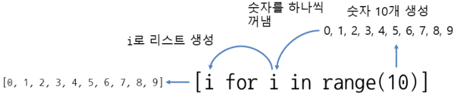


* [i for i in range(10)]는 변수 i를 그대로 사용하지만, 다음과 같이 식 부분에서 i를 다른 값과 연산하면 각 연산의 결과를 리스트로 생성합니다.

```python
# 0부터 9까지 숫자를 생성하면서 값에 5를 더하여 리스트 생성
c = [i+5 for i in range(10)]
print(c)
# 0부터 9까지 숫자를 생성하면서 값에 2를 곱하여 리스트 생성
d = [i*2 for i in range(10)]
print(d)
```


#### 참고 | 대괄호와 list() 리스트 표현식

리스트 표현식은 [식 for 변수 in 리스트]처럼 [ ] (대괄호)로 만들 수도 있고, list(식 for 변수 in 리스트)처럼 list로 만들 수도 있습니다. 둘 중에 성능은 대괄호 방식이 더 좋습니다. 특히 list 방식은 C 언어 스타일이라 대괄호 방식이 파이썬 다운 코드입니다. 따라서 리스트 표현식은 대괄호 방식을 사용하는 것이 좋습니다. list는 리스트 표현식을 만들 수 있다는 정도만 알아 두면 됩니다.


### 리스트 표현식에서 if 조건문 사용하기

* if 조건문은 for 반복문 뒤에 지정합니다.

  * [식 for 변수 in 리스트 if 조건식]

  * list(식 for 변수 in 리스트 if 조건식)

```python
# 0~9 숫자 중 2의 배수인 숫자(짝수)로 리스트 생성
a = [i for i in range(10) if i % 2 ==0]
print(a)
# 실행 결과
[0, 2, 4, 6, 8]
```

**[리스트 표현식에서 if 조건문 사용하기]**

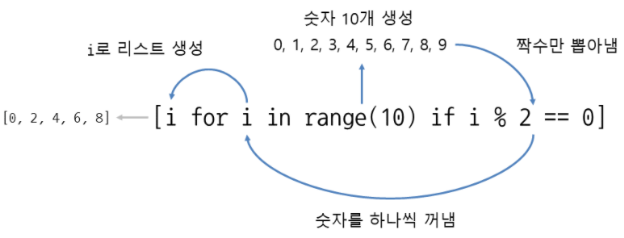

* 물론 다음과 같이 i를 다른 값과 연산해서 리스트를 만들어도 됩니다.

```python
# 0~9 숫자 중 홀수에 5를 더하여 리스트 생성
b = [i + 5 for i in range(10) if i % 2 ==1]
print(b)
# 실행 결과
[6, 8, 10, 12, 14]
```


### for 반복문과 if 조건문을 여러 번 사용하기

* 리스트 표현식은 for와 if를 여러 번 사용할 수도 있습니다.

```python
[식 for 변수1 in 리스트1 if 조건식1     for 변수2 in 리스트2 if 조건식2     ...     for 변수n in 리스트n if 조건식n]
 
list(식 for 변수1 in 리스트1 if 조건식1         for 변수2 in 리스트2 if 조건식2         ...         for 변수n in 리스트n if 조건식n)
```

* 2단부터 9단까지 구구단을 리스트 생성합니다.

```python
# 2단부터 9단까지 구구단을 리스트 생성합니다.
a = [i * j for j in range(2, 10) for i in range(1, 10)]
print(a)
# 실행 결과
[2, 4, 6, 8, 10, 12, 14, 16, 18, 3, 6, 9, 12, 15, 18, 21, 24, 27, 4, 8, 12, 16, 20, 
24, 28, 32, 36, 5, 10, 15, 20, 25, 30, 35, 40, 45, 6, 12, 18, 24, 30, 36, 42, 48, 54, 7, 14, 21, 28, 35, 42, 49, 56, 63, 8, 16, 24, 32, 40, 48, 56, 64, 72, 9, 18, 27, 36, 45, 54, 63, 72, 81]
```

* 여기서는 코드를 한 줄로 입력했지만 다음과 같이 여러 줄로 입력해도 됩니다. 이때 들여쓰기는 해도 되고 하지 않아도 됩니다. 하지만 `가독성`을 위해 들여쓰기를 해주는 것이 좋습니다.

```python
a = [i * j for j in range(2, 10)
           for i in range(1, 10)]
```

* 리스트 표현식에 for가 여러 개일 때 처리 순서는 뒤에서 앞으로 순입니다.

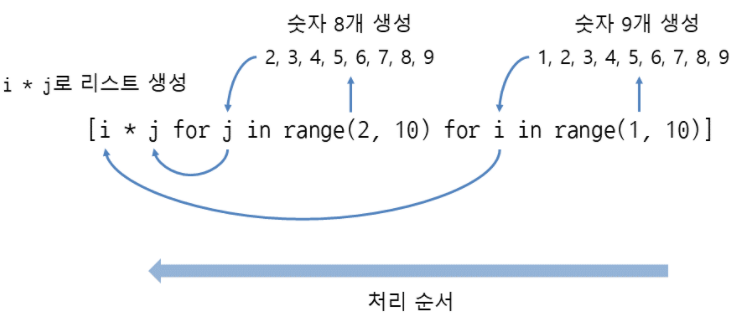


### 리스트에 map 사용하기

* map은 리스트의 요소를 지정된 함수로 처리해주는 함수입니다(map은 원본 리스트를 변경하지 않고 새 리스트를 생성합니다).
  * list(map(함수, 리스트))
  * tuple(map(함수, 튜플))
* 예를 들어 실수가 저장된 리스트가 있을 때 이 리스트의 모든 요소를 정수로 변환하려면 어떻게 해야 할까요? 먼저 for 반복문을 사용해서 변환해보겠습니다.

```python
# 실수가 저장된 리스트가 있을 때 이 리스트의 모든 요소를 정수로 변환
a = [1.2, 2.5, 3.7, 4.6]
print('정수 변환 전:', a)
for i in range(len(a)):
    # 실수를 정수로 변환
    a[i] = int(a[i])
print('정수 변환 후:', a)
# 실행 결과
정수 변환 후: [1, 2, 3, 4]
```

* for에 range(len(a))를 사용해서 인덱스를 가져왔습니다. 그리고 가져온 인덱스로 요소 하나 하나에 접근한 뒤 int로 변환하여 다시 저장했습니다.

* 매번 for 반복문으로 반복하면서 요소를 변환하려니 조금 번거롭습니다. 이때는 map을 사용하면 편리합니다.

```python
a = [1.2, 2.5, 3.7, 4.6]
# map을 이용해 실수를 정수로 변환
a = list(map(int, a))
print('정수 변환 후:', a)
정수 변환 후: [1, 2, 3, 4]
```

* a = list(map(int, a)) 한 줄로 변환이 끝났습니다. map에 int와 리스트를 넣으면 리스트의 모든 요소를 int를 사용해서 변환합니다. 그다음에 list를 사용해서 map의 결과를 다시 리스트로 만들어줍니다.

**[리스트에 map 함수 사용]**

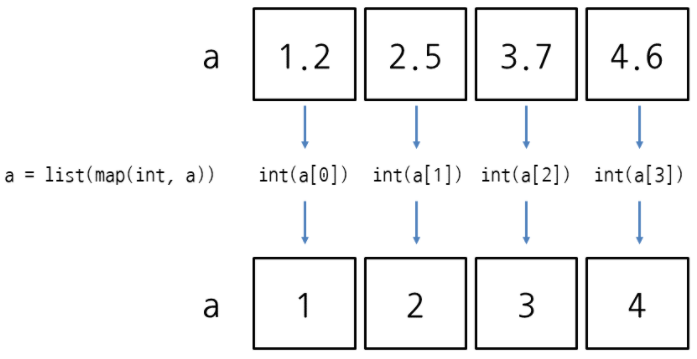

* 사실 map에는 리스트뿐만 아니라 모든 반복 가능한 객체를 넣을 수 있습니다. 이번에는 range를 사용해서 숫자를 만든 뒤 숫자를 문자열로 변환해보겠습니다.

```python
# 리스트 안 map 함수를 이용해 숫자를 문자 형태로 변환해 출력하기
b = list(map(str, range(10)))
print(b)
```


### input().split()과 map

* 지금까지 input().split()으로 값을 여러 개 입력받고 정수, 실수로 변환할 때도 map을 사용했었죠? 사실 input().split()의 결과가 문자열 리스트라서 map을 사용할 수 있었습니다.

* 다음과 같이 input().split()을 사용한 뒤에 변수 한 개에 저장해보면 리스트인지 확인할 수 있습니다.

```python
a = input().split()
10 20	(입력)
print(a)
# 실행 결과
['10', '20']
```

* 이제 map을 사용해서 input 값을 정수로 변환해봅니다.

```python
a = map(int, input().split())
10 20	(입력)
print(a)
# 실행 결과
<map object at 0x0000020A4E4F0048>
print(list(a))
# 실행 결과
[10, 20]
# 만약 입력값이 실수면 아래와 같은 에러가 발생한다.
10.6 20.8	(입력)
Traceback (most recent call last):
  File "list2.py", line 39, in <module>
    print(list(a))
ValueError: invalid literal for int() with base 10: '10.6'
```

* 다시 10 20을 입력하면 맵 객체(map object)가 만들어집니다. 이 상태로는 안에 들어있는 값을 볼 수 없으므로 list를 사용해서 리스트로 출력했습니다. 리스트를 보면 [10, 20]처럼 정수 두 개가 들어있습니다.

* 이 리스트 [10, 20]을 변수 두 개에 저장하면 지금까지 사용한 a, b = map(int, input().split())와 같은 동작이 됩니다.

```python
a, b = [10, 20]
print(a, b, sep=', ')
```

* 사실 map이 반환하는 맵 객체는 이터레이터라서 변수 여러 개에 저장하는 언패킹(unpacking)이 가능합니다. 그래서 a, b = map(int, input().split())처럼 list를 생략한 것입니다.

```python
x = input().split()    # input().split()의 결과는 문자열 리스트
m = map(int, x)        # 리스트의 요소를 int로 변환, 결과는 맵 객체
a, b = m               # 맵 객체는 변수 여러 개에 저장할 수 있음
```


### 튜플에서 특정 값의 인덱스 구하기

* **index(값)**은 튜플에서 특정 값의 인덱스를 구합니다. 이때 같은 값이 여러 개일 경우 처음 찾은 인덱스를 구합니다(가장 작은 인덱스). 다음은 53이 세 번째에 있으므로 인덱스 2가 나옵니다.

```python
a = (38, 21, 53, 62, 19, 53)
print(a.index(21))
1
print(a.index(53))
1
```

**[index로 특정 값의 인덱스 구하기]**

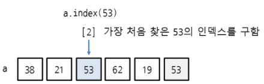


### 특정 값의 개수 구하기

* **count(값)**은 튜플에서 특정 값의 개수를 구합니다. 다음은 튜플 (10, 20, 30, 15, 20, 40)에서 20의 개수를 구합니다. 여기서는 20이 2개 들어있으므로 2가 나옵니다.

```python
# 튜플에서 특정 값의 개수 구하기
b = (10, 20, 30, 15, 20, 40)
print(b.count(20))
# 실행 결과
2
```

**[count로 특정 값의 개수 구하기]**


### for 반복문으로 요소 출력하기

* for 반복문으로 요소를 출력하는 방법은 리스트와 같습니다.

```python
a = (38, 21, 53, 62, 19)
for i in a:
    print(i, end=' ')
# 실행 결과
38 21 53 62 19
```


### 튜플 표현식 사용하기

* 튜플을 리스트 표현식처럼 생성할 때는 다음과 같이 tuple 안에 for 반복문과 if 조건문을  지정합니다.
  * tuple(식 for 변수 in 리스트 if 조건식)

```python
# 0~9 숫자 중 2의 배수인 숫자(짝수)로 튜플 생성
a = tuple(i for i in range(10) if i % 2 == 0)
print(a)
# 실행 결과
(0, 2, 4, 6, 8)
```

* 참고로 ( )(괄호) 안에 표현식을 넣으면 튜플이 아니라 제너레이터 표현식이 됩니다.

```python
print(i for i in range(10) if i % 2 == 0)
# 실행 결과
<generator object <genexpr> at 0x0000020F18AF1148>
# genexpr: generator expression
```


### tuple에 map 사용하기

* 튜플에 map을 사용하는 방법도 리스트와 같습니다.

```python
# tuple에 map 사용하기
a = (1.2, 2.5, 3.7, 4.6)
a = tuple(map(int, a))
print(a)
(1, 2, 3, 4)
```


### 튜플에서 가장 작은 수, 가장 큰 수, 합계 구하기

* 물론 튜플도 min, max 함수로 가장 작은 수와 가장 큰 수를 구하고, sum 함수로 요소의 합계를 구할 수 있습니다.

```python
a = (38, 21, 53, 62, 19)
print(min(a))
19
print(max(a))
62
print(sum(a))
193
```


### 연습문제: 리스트에서 특정 요소만 뽑아내기

* 리스트 a에 들어있는 문자열 중에서 길이가 5인 것들만 리스트 형태로 출력되게 만드세요(리스트 표현식 사용).

```python
a = ['alpha', 'bravo', 'charlie', 'delta', 'echo', 'foxtrot', 'golf', 'hotel', 'india']
b = [i for i in a if len(i) == 5]
print(b)
# 다른 방법
b = [a[i] for i in range(len(a)) if len(a[i]) == 5]
print(b)
# 실행 결과
['alpha', 'bravo', 'delta', 'hotel', 'india']
```


### 심사문제: 2의 거듭제곱 리스트 생성하기

* 표준 입력으로 정수 두 개가 입력됩니다(첫 번째 입력 값의 범위는 1~20, 두 번째 입력 값의 범위는 10~30이며 첫 번째 입력 값은 두 번째 입력 값보다 항상 작습니다). 첫 번째 정수부터 두 번째 정수까지를 지수로 하는 2의 거듭제곱 리스트를 출력하는 프로그램을 만드세요(input에서 안내 문자열은 출력하지 않아야 합니다). 단, 리스트의 두 번째 요소와 뒤에서 두 번째 요소는 삭제한 뒤 출력하세요. 출력 결과는 리스트 형태라야 합니다.

```python
# 심사문제: 2의 거듭제곱 리스트 생성하기
a, b = map(int, input().split())
c = [2**i for i in range(a, b+1) if i != a+1 and i != b-1]
print(c)
# 다른 방법 - pop대신 del을 써도 된다.
c = [2**i for i in range(a, b+1)]
c.pop(1)
c.pop(-2)
print(c)
# 입력
1 10
# 실행 결과
[2, 8, 16, 32, 64, 128, 256, 1024]
# 입력
10 20
# 실행 결과
[1024, 4096, 8192, 16384, 32768, 65536, 131072, 262144, 1048576]
```


## 2차원 리스트 사용하기

* 리스트를 사용할 때 한 줄로 늘어선 1차원 리스트를 사용했는데 이번에는 평면 구조의 2차원 리스트를 사용해보겠습니다. 2차원 리스트는 다음과 같이 가로×세로 형태로 이루어져 있으며 행(row)과 열(column) 모두 0부터 시작합니다.

**[2차원 리스트]**

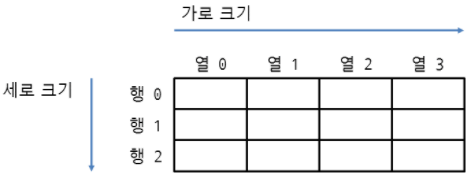


### 2차원 리스트를 만들고 요소에 접근하기

* 2차원 리스트는 리스트 안에 리스트를 넣어서 만들 수 있으며 안쪽의 각 리스트는 ,(콤마)로 구분합니다.
  * 리스트 = [[값, 값], [값, 값], [값, 값]]

* 그럼 숫자 2개씩 3묶음으로 리스트를 만들어보겠습니다.

```python
# 2차원 리스트를 만들고 요소에 접근하기
a = [[10, 20], [30, 40], [50, 60]]
print(a)
[[10, 20], [30, 40], [50, 60]]
```

* 가로 2, 세로 3의 2차원 리스트가 만들어졌습니다. 여기서는 리스트를 한 줄로 입력했지만 가로, 세로를 알아보기 쉽게 세 줄로 입력해도 됩니다.

```python
# 가로 2, 세로 3의 2차원 리스트 만들기
b = [[10, 20],
     [30, 40],
     [50, 60]]
print(b)
```


### 2차원 리스트의 요소에 접근하기

* 2차원 리스트의 요소에 접근하거나 값을 할당할 때는 리스트 뒤에 [ ](대괄호)를 두 번 사용하며 [ ] 안에 세로(row) 인덱스와 가로(column) 인덱스를 지정해주면 됩니다.

  * 리스트[세로인덱스]\[가로인덱스]

  * 리스트[세로인덱스]\[가로인덱스] = 값

```python
# 3 X 2 리스트
a = [[10, 20], [30, 40], [50, 60]]
print(a[0][0])	# 세로 인덱스 0, 가로 인덱스 0인 요소 출력
10
print(a[1][1])	# 세로 인덱스 1, 가로 인덱스 1인 요소 출력
40
print(a[2][1])	# 세로 인덱스 2, 가로 인덱스 1인 요소 출력
60
a[0][1] = 1000	# 세로 인덱스 0, 가로 인덱스 1인 요소에 값 할당
print(a[0][1])	# 세로 인덱스 0, 가로 인덱스 1인 요소 출력
1000
```

* 2차원 리스트도 인덱스는 0부터 시작합니다. 따라서 리스트의 가로 첫 번째, 세로 첫 번째 요소는 a[0][0]이 됩니다.

**[인덱스로 2차원 리스트의 요소에 접근]**

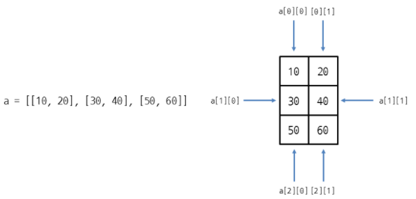


#### 참고 | 톱니형 리스트

* 2차원 리스트 [[10, 20], [30, 40], [50, 60]]은 가로 크기가 일정한 사각형 리스트입니다. 특히 파이썬에서는 가로 크기가 불규칙한 톱니형 리스트(jagged list)도 만들 수 있습니다.

```python
a = [[10, 20],
     [500, 600, 700],
     [9],
     [30, 40],
     [8],
     [800, 900, 1000]]
```

* 리스트 a는 가로 크기(행의 요소 개수) 가 제각각입니다. 이런 리스트는 요소가 배치된 모양이 톱니처럼 생겼다고 하여 톱니형 리스트라고 부릅니다.
* 톱니형 리스트는 다음과 같이 append 메서드 등을 사용하여 동적으로 생성할 수도 있습니다.

```python
# 톱니형 리스트
a = []
a.append([])
a[0].append(10)
a[0].append(20)
a.append([])
a[1].append(500)
a[1].append(600)
a[1].append(700)
print(a)
```


#### 참고 | 2차원 튜플

* 2차원 리스트가 있으면 2차원 튜플도 있겠죠? 다음과 같이 튜플 안에 튜플을 넣는 방식, 튜플 안에 리스트를 넣는 방식, 리스트 안에 튜플을 넣는 방식 등이 가능합니다.

  * 튜플 = ((값, 값), (값, 값), (값, 값))

  * 튜플 = ([값, 값], [값, 값], [값, 값])
  * 리스트 = [(값, 값), (값, 값), (값, 값)]

```python
a = ((10, 20), (30, 40), (50, 60)) # 튜플 안에 튜플을 넣은 2차원 튜플
b = ([10, 20], [30, 40], [50, 60]) # 튜플 안에 리스트를 넣음
c = [(10, 20), (30, 40), (50, 60)] # 리스트 안에 튜플을 넣음
```

* 튜플은 내용을 변경할 수 없으므로 a는 안쪽과 바깥쪽 모두 요소를 변경할 수 없습니다. b는 안쪽 리스트만 요소를 변경할 수 있고, c는 바깥쪽 리스트만 요소를 변경할 수 있습니다.

```python
a[0][0] = 500        # 안쪽 튜플은 변경할 수 없음. TypeError 발생
a[0] = (500, 600)    # 바깥쪽 튜플은 변경할 수 없음. TypeError 발생
b[0][0] = 500        # 안쪽 리스트는 변경할 수 있음
b[0] = (500, 600)    # 바깥쪽 튜플은 변경할 수 없음. TypeError 발생
c[0][0] = 500        # 안쪽 튜플은 변경할 수 없음. TypeError 발생
c[0] = (500, 600)    # 바깥쪽 리스트는 변경할 수 있음
```


#### 참고 | 사람이 알아보기 쉽게 출력하기

* 2차원 리스트를 출력하면 한 줄로 쭉 붙어서 출력됩니다.

```python
a = [[10, 20], [30, 40], [50, 60]]
print(a)
[[10, 20], [30, 40], [50, 60]]
```

* 만약 2차원 리스트의 사각형 구조를 유지하도록 출력하려면 pprint 모듈의 pprint 함수를 사용합니다.

```python
from pprint import pprint
a = [[10, 20], [30, 40], [50, 60]]
pprint(a, indent=1, width=20)
[[10, 20],
 [30, 40],
 [50, 60]]
```

* indent는 들여쓰기 칸 수, width는 가로 폭입니다. 각자 상황에 맞게 들여쓰기 칸 수와 가로 폭을 조절해서 사용해보세요.


### 반복문으로 2차원 리스트의 요소를 모두 출력하기

* 이제 반복문을 사용하여 2차원 리스트의 요소를 모두 출력하는 방법을 알아보겠습니다.

### for 반복문을 한 번만 사용하기

* 먼저 for 반복문을 한 번만 사용하는 방식입니다.

```python
a = [[10, 20], [30, 40], [50, 60]]
for x, y in a: # 리스트의 가로 한 줄(안쪽 리스트)에서 요소 두 개를 꺼냄
	print(x, y)
10 20
30 40
50 60
```

* 2차원 리스트에 for를 사용하면 가로 한 줄씩 반복하게 됩니다. 전체 리스트를 기준으로 보면 안쪽 리스트가 통째로 반복됩니다. 이때 for x, y in a:와 같이 in 앞에 변수를 두 개 지정해주면 가로 한 줄(안쪽 리스트)에서 요소 두 개를 꺼내 옵니다.

**[2차원 리스트에서 for 반복문을 한 번만 사용]**

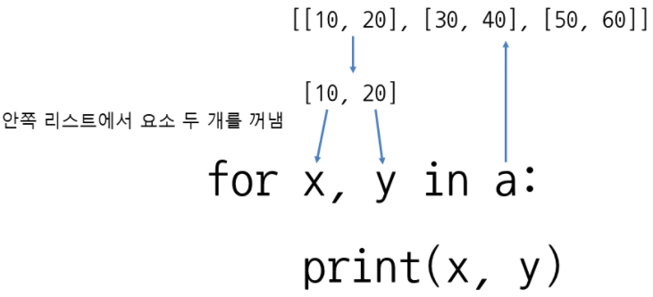

* 당연히 in 앞에 변수의 개수는 2차원 리스트에서 가로 크기(안쪽 리스트의 요소 개수)와 일치해야 합니다. 특히 for 반복문을 한 번만 사용하는 방식은 2차원 리스트의 가로 크기가 크지 않을 때 유용합니다.


### for 반복문을 두 번 사용하기

* 이번에는 for 반복문을 두 번 사용해서 2차원 리스트의 요소를 출력해보겠습니다. 다음 내용을 IDLE의 소스 코드 편집 창에 입력한 뒤 실행해보세요.

```python
a = [[10, 20], [30, 40], [50, 60]]
for i in a:		# a에서 안쪽 리스트를 꺼냄, 세로 방향
	for j in i:	# 안쪽 리스트에서 요소를 하나씩 꺼냄
		print(j, end=' ')
	print()
# 실행 결과
10 20
30 40
50 60
```

* 먼저 for i in a:는 전체 리스트에서 가로 한 줄씩 꺼내 옵니다(안쪽 리스트를 통째로 꺼내 옴). 다시 for j in i:와 같이 가로 한 줄(안쪽 리스트) i에서 요소를 하나씩 꺼내면 됩니다.

**[2차원 리스트에서 for 반복문을 두 번 사용]**

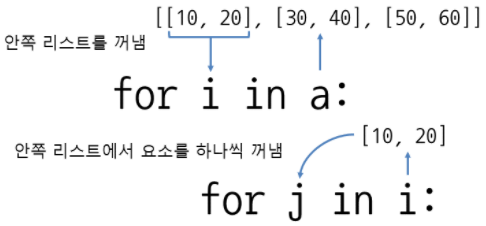


### for와 range 사용하기

* 그럼 이번에는 for range에 세로 크기와 가로 크기를 지정해서 2차원 리스트의 요소를 인덱스로 접근해보겠습니다.

```python
a = [[10, 20], [30, 40], [50, 60]]
for i in range(len(a)):		# 세로 크기
    for j in range(len(a[i])):	# 가로 크기
        print(a[i][j], end=' ')
	print()
# 실행 결과
10 20
30 40
50 60
# len(a)는 6이 아니라 3이고 len(a[i])는 2입니다.
```

* for i in range(len(a)):는 세로 크기 3만큼 반복하고, for j in range(len(a[i])):는 가로 크기 2만큼 반복합니다.

* 요소에 접근할 때는 **리스트[세로인덱스]\[가로인덱스]** 형식으로 접근합니다. 따라서 세로 인덱스에 변수 i를, 가로 인덱스에 변수 j를 지정해줍니다.


### while 반복문을 한 번 사용하기

* 이번에는 while 반복문을 사용하여 2차원 리스트의 요소를 출력해보겠습니다.

```python
a = [[10, 20], [30, 40], [50, 60]]
i = 0
while i < len(a):	# 반복할 때 리스트의 크기 활용(세로 크기)
	x, y = a[i]		# 요소 두 개를 한꺼번에 가져오기
    print(x, y)
    i += 1
# 실행 결과
10 20
30 40
50 60
```


### while 반복문을 두 번 사용하기

* 먼저 while i < len(a):와 같이 세로 크기만큼 반복하면서 while j < len(a[i]):와 같이 가로 크기(안쪽 리스트의 요소 개수)만큼 반복하면 됩니다. 가로 크기는 len(a[i])와 같이 안쪽 리스트의 크기를 구하면 되겠죠?
* 요소에 접근할 때는 **리스트[세로인덱스]\[가로인덱스]** 형식으로 접근합니다. 따라서 세로 인덱스에 변수 i를, 가로 인덱스에 변수 j를 지정해줍니다.

```python
a = [[10, 20], [30, 40], [50, 60]]
# while 반복문을 두 번 사용하기
i = 0
while i < len(a):			# 세로 크기
    j = 0
    while j < len(a[i]):	# 가로 크기
        print(a[i][j], end=' ')
        j += 1				# 가로 인덱스를 1 증가시킴
    print()
    i += 1					# 세로 인덱스를 1 증가시킴
# 실행 결과
10 20
30 40
50 60
```


### 반복문으로 리스트 만들기

* for 반복문과 append를 활용하여 리스트를 만드는 방법을 알아보겠습니다.

### for 반복문으로 1차원 리스트 만들기

* 먼저 요소 10개가 일렬로 늘어서 있는 1차원 리스트부터 만들어보겠습니다.

```python
# for 반복문으로 1차원 리스트 만들기
a = []				# 빈 리스트 생성 
for i in range(10):
    a.append(0)		# append로 요소 추가
print(a)
# 실행 결과
[0, 0, 0, 0, 0, 0, 0, 0, 0, 0]
```

* for 반복문으로 10번 반복하면서 append로 요소를 추가하면 1차원 리스트를 만들 수 있습니다.


### for 반복문으로 2차원 리스트 만들기

* for 반복문을 사용하여 2차원 리스트를 만들어보겠습니다.

```python
a = []					# 빈 리스트 생성
for i in range(3):
    line = []			# 안쪽 리스트로 사용할 빈 리스트 생성
	for j in range(2):
		line.append(0)	# 안쪽 리스트에 0추가
    a.append(line)		# 전체 리스트에 안쪽 리스트를 추가
print(a)
# 실행 결과
[[0, 0], [0, 0], [0, 0]]
# 행렬 형태로 출력
pprint(a, indent=1, width=20)
# 실행 결과
[[0, 0],
 [0, 0],
 [0, 0]]
```


### 리스트 표현식으로 2차원 리스트 만들기

* for 반복문을 두 번 사용하니 코드가 좀 길어졌죠? 리스트 표현식을 활용하면 코드 한 줄로 2차원 리스트를 만들 수 있습니다.

```python
# 리스트 표현식으로 2차원 리스트 만들기
a = [[0 for j in range(2)] for i in range(3)]
pprint(a, indent=1, width=20)
# 실행 결과
[[0, 0],
 [0, 0],
 [0, 0]]
```

* 만약 for 반복문을 한 번만 사용하고 싶다면 다음과 같이 식 부분에서 리스트 자체를 곱해주면 됩니다.

```python
a = [[0] * 2 for i in range(3)]
print(a)
# 실행 결과
[[0, 0], [0, 0], [0, 0]]
```


### 톱니형 리스트(jagged list) 만들기

* 지금까지 만든 2차원 리스트는 사각형 리스트였습니다. 그럼 가로 크기가 불규칙한 톱니형 리스트(jagged list)는 어떻게 만들면 될까요? 여기서는 가로 크기를 알고 있다고 가정하고, 리스트를 만들어보겠습니다.

```python
# 가로 크기를 저장한 리스트
a = [3, 1, 3, 2, 5]		# 가로 크기를 저장한 리스트
b = []					# 빈 리스트
for i in a: 			# 가로 크기를 저장한 리스트로 반복
	line = []			# 안쪽 리스트로 사용할 빈 리스트 생성
	for j in range(i):	# 리스트 a에 저장된 가로 크기만큼 반복
		line.append(0)
    b.append(line)		# 리스트 b에 안쪽 리스트를 추가
print(b)
# 실행 결과
[[0, 0, 0], [0], [0, 0, 0], [0, 0], [0, 0, 0, 0, 0]]
```

* 사실 그냥 리스트 표현식을 활용하면 이것도 간단하게 만들 수 있습니다.

```python
# 리스트 표현식을 활용해 톱니형 리스트 만들기
a = [[0] * i for i in a]
print(a)
# 실행 결과
[[0, 0, 0], [0], [0, 0, 0], [0, 0], [0, 0, 0, 0, 0]]
```

* 가로 크기가 들어있는 리스트 [3, 1, 3, 2, 5]에서 꺼낸 숫자만큼 리스트 [0]을 곱해서 톱니형 리스트를 만들었습니다.

#### 참고 | sorted로 2차원 리스트 정렬하기

* 2차원 리스트를 정렬할 때는 sorted 함수를 사용합니다.
  * sorted(반복가능한객체, key=정렬함수, reverse=True 또는 False)

* 다음은 학생 정보가 저장된 2차원 리스트를 정렬합니다.

```python
students = [
    ['john', 'C', 19],
    ['maria', 'A', 25],
    ['andrew', 'B', 7]
]
# 안쪽 리스트의 인덱스 1을 기준으로 정렬
print(sorted(students, key = lambda student: student[1]))
# 안쪽 리스트의 인덱스 2을 기준으로 정렬
print(sorted(students, key = lambda student: student[2]))
# 실행 결과
[['maria', 'A', 25], ['andrew', 'B', 7], ['john', 'C', 19]]
[['andrew', 'B', 7], ['john', 'C', 19], ['maria', 'A', 25]]
```

* sorted의 key에 정렬 함수를 지정하여 안쪽 리스트의 요소를 기준으로 정렬했습니다.
* student[1]은 안쪽 리스트의 인덱스 1을 뜻하며 'A', 'B', 'C' 순으로 정렬합니다. 마찬가지로 student[2]는 안쪽 리스트의 인덱스 2를 뜻하며 7, 19, 25 순으로 정렬합니다. 여기서는 정렬 함수를 람다 표현식으로 작성했는데 람다 표현식은 'Unit 32 람다 표현식 사용하기'에서 자세히 설명하겠습니다.


### 2차원 리스트의 할당과 복사 알아보기

* 이번에는 2차원 리스트의 할당과 복사에 대해 알아보겠습니다. '22.2 리스트의 할당과 복사'에서 리스트를 다른 변수에 할당해도 변수 이름만 달라질 뿐 같은 리스트(객체)라고 했죠? 2차원 리스트도 마찬가지입니다.

* 다음과 같이 2차원 리스트를 만든 뒤 다른 변수에 할당하고, 요소를 변경해보면 `두 리스트`에 모두 반영됩니다.

```python
a = [[10, 20], [30, 40]]
b = a
b[0][0] = 500
print(a)
print(b)
# 실행 결과
[[500, 20], [30, 40]]
[[500, 20], [30, 40]]
```

* 그런데 리스트 a를 copy 메서드로 b에 복사한 뒤 b의 요소를 변경해보면 리스트 a와 b에 모두 반영됩니다.

```python
a = [[10, 20], [30, 40]]
b = a.copy()
b[0][0] = 500
print(a)
print(b)
# 실행 결과
[[500, 20], [30, 40]]
[[500, 20], [30, 40]]
```

* 2차원 이상의 다차원 리스트는 리스트를 완전히 복사하려면 copy 메서드 대신 copy 모듈의 deepcopy 함수를 사용해야 합니다.

```python
import copy
a = [[10, 20], [30, 40]]
b = copy.deepcopy(a)
b[1][0] = 150
print(a)
print(b)
# 실행 결과
[[10, 20], [30, 40]]
[[10, 20], [150, 40]]
```

* 이제 리스트 b의 요소를 변경해도 리스트 a에는 영향을 미치지 않습니다. copy.deepcopy 함수는 중첩된 리스트(튜플)에 들어있는 모든 리스트(튜플)를 복사하는 깊은 복사(deep copy)를 해줍니다.


### 연습문제: 3차원 리스트 만들기

* 높이 2, 세로 크기 4, 가로 크기 3인 3차원 리스트를 만드세요.
  * 리스트[높이인덱스]\[세로인덱스]\[가로인덱스]
  * 리스트[높이인덱스]\[세로인덱스]\[가로인덱스] = 값

```python
a = [[[0 for col in range(3)] for row in range(4)] for depth in range(2)]
print(a)
# 실행 결과
[[[0, 0, 0], [0, 0, 0], [0, 0, 0], [0, 0, 0]], [[0, 0, 0], [0, 0, 0], [0, 0, 0], [0, 0, 0]]]
```


### 심사문제: 지뢰찾기(Minesweeper)

* 표준 입력으로 2차원 리스트의 가로(col)와 세로(row)가 입력되고 그 다음 줄부터 리스트의 요소로 들어갈 문자가 입력됩니다. 이때 2차원 리스트 안에서 *는 지뢰이고 .은 지뢰가 아닙니다. 지뢰가 아닌 요소에는 인접한 지뢰의 개수를 출력하는 프로그램을 만드세요(input에서 안내 문자열은 출력하지 않아야 합니다).
* 여러 줄을 입력 받으려면 다음과 같이 for 반복문에서 input을 호출한 뒤 append로 각 줄을 추가하면 됩니다(list 안에 문자열을 넣으면 문자열이 문자 리스트로 변환됩니다).

```python
matrix = []
for i in range(row):
    matrix.append(list(input()))
```

* 이 문제는 지금까지 심사문제 중에서 가장 어렵습니다. 처음 풀어보는 경우 대략 두 시간은 걸립니다. 시간을 두고 천천히 고민해서 풀어보세요. 지금까지 학습한 내용을 모두 동원해야 풀 수 있으며 막힐 때는 지금까지 학습한 내용을 다시 복습하면서 힌트를 찾아보세요.

```python
# 심사문제: 지뢰찾기(Minesweeper)
col, row = map(int, input().split())
matrix = []
for i in range(row):
    matrix.append(list(input()))
print('입력 결과 확인:')
# 입력 결과 확인
for i in matrix:
    for j in i:
        print(j, end='')
    print()
print('값 변경 후 출력:')
# 값 변경하여 출력하기
for i in range(row):
    for j in range(col):
        if matrix[i][j] == '*':
            print(matrix[i][j], sep='', end='')
        else:
            count = 0
            # 한 칸 위부터 한 칸 아래까지 반복
            for x in range(i-1, i+2):
            # 한 칸 앞(왼쪽)부터 한 칸 뒤(오른쪽)까지 반복
                for y in range(j-1, j+2):
            # 리스트의 범위를 벗어나면 접근하지 말고 건너뛰어 준다.
                    if x < 0 or y < 0 or x >= row or y >= col:
                        continue 
                    elif matrix[x][y] == '*':
                        count += 1
            print(count, sep='', end='')
    print()
# 입력
3 3
.**
*..
.*.
# 실행 결과
2**
*43
2*1
# 입력
5 5
..*..
...*.
.*...
.***.
*.*..
# 실행 결과
01*21
123*1
2*532
3***1
*4*31
```


## 문자열 응용하기 (String Application)

* 지금까지 리스트 사용 방법을 알아보았습니다. 리스트는 요소 여러 개가 연속적으로 이어져 있죠? 마찬가지로 문자열도 문자 여러 개가 연속적으로 이어져 있는 시퀀스 자료형이라 리스트와 비슷한 점이 많습니다.

* 이번에는 문자열 메서드 사용 방법과 문자열 포매팅에 대해 알아보겠습니다.

### 문자열 조작하기

* 문자열은 문자열을 조작하거나 정보를 얻는 다양한 메서드(method)를 제공합니다. 파이썬에서 제공하는 문자열 메서드는 여러 가지가 있지만 여기서는 자주 쓰는 메서드를 다루겠습니다.

### 문자열 바꾸기 (Replace string)

* **replace('바꿀문자열', '새문자열')**은 문자열 안의 문자열을 다른 문자열로 바꿉니다(문자열 자체는 변경하지 않으며 바뀐 결과를 반환합니다). 다음은 문자열 'Hello, world!'에서 'world'를 'Python'으로 바꾼 뒤 결과를 반환합니다.

```python
print('Hello, world!'.replace('world', 'Python'))
# 실행 결과
Hello, Python!
```

* 만약 바뀐 결과를 유지하고 싶다면 문자열이 저장된 변수에 replace를 사용한 뒤 다시 변수에 할당해주면 됩니다.

```python
s = 'Hello, world!'
s = s.replace('world', 'Python')
print(s)
# 실행 결과
Hello, Python!
```


### 문자 바꾸기 (Replace text)

* translate는 문자열 안의 문자를 다른 문자로 바꿉니다. 먼저 **str.maketrans('바꿀문자', '새문자')**로 변환 테이블을 만듭니다. 그다음에 **translate(테이블)**을 사용하면 문자를 바꾼 뒤 결과를 반환합니다. 다음은 문자열 'apple'에서 a를 1, e를 2, i를 3, o를 4, u를 5로 바꿉니다.

```python
# 문자 바꾸기
table = str.maketrans('aeiou', '12345')
print('apple'.translate(table))
# 실행 결과
1ppl2
```


### 문자열 분리하기 (Separate string)

* **split()**은 공백을 기준으로 문자열을 분리하여 리스트로 만듭니다. 지금까지 input으로 문자열을 입력받은 뒤 리스트로 만든 메서드가 바로 이 split입니다.

```python
# 기준 문자열이 공백일 때
print('apple pear graph pineapple orange'.split())
# 실행 결과
['apple', 'pear', 'graph', 'pineapple', 'orange']
```

* **split('기준문자열')**과 같이 기준 문자열을 지정하면 기준 문자열로 문자열을 분리합니다. 즉, 문자열에서 각 단어가 ,(콤마)와 공백으로 구분되어 있을 때 ', '으로 문자열을 분리하면 단어만 리스트로 만듭니다.

```python
# 기준 문자열이 ,(콤마)와 공백일 때
print('apple, pear, graph, pineapple, orange'.split(', '))
# 실행 결과
['apple', 'pear', 'graph', 'pineapple', 'orange']
```


### 구분자 문자열(separator string)과 문자열 리스트(string list) 연결하기

* **join(리스트)**는 구분자 문자열과 문자열 리스트의 요소를 연결하여 문자열로 만듭니다. 다음은 공백 ' '에 join을 사용하여 각 문자열 사이에 공백이 들어가도록 만듭니다.

```python
# 구분자 문자열이 공백일 때
print(' '.join(['apple', 'pear', 'graph', 'pineapple', 'orange']))
# 실행 결과
apple pear graph pineapple orange
```

* 마이너스 '-'에 join을 사용하면 각 문자열 사이에 마이너스가 들어가겠죠?

```python
# 구분자 문자열이 -(하이픈)일 때
print('-'.join(['apple', 'pear', 'graph', 'pineapple', 'orange']))
# 실행 결과
apple-pear-graph-pineapple-orange
```


### 소문자를 대문자로 바꾸기

* **upper()**는 문자열의 문자를 모두 대문자로 바꿉니다. 만약 문자열 안에 대문자가 있다면 그대로 유지됩니다.

```python
# 소문자를 대문자로 바꾸기
print('python'.upper())
```


### 대문자를 소문자로 바꾸기

* **lower()**는 문자열의 문자를 모두 소문자로 바꿉니다. 만약 문자열 안에 소문자가 있다면 그대로 유지됩니다.

```python
# 대문자를 소문자로 바꾸기
print('PYTHON'.lower())
```


### 왼쪽 공백 삭제하기

* 문자열을 사용하다 보면 공백을 삭제해야 할 경우가 생깁니다. 이때는 lstrip, rstrip, strip 메서드를 사용합니다.
* **lstrip()**은 문자열에서 왼쪽에 있는 연속된 모든 공백을 삭제합니다(l은 왼쪽(**l**eft)을 의미).

```python
print('   Python   '.lstrip())
# 실행 결과
'Python   '
```


### 오른쪽 공백 삭제하기

* **rstrip()**은 문자열에서 오른쪽에 있는 연속된 모든 공백을 삭제합니다(r은 오른쪽(**r**ight)을 의미).

```python
print('   Python   '.lstrip())
# 실행 결과
'   Python'
```


### 양쪽 공백 삭제하기

* **strip()**은 문자열에서 양쪽에 있는 연속된 모든 공백을 삭제합니다.

```python
print('   Python   '.strip())
# 실행 결과
'Python'
```


### 왼쪽의 특정 문자 삭제하기

* **lstrip('삭제할문자들')**과 같이 삭제할 문자들을 문자열 형태로 넣어주면 문자열 왼쪽에 있는 해당 문자를 삭제합니다. 다음은 문자열 왼쪽의 ,(콤마)와 .(점)을 삭제합니다. 단, 여기서는 공백을 넣지 않았으므로 공백은 그대로 둡니다.

```python
print(', python.'.lstrip(',.'))
# 실행 결과
' python.'
```


### 오른쪽의 특정 문자 삭제하기

* **rstrip('삭제할문자들')**과 같이 삭제할 문자들을 문자열 형태로 넣어주면 문자열 오른쪽에 있는 해당 문자를 삭제합니다. 다음은 문자열 오른쪽의 ,(콤마)와 .(점)을 삭제합니다. 마찬가지로 공백을 넣지 않았으므로 공백은 그대로 둡니다.

```python
print(', python.'.rstrip(',.'))
# 실행 결과
', python'
```


### 양쪽의 특정 문자 삭제하기

* **strip('삭제할문자들')**과 같이 삭제할 문자들을 문자열 형태로 넣어주면 문자열 양쪽에 있는 해당 문자를 삭제합니다. 다음은 문자열 양쪽의 ,(콤마)와 .(점)을 삭제합니다. 여기서도 공백을 넣지 않았으므로 공백은 그대로 둡니다.

```python
print(', python.'.strip(',.'))
# 실행 결과
' python'
```


#### 참고 | 구두점을 간단하게 삭제하기

* string 모듈의 punctuation에는 모든 구두점이 들어있습니다. 다음과 같이 strip 메서드에 string.punctuation을 넣으면 문자열 양쪽의 모든 구두점을 간단하게 삭제할 수 있습니다.

```python
import string
', python.'.strip(string.punctuation)
'python'
print(string.punctuation)
'!"#$%&\'()*+,-./:;<=>?@[\\]^_`{|}~'
```

* 만약 공백까지 삭제하고 싶다면 string.punctuation에 공백 ' '을 연결해서 넣어주면 되겠죠?

```python
', python.'.strip(string.punctuation + ' ')
'python'
# 물론 메서드 체이닝을 활용해도 됩니다.
', python.'.strip(string.punctuation).strip()
'python'
```


### 문자열을 왼쪽 정렬하기

* **ljust(길이)**는 문자열을 지정된 길이로 만든 뒤 왼쪽으로 정렬하며 남는 공간을 공백으로 채웁니다(l은 왼쪽(**l**eft)을 의미). 다음은 문자열 'python'의 길이를 10으로 만든 뒤 왼쪽으로 정렬하고 남는 공간을 공백 4칸으로 채웁니다.

```python
'python'.ljust(10)
'python    '
```


### 문자열을 오른쪽 정렬하기

* **rjust(길이)**는 문자열을 지정된 길이로 만든 뒤 오른쪽으로 정렬하며 남는 공간을 공백으로 채웁니다(r은 오른쪽(**r**ight)을 의미). 다음은 문자열 'python'의 길이를 10으로 만든 뒤 오른쪽으로 정렬하고 남는 공간을 공백 4칸으로 채웁니다.

```python
'python'.rjust(10)
'    python'
```


* 만약 가운데로 정렬했을 때 전체 길이와 남는 공간이 모두 홀수가 된다면 왼쪽에 공백이 한 칸 더 들어갑니다. 예를 들어 길이가 6인 'python'을 11로 가운데 정렬하면 5가 남아서 왼쪽에 공백 3칸, 오른쪽에 공백 2칸이 들어갑니다.

```python
'python'.center(11)
'   python  '
```


### 메서드 체이닝

* 이렇게 문자열 메서드는 처리한 결과를 반환하도록 만들어져 있습니다. 따라서 메서드를 계속 연결해서 호출하는 메서드 체이닝이 가능합니다. 메서드 체이닝은 메서드를 줄줄이 연결한다고 해서 메서드 체이닝(method chaining)이라 부릅니다.
* 문자열을 오른쪽으로 정렬한 뒤 대문자로 바꿉니다.

```python
'python'.rjust(10).upper()
'    PYTHON'
```


### 문자열 왼쪽에 0 채우기

* 지금까지 문자열을 정렬하면서 남는 공간에 공백을 채웠죠? 파이썬을 사용하다 보면 문자열 왼쪽에 0을 채워야 할 경우가 생깁니다.
* **zfill(길이)**는 지정된 길이에 맞춰서 문자열의 왼쪽에 0을 채웁니다( **z**ero **fill**을 의미). 단, 문자열의 길이보다 지정된 길이가 작다면 아무것도 채우지 않습니다. 보통 zfill은 숫자를 일정 자릿수로 맞추고 앞자리는 0으로 채울 때 사용합니다.

```python
# 문자열 왼쪽에 0 채우기
# 숫자 앞에 0을 채움
'35'.zfill(4)

# 숫자 앞에 0을 채움
'3.5'.zfill(6)

# 문자열 앞에 0을 채울 수도 있음
'hello'.zfill(10)
'00000hello'

# 실행 결과
0035
0003.5
00000hello
```


### 문자열 위치 찾기

* **find('찾을문자열')**은 문자열에서 특정 문자열을 찾아서 인덱스를 반환하고, 문자열이 없으면 -1을 반환합니다. find는 왼쪽에서부터 문자열을 찾는데, 같은 문자열이 여러 개일 경우 처음 찾은 문자열의 인덱스를 반환합니다. 여기서는 'pl'이 2개 있지만 왼쪽에서 처음 찾은 'pl'의 인덱스 2를 반환합니다.

```python
# 문자열 위치 찾기
print('apple pineapple'.find('pl'))
print('apple pineapple'.find('xy'))
# 실행 결과
2
-1
```

* **index('찾을문자열')**은 왼쪽에서부터 특정 문자열을 찾아서 인덱스를 반환합니다. 단, 문자열이 없으면 에러를 발생시킵니다. index도 같은 문자열이 여러 개일 경우 처음 찾은 문자열의 인덱스를 반환합니다.

```python
# 문자열 위치 찾기
print('apple pineapple'.index('pl'))
# 실행 결과
2
```


### 오른쪽에서부터 문자열 위치 찾기

* **rfind('찾을문자열')**은 오른쪽에서부터 특정 문자열을 찾아서 인덱스를 반환하고, 문자열이 없으면 -1을 반환합니다(r은 오른쪽( **r**ight)을 의미). 같은 문자열이 여러 개일 경우 처음 찾은 문자열의 인덱스를 반환합니다. 여기서는 'pl'이 2개 있지만 오른쪽에서 처음 찾은 'pl'의 인덱스 12를 반환합니다.

```python
# 오른쪽에서부터 문자열 위치 찾기
print('apple pineapple'.rfind('pl'))
print('apple pineapple'.rfind('xy'))
# 실행 결과
12
-1
```

* **rindex('찾을문자열')**은 오른쪽에서부터 특정 문자열을 찾아서 인덱스를 반환합니다(r은 오른쪽(**r**ight)을 의미). 마찬가지로 문자열이 없으면 에러를 발생시키며 같은 문자열이 여러 개일 경우 처음 찾은 문자열의 인덱스를 반환합니다.

```python
# 오른쪽에서부터 문자열 위치 찾기
print('apple pineapple'.rindex('pl'))
# 실행 결과
12
```


### 문자열 개수 세기

* **count('문자열')**은 현재 문자열에서 특정 문자열이 몇 번 나오는지 알아냅니다. 여기서는 'pl'이 2번 나오므로 2가 반환됩니다.

```python
# 문자열 개수 세기
print('apple pineapple'.count('pl'))
# 실행 결과
2
```


### 문자열 서식 지정자와 포매팅 사용하기

* 파이썬은 다양한 방법으로 문자열을 만들 수 있습니다. 그중에서 서식 지정자(format specifier)로 문자열을 만드는 방법과 format 메서드로 문자열을 만드는 문자열 포매팅(string formatting)에 대해 알아보겠습니다.
* 예를 들어 학생의 이름과 평균 점수를 출력한다고 하죠.

```python
제임스의 평균 점수는 85.3점입니다.
```

* 만약 학생이 바뀐다면 이름과 점수 부분도 바뀌겠죠?

```python
마리아의 평균 점수는 98.7점입니다.
```

* 두 문자열에서 '의 평균 점수는', '점입니다.'는 같지만 이름과 점수가 다릅니다. 이렇게 문자열 안에서 특정 부분을 원하는 값으로 바꿀 때 서식 지정자 또는 문자열 포매팅을 사용합니다.


### 서식 지정자로 문자열 넣기

* 그럼 서식 지정자(format specifier)로 문자열 중간에 다른 문자열을 넣어보겠습니다.
  * '%s' % '문자열'

```python
print('I am %s.' % 'james')
'I am james.'
```

* 서식 지정자는 %로 시작하고 자료형을 뜻하는 문자가 붙습니다. %s는 문자열이라는 뜻이며 **s**tring의 s입니다. 이처럼 문자열 안에 %s를 넣고 그 뒤에 %를 붙인 뒤 'james'를 지정해주면 %s 부분이 'james'로 바뀝니다('I am %s.'과 'james' 사이의 %는 따옴표로 묶지 않고 그대로 입력해야 합니다).

* 물론 문자열을 바로 지정하지 않고 변수를 지정할 수도 있습니다.

```python
name = 'maria'
print('I am %s.' % name)
'I am maria.'
```


### 서식 지정자로 숫자 넣기

* 그럼 문자열 안에 숫자는 어떻게 넣을까요?
  * '%d' % 숫자

```python
print('I am %d years old.' % 20)
'I am 20 years old.'
```

* 숫자는 %d를 넣고 % 뒤에 숫자를 지정하면 됩니다. %d는 10진 정수 **d**ecimal integer의 d입니다.


### 서식 지정자로 소수점 표현하기

* 숫자 중에 소수점으로 된 실수를 넣어야 할 경우도 있습니다.
  * '%f' % 숫자

```python
print('%f' % 2.3)
'2.300000'
```


* 실수를 넣을 때는 %f를 사용하며 고정 소수점 **f**ixed point의 f입니다. %f는 기본적으로 소수점 이하 6자리까지 표시하므로 2.3은 2.300000으로 표시됩니다.

* 소수점 이하 자릿수를 지정하고 싶다면 다음과 같이 f 앞에 .(점)과 자릿수를 지정해주면 됩니다.
  * '%.자릿수f' % 숫자

```python
print('%.2f' % 2.3)
'2.30'
print('%.3f' % 2.3)
'2.300'
```


### 서식 지정자로 문자열 정렬하기

* 다음과 같이 % 뒤에 숫자를 붙이면 문자열을 지정된 길이로 만든 뒤 오른쪽으로 정렬하고 남는 공간을 공백으로 채웁니다.
  * %길이s

```python
print('%10s' % 'python')
'    python'
```

* %10s는 문자열의 길이를 10으로 만든 뒤 지정된 문자열을 넣고 오른쪽으로 정렬합니다. 따라서 문자열 'python'은 길이가 6이므로 왼쪽 공간을 공백 4칸으로 채웁니다.


#### 참고 | 자릿수가 다른 숫자 출력하기

* 문자열 오른쪽 정렬은 자릿수가 다른 숫자를 출력할 때 유용합니다. %d와 %f도 숫자와 조합하여 오른쪽으로 정렬할 수 있습니다.
  * %길이d

```python
print('%10d' % 150)
'       150'
print('%10d' % 15000)
'     15000'
```

* 실수는 다음과 같이 .(점) 앞에 정렬할 길이를 지정하고, 점 뒤에 소수점 이하 자릿수를 지정합니다.


### format 메서드 사용하기

* 파이썬은 문자열을 만들 때 서식 지정자 방식보다 더 간단한 문자열 포매팅(string formatting)을 제공합니다. 문자열 포매팅은 { }(중괄호) 안에 포매팅을 지정하고 format 메서드로 값을 넣습니다.
  * '{인덱스}'.format(값)

```python
print('Hello, {0}'.format('world!'))
'Hello, world!'
print('Hello, {0}'.format(100))
'Hello, 100'
```

* 이렇게 문자열 안에 { }를 넣고 인덱스를 지정합니다. 그리고 format에는 { } 부분에 넣을 값을 지정하면 됩니다.


### format 메서드로 값을 여러 개 넣기

```python
print('Hello, {0} {2} {1}'.format('Python', 'Script', 3.6))
'Hello, Python 3.6 Script'
```


### format 메서드로 같은 값을 여러 개 넣기

```python
print('{0} {0} {1} {1}'.format('Python', 'Script'))
'Python Python Script Script'
```


### format 메서드로 인덱스 생략하기

```python
print('Hello, {} {} {}'.format('Python', 'Script', 3.6))
'Hello, Python Script 3.6'
```


### format 메서드에서 인덱스 대신 이름 지정하기

```python
print('Hello, {language} {version}'.format(language='Python', version=3.6))
'Hello, Python 3.6'
```


### format 메서드로 문자열 정렬하기

* 지금까지 문자열의 서식 지정자나 ljust, rjust, center로 정렬을 했죠? 문자열 포매팅도 문자열을 정렬할 수 있습니다. 다음과 같이 인덱스 뒤에 :(콜론)을 붙이고 정렬할 방향과 길이를 지정해주면 됩니다.
  * '{인덱스:<길이}'.format(값)

```python
print('{0:<10}'.format('python'))
'python    '
```


## 딕셔너리 응용하기


### 딕셔너리 조작하기


### 딕셔너리에 키-값 쌍 추가하기

* 딕셔너리의 중요한 기능 중 하나가 바로 키-값 쌍 추가입니다. 다음과 같이 딕셔너리에 키-값 쌍을 추가하는 메서드는 2가지가 있습니다.
  * setdefault: 키-값 쌍 추가
  * updagte: 키의 값 수정, 키가 없으면 키-값 쌍 추가

### 딕셔너리에 키와 기본값 저장하기

* **setdefault(키)**는 딕셔너리에 키-값 쌍을 추가합니다. setdefault에 키만 지정하면 값에 None을 저장합니다. 다음은 키 'e'를 추가하고 값에 None을 저장합니다.

```python
x = {'a': 10, 'b': 20, 'c': 30, 'd': 40}
x.setdefault('e')
x
{'a': 10, 'b': 20, 'c': 30, 'd': 40, 'e': None}
```


### 딕셔너리에서 키의 값 수정하기

* 키-값 쌍을 추가했으면 값을 수정하고 싶을 수도 있겠죠? 이때는 update 메서드를 사용합니다.
* **update(키=값)**은 이름 그대로 딕셔너리에서 키의 값을 수정합니다. 예를 들어 딕셔너리가 x = {'a': 10}이라면 x.update(a=90)과 같이 키에서 작은따옴표 또는 큰따옴표를 빼고 키 이름과 값을 지정합니다.

```python
x = {'a': 10, 'b': 20, 'c': 30, 'd': 40}
x.update(a=90)
x
{'a': 90, 'b': 20, 'c': 30, 'd': 40}
```


### 딕셔너리에서 키-값 쌍 삭제하기

* 이번에는 딕셔너리에서 키-값 쌍을 삭제하는 메서드를 사용해보겠습니다.
* **pop(키)**는 딕셔너리에서 특정 키-값 쌍을 삭제한 뒤 삭제한 값을 반환합니다. 다음은 딕셔너리 x에서 키 'a'를 삭제한 뒤 10을 반환합니다.

```python
x = {'a': 10, 'b': 20, 'c': 30, 'd': 40}
x.pop('a')
10
x
{'b': 20, 'c': 30, 'd': 40}
```


### 딕셔너리에서 임의의 키-값 쌍 삭제하기

* **popitem()**은 딕셔너리에서 임의의 키-값 쌍을 삭제한 뒤 삭제한 키-값 쌍을 튜플로 반환합니다. 이 메서드는 파이썬 버전에 따라 동작이 달라지는데, 파이썬 3.6 이상에서는 마지막 키-값 쌍을 삭제하며 3.5 이하에서는 임의의 키-값 쌍을 삭제합니다.

* 이 책에서는 파이썬 3.6 이상을 기준으로 설명하겠습니다. 다음은 딕셔너리 x에서 마지막 키-값 쌍인 'd': 40을 삭제합니다.

```python
x = {'a': 10, 'b': 20, 'c': 30, 'd': 40}
x.popitem()
('d', 40)
x
{'a': 10, 'b': 20, 'c': 30}
```


### 딕셔너리의 모든 키-값 쌍을 삭제하기

* **clear()**는 딕셔너리의 모든 키-값 쌍을 삭제합니다. 다음은 딕셔너리 x의 모든 키-값 쌍을 삭제하여 빈 딕셔너리 {}가 됩니다.

```python
x = {'a': 10, 'b': 20, 'c': 30, 'd': 40}
x.clear()
x
{}
```


### 딕셔너리에서 키의 값을 가져오기

* **get(키)**는 딕셔너리에서 특정 키의 값을 가져옵니다. 다음은 딕셔너리 x에서 키 'a'의 값을 가져옵니다.

```python
x = {'a': 10, 'b': 20, 'c': 30, 'd': 40}
x.get('a')
10
```


### 리스트와 튜플로 딕셔너리 만들기

* 먼저 keys = ['a', 'b', 'c', 'd']처럼 키가 들어있는 리스트를 준비합니다(튜플도 됩니다). 그리고 dict.fromkeys에 키가 들어있는 리스트를 넣으면 딕셔너리를 생성합니다.
* **dict.fromkeys(키리스트)**는 키 리스트로 딕셔너리를 생성하며 값은 모두 None으로 저장합니다.

```python
keys = ['a', 'b', 'c', 'd']
x = dict.fromkeys(keys)
x
{'a': None, 'b': None, 'c': None, 'd': None}
```


### 반복문으로 딕셔너리의 키-값 쌍을 모두 출력하기

```python
x = {'a': 10, 'b': 20, 'c': 30, 'd': 40}
for i in x:
    print(i, end=' ')
a b c d
```


### 딕셔너리의 키만 출력하기

```python
x = {'a': 10, 'b': 20, 'c': 30, 'd': 40}
for key in x.keys():
	print(key, end=' ')
# 실행 결과
a b c d

```


### 딕셔너리의 값만 출력하기

```python
x = {'a': 10, 'b': 20, 'c': 30, 'd': 40}
>>> for value in x.values():
...     print(value, end=' ')
...
10 20 30 40
```


## 세트 사용하기

### 세트 만들기

* 세트는 { } (중괄호) 안에 값을 저장하며 각 값은 ,(콤마)로 구분해줍니다.
  * 세트 = {값1, 값2, 값3}

```python
fruits = {'strawberry', 'grape', 'orange', 'pineapple', 'cherry'}
print(fruits)
{'pineapple', 'orange', 'grape', 'strawberry', 'cherry'}
```


### 세트에 특정 값이 있는지 확인하기

* 세트에 특정 값이 있는지 확인하려면 지금까지 리스트, 튜플, 딕셔너리에 사용했던 in 연산자를 사용하면 됩니다.
  * 값 in 세트

```python
fruits = {'strawberry', 'grape', 'orange', 'pineapple', 'cherry'}
print('orange' in fruits)
print('peach' in fruits)
# 실행 결과
True
False
```


### set를 사용하여 세트 만들기

* set('apple')과 같이 영문 문자열을 세트로 만들면 'apple'에서 유일한 문자인 'a', 'p', 'l', 'e'만 세트로 만들어집니다. 즉, 중복된 문자는 포함되지 않습니다.
  * set(반복가능한객체)

```python
a = set('apple')
print(a)
# 실행 결과
{'e', 'a', 'p', 'l'}
```


#### 참고|한글 문자열을 세트로 만들기

* set을 사용하여 한글 문자열을 세트로 만들면 다음과 같이 음절 단위로 세트가 만들어집니다.

```python
set('안녕하세요')
{'녕', '요', '안', '세', '하'}
```


#### 참고 | 세트 안에 세트 넣기

* 세트는 리스트, 딕셔너리와 달리 세트 안에 세트를 넣을 수 없습니다.

``` python
a = {{1, 2}, {3, 4}}
Traceback (most recent call last):
  File "<pyshell#3>", line 1, in <module>
    a = {{1, 2}, {3, 4}}
TypeError: unhashable type: 'set'
```


#### 참고 | 프로즌 세트

* 파이썬은 내용을 변경할 수 없는 세트도 제공합니다.

* 프로즌세트 = frozenset(반복가능한객체)

```python
a = frozenset(range(10))
print(a)
frozenset({0, 1, 2, 3, 4, 5, 6, 7, 8, 9})
```


### 집합 연산 사용하기

```python
a = {1, 2, 3, 4}
b = {3, 4, 5, 6}
print(a | b)
{1, 2, 3, 4, 5, 6}
print(set.union(a, b))
{1, 2, 3, 4, 5, 6}
```


```python

print(a & b)
{3, 4}
print(set.intersection(a, b))
{3, 4}

print(a - b)
{1, 2}
print(set.difference(a, b))
{1, 2}
```

* 대칭자집합(symmetric difference)

```python
print(a ^ b)
{1, 2, 5, 6}
print(set.symmetric_difference(a, b))
{1, 2, 5, 6}
```


### 세트에 요소 추가하기(add element in set)

* **add(요소)**는 세트에 요소를 추가합니다.

```python
>>> a = {1, 2, 3, 4}
>>> a.add(5)
>>> a
{1, 2, 3, 4, 5}

```


### 세트에서 특정 요소를 삭제하기

* **remove(요소)**는 세트에서 특정 요소를 삭제하고 요소가 없으면 에러를 발생시킵니다.

```python
>>> a.remove(3)
>>> a
{1, 2, 4, 5}
```

* **discard(요소)**는 세트에서 특정 요소를 삭제하고 요소가 없으면 그냥 넘어갑니다. 다음은 세트 a에 2가 있으므로 2를 삭제하고, 3은 없으므로 그냥 넘어갑니다.

```python
>>> a.discard(2)
>>> a
{1, 4, 5}
>>> a.discard(3)
>>> a
{1, 4, 5}
```


### 세트에서 임의의 요소 삭제하기

* **pop()**은 세트에서 임의의 요소를 삭제하고 해당 요소를 반환합니다. 만약 요소가 없으면 에러를 발생시킵니다.

```python
a = {1, 2, 3, 4}
a.pop()
1
a
{2, 3, 4}
```


### 세트의 모든 요소를 삭제하기

* clear()는 세트에서 모든 요소를 삭제합니다.

```python
a.clear()
a
set()
```


### 세트의 요소 개수 구하기

* 지금까지 리스트, 튜플, 문자열, range, 딕셔너리의 요소 개수를 구할 때 len 함수를 사용했죠?
* 마찬가지로 **len(세트)**는 세트의 요소 개수(길이)를 구합니다.

```python
a = {1, 2, 3, 4}
len(a)
4
```


### 반복문으로 세트의 요소를 모두 출력하기

* 이번에는 세트와 for 반복문을 사용하여 요소를 출력해보겠습니다. 간단하게 for in 뒤에 세트만 지정하면 됩니다.

```python
for 변수 in 세트:
     반복할 코드
```

* 다음은 for로 세트 a의 요소를 출력합니다.

```python
a = {1, 2, 3, 4}
for i in a:
    print(i)
# 실행 결과
1
2
3
4
```


### 세트 표현식 사용하기

* 세트는 for 반복문과 if 조건문을 사용하여 세트를 생성할 수 있습니다. 다음과 같이 세트 안에 식과 for 반복문을 지정하면 됩니다.
  * {식 for 변수 in 반복 가능한 객체}
  * set(식 for 변수 in 반복 가능한 객체)

```python
a = {i for i in 'apple'}
print(a)
# 실행 결과
{'e', 'a', 'l', 'p'}
```


### 세트 표현식에 if 조건문 사용하기

* 이번에는 세트 표현식에서 if 조건문을 사용해보겠습니다. 다음과 같이 if 조건문은 for 반복문 뒤에 지정합니다.
  * {식 for 변수 in 세트 if 조건식}
  * set(식 for 변수 in 세트 if 조건식)

```python
a = {i for i in 'pineapple' if i not in 'apl'}
print(a)

```


## 파일 사용하기

* 프로그래밍에서 중요한 축을 차지하는 부분이 파일 처리입니다. 이번에는 파일에서 문자열을 읽고 쓰는 방법과 파이썬 객체를 파일에 읽고 쓰는 방법을 알아보겠습니다. 

### 파일에 문자열 쓰기

* 파일에 문자열을 쓸 때는 open 함수로 파일을 열어서 파일 객체(file object)를 얻은 뒤에 write 메서드를 사용합니다.
  * 파일객체 = open(파일이름, 파일모드)
  * 파일객체.write('문자열')
  * 파일객체.close()

```python
file = open('hello.txt', 'w')    # hello.txt 파일을 쓰기 모드(w)로 열기. 파일 객체 반환
file.write('Hello, world!')      # 파일에 문자열 저장
file.close()                     # 파일 객체 닫기
```


### 파일에서 문자열 읽기

* 이번에는 앞에서 만든 hello.txt 파일의 문자열을 읽어보겠습니다. 파일을 읽을 때도 open 함수로 파일을 열어서 파일 객체를 얻은 뒤 read 메서드로 파일의 내용을 읽습니다. 단, 이때는 파일 모드를 읽기 모드 'r'로 지정합니다.
  * 변수 = 파일객체.read()

```python
file = open('hello.txt', 'r')    # hello.txt 파일을 읽기 모드(r)로 열기. 파일 객체 반환
s = file.read()                  # 파일에서 문자열 읽기
print(s)                         # Hello, world!
file.close()                     # 파일 객체 닫기
# 실행 결과
Hello, world!
```

* 

### 자동으로 파일 객체 닫기

* 파일을 열 때마다 매번 close로 닫으려니 좀 귀찮습니다. 파이썬에서는 with as를 사용하면 파일을 사용한 뒤 자동으로 파일 객체를 닫아줍니다. 다음과 같이 with 다음에 open으로 파일을 열고 as 뒤에 파일 객체를 지정합니다.

```python
with open('hello.txt', 'r') as file:    # hello.txt 파일을 읽기 모드(r)로 열기
    s = file.read()                     # 파일에서 문자열 읽기
    print(s)                            # Hello, world!
```


### 문자열 여러 줄을 파일에 쓰기, 읽기


### 반복문으로 문자열 여러 줄을 파일에 쓰기

```python
with open('hello.txt', 'w') as file:    # hello.txt 파일을 쓰기 모드(w)로 열기
    for i in range(3):
        file.write('Hello, world! {0}\n'.format(i))
```


### 리스트에 들어있는 문자열을 파일에 쓰기

```python
lines = ['안녕하세요.\n', '파이썬\n', '코딩 도장입니다.\n']
 
with open('hello.txt', 'w') as file:    # hello.txt 파일을 쓰기 모드(w)로 열기
    file.writelines(lines)
```


### 파일의 내용을 한 줄씩 리스트로 가져오기

```python
with open('hello.txt', 'r') as file:    # hello.txt 파일을 읽기 모드(r)로 열기
    lines = file.readlines()
    print(lines)

```


### 파일의 내용을 한 줄씩 읽기

```python
with open('hello.txt', 'r') as file:    # hello.txt 파일을 읽기 모드(r)로 열기
    line = None    # 변수 line을 None으로 초기화
    while line != '':
        line = file.readline()
        print(line.strip('\n'))    # 파일에서 읽어온 문자열에서 \n 삭제하여 출력

```


### for 반복문으로 파일의 내용을 줄 단위로 읽기

* while 반복문에서 readline을 사용하니 동작 방식이 조금 헷갈리죠? 파이썬에서는 for 반복문으로 좀 더 간단하게 파일의 내용을 읽을 수 있습니다. 다음은 for 반복문에 파일 객체를 지정하여 줄 단위로 파일의 내용을 읽습니다.

```python
with open('hello.txt', 'r') as file:    # hello.txt 파일을 읽기 모드(r)로 열기
    for line in file:    # for에 파일 객체를 지정하면 파일의 내용을 한 줄씩 읽어서 변수에 저장함
        print(line.strip('\n'))    # 파일에서 읽어온 문자열에서 \n 삭제하여 출력
```


### 회문 판별하기


### 반복문으로 문자 검사하기

```python
word = input('단어를 입력하세요: ')
 
is_palindrome = True                 # 회문 판별값을 저장할 변수, 초깃값은 True
for i in range(len(word) // 2):      # 0부터 문자열 길이의 절반만큼 반복
    if word[i] != word[-1 - i]:      # 왼쪽 문자와 오른쪽 문자를 비교하여 문자가 다르면
        is_palindrome = False        # 회문이 아님
        break
 
print(is_palindrome)                 # 회문 판별값 출력
```


### 시퀀스 뒤집기로 문자 검사하기

```python

word = input('단어를 입력하세요: ')
 
print(word == word[::-1])    # 원래 문자열과 반대로 뒤집은 문자열을 비교
```


### 리스트와 reversed 사용하기

* 사실 파이썬에서는 이 방법이외에도 다양한 방법으로 회문을 판별할 수 있습니다. 다음과 같이 반복 가능한 객체의 요소 순서를 반대로 뒤집는 reversed를 사용해도 됩니다.

```python
>>> word = 'level'
>>> list(word) == list(reversed(word))
True
>>> list(word)
['l', 'e', 'v', 'e', 'l']
>>> list(reversed(word))
['l', 'e', 'v', 'e', 'l']
```


### 문자열의 join 메서드와 reversed 사용하기

```python
>>> word = 'level'
>>> word == ''.join(reversed(word))
True
>>> word
'level'
>>> ''.join(reversed(word))
'level'

```


### 반복문으로 N-gram 출력하기

```python
text = 'Hello'
 
for i in range(len(text) - 1):             # 2-gram이므로 문자열의 끝에서 한 글자 앞까지만 반복함
    print(text[i], text[i + 1], sep='')    # 현재 문자와 그다음 문자 출력
```


### zip으로 2-gram만들기

* 이번에는 zip 함수로 2-gram을 만드는 방법을 알아보겠습니다.

```python
text = 'hello'
 
two_gram = zip(text, text[1:])
for i in two_gram:
    print(i[0], i[1], sep='')
```


### 단어 단위 N-gram 만들기

```python
# 단어 단위 N-gram 만들기
n = int(input())
text = input()
words = text.split()
if (len(words) < n):
    print('wrong')
else:
	n_gram = zip(*[words[i:] for i in range(n)])
    for i in n_gram:
        print(i)
# 입력
7
Python is a programming language that lets you work quickly
# 실행 결과
('Python', 'is', 'a', 'programmming', 'language', 'that', 'lets') 
('is', 'a', 'programmming', 'language', 'that', 'lets', 'you')    
('a', 'programmming', 'language', 'that', 'lets', 'you', 'work')  
('programmming', 'language', 'that', 'lets', 'you', 'work', 'quickly')

# 입력
7
Python is a programming language
# 실행 결과
wrong
```


### Hello, world! 출력 함수 만들기

* 함수는 def에 함수 이름을 지정하고 **( )**(괄호)와 **:**(콜론)을 붙인 뒤 다음 줄에 원하는 코드를 작성합니다(함수의 이름을 짓는 방법은 변수와 같습니다). 이때 코드는 반드시 들여쓰기를 해야 합니다(들여쓰기 규칙은 if, for, while과 같습니다).

``` python
def hello():
    print('Hello, world!')
 
hello()
# 실행 결과
Hello, world!
```


### 덧셈 함수 만들기

* 함수에서 값을 받으려면 ( )(괄호) 안에 변수 이름을 지정해주면 됩니다. 특히 이 변수를 매개변수(parameter)라고 부릅니다.

```python
# 덧셈 함수 만들기
def add(a, b):
    print(a + b)

add(10, 20)
# 실행 결과
30
```


### 함수에서 값을 여러 개 반환하기

```python
def add_sub(a, b):
    return a + b, a - b
x = add_sub(10, 20)
# 실행 결과
(30, -10)
```


### 함수의 호출 과정 알아보기


```python
def mul(a, b):
    c = a * b
    return c
 
def add(a, b):
    c = a + b
    print(c)
    d = mul(a, b)
    print(d)
 
x = 10
y = 20
add(x, y)

```


### 람다 표현식 사용하기


* 지금까지 def로 함수를 정의해서 사용했습니다. 이번에는 람다 표현식으로 익명 함수를 만드는 방법을 알아보겠습니다.

* 람다 표현식은 식 형태로 되어 있다고 해서 람다 표현식(lambda expression)이라고 부릅니다. 특히 람다 표현식은 함수를 간편하게 작성할 수 있어서 다른 함수의 인수로 넣을 때 주로 사용합니다.

### 람다 표현식으로 함수 만들기(create function by using lambda expression)

* 람다 표현식을 사용하기 전에 먼저 숫자를 받은 뒤 10을 더해서 반환하는 함수 plus_ten을 만들어보겠습니다.

```python
def plus_ten(x):
    return x + 10
plus_ten(1)
# 실행 결과
11
```

* return x + 10으로 매개변수 x에 10을 더한 값을 반환하는 간단한 함수입니다.
* 그럼 이 plus_ten 함수를 람다 표현식으로 작성해보겠습니다. 람다 표현식은 다음과 같이 lambda에 매개변수를 지정하고 :(콜론) 뒤에 반환값으로 사용할 식을 지정합니다.
  * lambda 매개변수들: 식

```python
print(lambda x: x + 10)
<function <lambda> at 0x00000263653A4AF8>
```


* 실행을 해보면 함수 객체가 나오는데, 이 상태로는 함수를 호출할 수 없습니다. 왜냐하면 람다 표현식은 이름이 없는 함수를 만들기 때문입니다. 그래서 람다 표현식을 익명 함수(anonymous function)로 부르기도 합니다.

```python
plus_ten = lambda x: x + 10
print(plus_ten(1))
# 실행 결과
11
```


### 람다 표현식 자체를 호출하기(Calling lambda expression itself)

* 람다 표현식은 변수에 할당하지 않고 람다 표현식 자체를 바로 호출할 수 있습니다. 다음과 같이 람다 표현식을 ( )(괄호)로 묶은 뒤에 다시 ( )를 붙이고 인수를 넣어서 호출하면 됩니다.
  * (lambda 매개변수들: 식) (인수들)

```python
print((lambda x: x + 10)(1))
11
```


### 람다 표현식을 인수로 사용하기(use lambda expression as factor)

```python
def plus_ten(x):
    return x + 10
list(map(plus_ten, [1, 2, 3]))
```


### 람다 표현식과 map, filter, reduce 함수 활용하기


### 람다 표현식에 조건부 표현식 사용하기(Use conditional expression in lambda expression)

```python
a = [1, 2, 3, 4, 5, 6, 7, 8, 9, 10]
print(list(map(lambda x: str(x) if x % 3 == 0 else x, a)))
# 실행 결과
[1, 2, '3', 4, 5, '6', 7, 8, '9', 10]
```


### map에 객체를 여러 개 넣기(input multiple objects with lambda expression in map method)

* map은 리스트 등의 반복 가능한 객체를 여러 개 넣을 수도 있습니다. 다음은 두 리스트의 요소를 곱해서 새 리스트를 만듭니다.

```python
a = [1, 2, 3, 4, 5]
b = [2, 4, 6, 8, 10]
list(map(lambda x, y: x * y, a, b))
# 실행 결과
[2, 8, 18, 32, 50]
```


### filter 사용하기

* 이번에는 filter를 사용해보겠습니다. filter는 반복 가능한 객체에서 특정 조건에 맞는 요소만 가져오는데, filter에 지정한 함수의 반환값이 True일 때만 해당 요소를 가져옵니다.
  * filter(함수, 반복가능한객체)
* 먼저 def로 함수를 만들어서 filter를 사용해보겠습니다. 다음은 리스트에서 5보다 크면서 10보다 작은 숫자를 가져옵니다.

```python
def f(x):
	return x > 5 and x < 10
a = [8, 3, 2, 10, 15, 7, 1, 9, 0, 11]
list(filter(f, a))
```


### reduce 사용하기

* 마지막으로 reduce를 사용해보겠습니다. reduce는 반복 가능한 객체의 각 요소를 지정된 함수로 처리한 뒤 이전 결과와 누적해서 반환하는 함수입니다(reduce는 파이썬 3부터 내장 함수가 아닙니다. 따라서 functools 모듈에서 reduce 함수를 가져와야 합니다).
  * from functools import reduce
  * reduce(함수, 반복가능한객체)
* 다음은 리스트에 저장된 요소를 순서대로 더한 뒤 누적된 결과를 반환합니다.

```python
def f(x, y):
    return x + y
a = [1, 2, 3, 4, 5]
from functools import reduce
print(reduce(f, a))
# 실행 결과
15
```

* 이제 함수 f를 람다 표현식으로 만들어서 reduce에 넣어보겠습니다.

```python
a = [1, 2, 3, 4, 5]
from functools import reduce
print(reduce(lambda x, y: x + y, a))
```


### 함수 안에서 전역 변수 변경하기(change global variable in function)

* 만약 함수 안에서 전역 변수의 값을 변경하면 어떻게 될까요?

```python
x = 10		# 전역 변수
def foo():
    x = 20	# x는 foo의 지역 변수
	print(x)# foo의 지역 변수 출력
foo()
print(x)	# 전역 변수 출력
# 실행 결과
20
10
```


* 함수 안에서 전역 변수의 값을 변경하려면 globla 키워드를 사용해야 합니다. 다음과 같이 함수 안에서 global에 전역 변수의 이름을 지정해줍니다.
  * global 전역변수

```python
x = 10		# 전역 변수
def foo():
    global x# 전역 변수 x를 사용하겠다고 설정
    x = 20	# x는 전역 변수
	print(x)# 전역 변수 출력
foo()
print(x)	# 전역 변수 출력
# 실행 결과
20
20
```


### 함수 안에서 함수 만들기(create function in function)

* 이번에는 함수 안에서 함수를 만드는 방법을 알아보겠습니다. 다음과 같이 def로 함수를 만들고 그 안에서 다시 def로 함수를 만들면 됩니다.

```python
def 함수이름1():
    코드
    def 함수이름2():
        코드
```

* 간단하게 함수 안에서 문자열을 출력하는 함수를 만들고 호출해봅니다.

```python
def print_hello():
    hello = 'Hello, world!'
    def print_message():
        print(hello)
    print_message()
print_hello()
# 실행 결과
Hello, world!
```


### 지역 변수 변경하기(change local variable)

* 지금까지 바깥쪽 함수의 지역 변수를 안쪽 함수에서 사용해봤습니다. 그럼 바깥쪽 함수의 지역 변수를 안쪽 함수에서 변경하면 어떻게 될까요?
* 다음과 같이 안쪽 함수 B에서 바깥쪽 함수 A의 지역 변수 x를 변경해봅니다.

```python
def A():
    x = 10		# A의 지역 변수 x
	def B():
		x = 20	# x에 20 할당      
    B()
    print(x)	# A의 지역 변수 x 출력
A()
# 실행 결과
10
```


### 클로져 사용하기

```python
def calc():
    a = 3
    b = 5
    def mul_add(x):
        return a * x + b    # 함수 바깥쪽에 있는 지역 변수 a, b를 사용하여 계산
    return mul_add          # mul_add 함수를 반환
 
c = calc()
print(c(1), c(2), c(3), c(4), c(5))

```


### lambda로 클로저 만들기(create closer with lambda expression)

```python
def calc():
    a = 3
    b = 5
    return lambda x: a * x + b    # 람다 표현식을 반환
 
c = calc()
print(c(1), c(2), c(3), c(4), c(5))

```


### 클로저의 지역 변수 변경하기

* 지금까지 클로저의 지역 변수를 가져오기만 했는데, 클로저의 지역 변수를 변경하고 싶다면 nonlocal을 사용하면 됩니다. 다음은 a * x + b의 결과를 함수 calc의 지역 변수 total에 누적합니다.

```python
def calc():
    a = 3
    b = 5
    total = 0
    def mul_add(x):
        nonlocal total
        total = total + a * x + b
        print(total)
    return mul_add
 
c = calc()
c(1)
c(2)
c(3)

```


### 클래스 사용하기

### 파이썬에서 흔히 볼 수 있는 클래스

```python
# 파이썬에서 흔히 볼 수 있는 클래스
a = int(10)
print(a)
b = list(range(10))
print(b)
c = dict(x = 10, y = 20)
print(c)
# 실행 결과
10
[0, 1, 2, 3, 4, 5, 6, 7, 8, 9]
{'x': 10, 'y': 20}
```

* 즉, 파이썬에서는 자료형도 클래스입니다. 다음과 같이 type를 사용하면 객체가 어떤 클래스인지 확인할 수 있습니다.
  * type(객체)

```python
# Person 클래스 정의
class Person:
    def greeting(self):
        print('Hello')
# type 객체
a = 10
print(type(a))
b = [0, 1, 2]
print(type(b))
c = {'x': 10, 'y': 20}
print(type(c))
maria = Person()
print(type(maria))
# 실행 결과
<class 'int'>
<class 'list'>
<class 'dict'>
<class '__main__.Person'>
```


### 인스턴스와 객체의 차이점?

* 클래스는 객체를 표현하는 문법이라고 했는데, 클래스로 인스턴스를 만든다고 하니 좀 헷갈리죠? 사실 인스턴스와 객체는 같은 것을 뜻합니다. 보통 객체만 지칭할 때는 그냥 객체(object)라고 부릅니다. 하지만 클래스와 연관지어서 말할 때는 인스턴스(instance)라고 부릅니다. 그래서 다음과 같이 리스트 변수 a, b가 있으면 a, b는 객체입니다. 그리고 a와 b는 list 클래스의 인스턴스입니다.

```python
a = list(range(10))
b = list(range(20))
```

#### 참고 | 빈 클래스 만들기

* 내용이 없는 빈 클래스를 만들 때는 코드 부분에 pass를 넣어줍니다.

```python
class Person:
    pass
```


#### 참고 | 메서드 안에서 메서드 호출하기

* 메서드 안에서 메서드를 호출할 때는 다음과 같이 **self.메서드()** 형식으로 호출해야 합니다. self 없이 메서드 이름만 사용하면 클래스 바깥쪽에 있는 함수를 호출한다는 뜻이 되므로 주의해야 합니다.

```python
class Person:
    def greeting(self):
        print('Hello')
 
    def hello(self):
        self.greeting()    # self.메서드() 형식으로 클래스 안의 메서드를 호출
 
james = Person()
james.hello()    # Hello
```


### 속성 사용하기(Use (class) attribute)

```python
class Person:
    def __init__(self):
        self.hello = '안녕하세요.'
        
	def greeting(self):
        print(self.hello)
james = Person()
james.greeting()	# 안녕하세요.
```


### 인스턴스를 만들 때 값 받기(Get value when we made instance of class )

```python
class Person:
    def __init__(self, name, age, address):
        self.hello = '안녕하세요.'
        self.name = name
        self.age = age
        self.address = address
        
	def greeting(self):
        print('{0} 저는 {1} 입니다.'.format(self.hello, self.name))
        
maria = Person('마리아', 20, '서울시 서초구 반포동')
maria.greeting() # 안녕하세요. 저는 마리아입니다.
print('이름:', maria.name)	# 마리아
print('나이:', maria.age)		# 20
print('주소:', maria.address)	# 서울시 서초구 반포동
```


### 비공개 속성 사용하기(Use class private attribute)

* 앞에서 만든 Person 클래스에는 hello, name, age, address 속성이 있습니다.
* 이 속성들은 메서드에서 self로 접근할 수 있고, 인스턴스.속성 형식으로 클래스 바깥에서도 접근할 수 있습니다.

```python
class Person:
    def __init__(self, name, age, address, wallet):
        self.name = name
        self.age = age
        self.address = address
        self.__wallet = wallet    # 변수 앞에 __를 붙여서 비공개 속성으로 만듦
 
maria = Person('마리아', 20, '서울시 서초구 반포동', 10000)
maria.__wallet -= 10000    # 클래스 바깥에서 비공개 속성에 접근하면 에러가 발생함
# 실행 결과
Traceback (most recent call last):
  File "C:\project\class_private_attribute_error.py", line 9, in <module>
    maria.__wallet -= 10000    # 클래스 바깥에서 비공개 속성에 접근하면 에러가 발생함
AttributeError: 'Person' object has no attribute '__wallet' 
```

* 실행을 해보면 에러가 발생합니다. self.__wallet처럼 앞에 밑줄 두 개를 붙여서 비공개 속성으로 만들었으므로 클래스 바깥에서 maria.__wallet으로는 접근할 수 없습니다. 사람이 가지고 있는 지갑은 본인만 사용할 수 있는데 maria.__wallet -= 10000처럼 바깥에서 마음대로 돈을 뺄 수는 없겠죠?
* 비공개 속성은 클래스 안의 메서드에서만 접근할 수 있습니다. 다음과 같이 돈을 내는 pay 메서드를 만들어봅니다.

```python
class Person:
    def __init__(self, name, age, address, wallet):
        self.name = name
        self.age = age
        self.address = address
        self.__wallet = wallet    # 변수 앞에 __를 붙여서 비공개 속성으로 만듦
 
    def pay(self, amount):
        self.__wallet -= amount   # 비공개 속성은 클래스 안의 메서드에서만 접근할 수 있음
        print('이제 {0}원 남았네요.'.format(self.__wallet))
 
maria = Person('마리아', 20, '서울시 서초구 반포동', 10000)
maria.pay(3000)
# 실행 결과
이제 7000원 남았네요.
```


### 클래스 속성 사용하기(Use class attribute)

* 그럼 이번에는 클래스 속성을 사용해보겠습니다. 클래스 속성은 다음과 같이 클래스에 바로 속성을 만듭니다.

```python
class 클래스이름:
    속성 = 값
```

* 이제 간단하게 사람 클래스에 클래스 속성으로 가방 속성을 넣고 사용해보겠습니다. 다음과 같이 Person 클래스에 바로 bag 속성을 넣고, put_bag 메서드를 만듭니다. 그리고 인스턴스 두 개를 만든 뒤 각각 put_bag 메서드를 사용합니다.

```python
class Person:
    bag = []
 
    def put_bag(self, stuff):
        self.bag.append(stuff)
 
james = Person()
james.put_bag('책')
 
maria = Person()
maria.put_bag('열쇠')
 
print(james.bag)
print(maria.bag)
# 실행 결과
['책', '열쇠']
['책', '열쇠']
```


### 인스턴스 속성 사용하기

* 그럼 가방을 여러 사람이 공유하지 않으려면 어떻게 해야 할까요? 그냥 bag를 인스턴스 속성으로 만들면 됩니다.

```python
class Person:
    def __init__(self):
        self.bag = []
    def put_bag(self, stuff):
        self.bag.append(stuff)
        
james = Person()
james.put_bag('책')
maria = Person()
maria.put_bag('열쇠')
print(james.bag)
print(maria.bag)
# 실행 결과
['책']
['열쇠']
```


### 비공개 클래스 속성 사용하기(use private class attribute)

* 클래스 속성도 비공개 속성을 만들 수 있습니다. 클래스 속성을 만들 때 **__****속성**과 같이 __(밑줄 두 개)로 시작하면 비공개 속성이 됩니다. 따라서 클래스 안에서만 접근할 수 있고, 클래스 바깥에서는 접근할 수 없습니다.

```python
class 클래스이름:
    __속성 = 값    # 비공개 클래스 속성
```

* 즉, 클래스에서 공개하고 싶지 않은 속성이 있다면 비공개 클래스를 사용해야 합니다. 예를 들어 기사 게임 캐릭터는 아이템을 최대 10개까지만 보유할 수 있다고 하죠.

```python
class Knight:
    __item_limit = 10    # 비공개 클래스 속성
 
    def print_item_limit(self):
        print(Knight.__item_limit)    # 클래스 안에서만 접근할 수 있음
 
 
x = Knight()
x.print_item_limit()    # 10
 
print(Knight.__item_limit)    # 클래스 바깥에서는 접근할 수 없음
# 실행 결과
Traceback (most recent call last):
  File "class1.py", line 11, in <module>
    print(Knight.__item_limit)    # 클래스 바깥에서는 접근할 수 없
음
AttributeError: type object 'Knight' has no attribute '__item_limit'
```

* 실행을 해보면 클래스 Knight의 비공개 클래스 속성 __item_limit는 클래스 안의 print_item_limit 메서드에서만 접근할 수 있고, 클래스 바깥에서 접근하면 에러가 발생합니다. 아이템의 보유 제한이 10개인데, 이 클래스를 사용하는 사람이 마음대로 __item_limit = 1000으로 수정하면 곤란하겠죠?

* 이처럼 비공개 클래스 속성은 클래스 바깥으로 드러내고 싶지 않은 값에 사용합니다.


#### 참고 | 클래스와 메서드의 독스트링 사용하기(Use class and docstrings of method)

* 함수와 마찬가지로 클래스와 메서드도 독스트링을 사용할 수 있습니다. 다음과 같이 클래스와 메서드를 만들 때 :(콜론) 바로 다음 줄에 """ """(큰따옴표 세 개) 또는 ''' '''(작은따옴표 세 개)로 문자열을 입력하면 됩니다. 그리고 클래스의 독스트링은 **클래스.__doc__** 형식으로 사용하고, 메서드의 독스트링은 **클래스.메서드.__doc__** 또는 **인스턴스.메서드.__doc__** 형식으로 사용합니다.
* 독스트링(documentatin strings: 문서화 문자열의 줄임말)은 코멘트와 유사하게 코드를 설명하기 위한 목적으로 사용됩니다.

```python
class Person:
    '''사람 클래스입니다.'''
    
    def greeting(self):
        '''인사 메서드입니다.'''
        print('Hello')
 
print(Person.__doc__)             # 사람 클래스입니다.
print(Person.greeting.__doc__)    # 인사 메서드입니다.
 
maria = Person()
print(maria.greeting.__doc__)     # 인사 메서드입니다.

```


### 정적 메서드 사용하기(use static method of class)

* 지금까지 클래스의 메서드를 사용할 때 인스턴스를 통해서 호출했습니다. 이번에는 인스턴스를 통하지 않고 클래스에서 바로 호출할 수 있는 정적 메서드와 클래스 메서드에 대해 알아보겠습니다.
* 먼저 정적 메서드입니다. 정적 메서드는 다음과 같이 메서드 위에 @staticmethod를 붙입니다. 이때 정적 메서드는 매개변수에 self를 지정하지 않습니다.

```python
class Calc:
    @staticmethod
    def add(a, b):
        print(a + b)
 
    @staticmethod
    def mul(a, b):
        print(a * b)
 
Calc.add(10, 20)    # 클래스에서 바로 메서드 호출
Calc.mul(10, 20)    # 클래스에서 바로 메서드 호출
# 실행 결과
30
200
```


#### 참고 | 파이썬 자료형의 인스턴스 메서드와 정적 메서드(instance method and static method of python data type)

파이썬의 자료형도 인스턴스 메서드와 정적, 클래스 메서드로 나뉘어져 있습니다. 예를 들어 세트에 요소를 더할 때는 인스턴스 메서드를 사용하고, 합집합을 구할 때는 정적 메서드를 사용하도록 만들어져 있습니다.

```python
a = {1, 2, 3, 4}
a.update({5}) # 인스턴스 메서드
print(a)
# 실행 결과
{1, 2, 3, 4, 5}
print(set.union({1, 2, 3, 4}, {5}))
# 실행 결과
{1, 2, 3, 4, 5}
```

이처럼 인스턴스의 내용을 변경해야 할 때는 update와 같이 인스턴스 메서드로 작성하면 되고, 인스턴스 내용과는 상관없이 결과만 구하면 될 때는 set.union과 같이 정적 메서드로 작성하면 됩니다.


### 클래스 메서드 사용하기(Use class method)

* 클래스 메서드는 다음과 같이 메서드 위에 @classmethod를 붙입니다. 이때 클래스 메서드는 첫 번째 매개변수에 cls를 지정해야 합니다(cls는 **cl**a**s**s에서 따왔습니다).

```python
class Person:
    count = 0    # 클래스 속성
 
    def __init__(self):
        Person.count += 1    # 인스턴스가 만들어질 때
                             # 클래스 속성 count에 1을 더함
 
    @classmethod
    def print_count(cls):
        print('{0}명 생성되었습니다.'.format(cls.count))    # cls로 클래스 속성에 접근
 
james = Person()
maria = Person()
 
Person.print_count()    # 2명 생성되었습니다.
# 실행 결과
2명 생성되었습니다.
```


## 클래스 상속 사용하기(Use class inheritance)

### 사람 클래스로 학생 클래스 만들기(create student class with person class)

* 클래스 상속은 다음과 같이 클래스를 만들 때 ( )(괄호)를 붙이고 안에 기반 클래스 이름을 넣습니다.

```python
class 기반클래스이름:
    코드
 
class 파생클래스이름(기반클래스이름):
    코드
```

* 그럼 간단하게 사람 클래스를 만들고 사람 클래스를 상속받아 학생 클래스를 만들어보겠습니다.

```python
class Person:
    def greeting(self):
        print('안녕하세요.')
 
class Student(Person):
    def study(self):
        print('공부하기')
 
james = Student()
james.greeting()    # 안녕하세요.: 기반 클래스 Person의 메서드 호출
james.study()       # 공부하기: 파생 클래스 Student에 추가한 study 메서드
# 실행 결과
안녕하세요.
공부하기
```


### 상속 관계와 포함 관계 알아보기

* 지금까지 기반 클래스를 상속하여 새로운 클래스를 만들어 보았습니다. 그런데 클래스 상속은 정확히 어디에 사용해야 할까요?

### 상속 관계

* 앞에서 만든 Student 클래스는 Person 클래스를 상속받아서 만들었습니다.

``` python
class Person:
    def greeting(self):
        print('안녕하세요.')
 
class Student(Person):
    def study(self):
        print('공부하기')

```

### 포함 관계(inclusion relationship)

* 하지만 학생 클래스가 아니라 사람 목록을 관리하는 클래스를 만든다면 어떻게 해야 할까요? 다음과 같이 리스트 속성에 Person 인스턴스를 넣어서 관리하면 됩니다.

```python
class Person:
    def greeting(self):
        print('안녕하세요.')
 
class PersonList:
    def __init__(self):
        self.person_list = []    # 리스트 속성에 Person 인스턴스를 넣어서 관리
 
    def append_person(self, person):    # 리스트 속성에 Person 인스턴스를 추가하는 함수
        self.person_list.append(person)

```


### 기반 클래스의 속성 사용하기

* 이번에는 기반 클래스에 들어있는 인스턴스 속성을 사용해보겠습니다. 다음과 같이 Person 클래스에 hello 속성이 있고, Person 클래스를 상속받아 Student 클래스를 만듭니다. 그다음에 Student로 인스턴스를 만들고 hello 속성에 접근해봅니다.

```python
class Person:
    def __init__(self):
        print('Person __init__')
        self.hello = '안녕하세요.'
 
class Student(Person):
    def __init__(self):
        print('Student __init__')
        self.school = '파이썬 코딩 도장'
 
james = Student()
print(james.school)
print(james.hello)    # 기반 클래스의 속성을 출력하려고 하면 에러가 발생함
# 실행 결과
Student __init__
파이썬 코딩 도장
Traceback (most recent call last):
  File "C:\project\class_inheritance_attribute_error.py", line 14, in <module>
    print(james.hello)
AttributeError: 'Student' object has no attribute 'hello' 

```


### super()로 기반 클래스 초기화하기(Initialize attribute of class inheritance)

* 이때는 super()를 사용해서 기반 클래스의 __init__ 메서드를 호출해줍니다. 다음과 같이 super() 뒤에 .(점)을 붙여서 메서드를 호출하는 방식입니다.
  * super().메서드()

```python
class Person:
    def __init__(self):
        print('Person __init__')
        self.hello = '안녕하세요.'
 
class Student(Person):
    def __init__(self):
        print('Student __init__')
        super().__init__()                # super()로 기반 클래스의 __init__ 메서드 호출
        self.school = '파이썬 코딩 도장'
 
james = Student()
print(james.school)
print(james.hello)
# 실행 결과
Student __init__
Person __init__
파이썬 코딩 도장
안녕하세요.
```


### 메서드 오버라이딩 사용하기(Use method overriding)

* 이번에는 파생 클래스에서 기반 클래스의 메서드를 새로 정의하는 메서드 오버라이딩에 대해 알아보겠습니다. 다음과 같이 Person의 greeting 메서드가 있는 상태에서 Student에도 greeting 메서드를 만듭니다.

```python
class Person:
    def greeting(self):
        print('안녕하세요.')
 
class Student(Person):
    def greeting(self):
        print('안녕하세요. 저는 파이썬 코딩 도장 학생입니다.')
 
james = Student()
james.greeting()
# 실행 결과
안녕하세요. 저는 파이썬 코딩 도장 학생입니다.
```


### 다중 상속 사용하기(Use Multiple Inheritance)

* 다중 상속은 여러 기반 클래스로부터 상속을 받아서 파생 클래스를 만드는 방법입니다. 다음과 같이 클래스를 만들 때 ( )(괄호) 안에 클래스 이름을 ,(콤마)로 구분해서 넣습니다.

```python
class 기반클래스이름1:
    코드
 
class 기반클래스이름2:
    코드
 
class 파생클래스이름(기반클래스이름1, 기반클래스이름2):
    코드
```

* 그럼 사람 클래스와 대학교 클래스를 만든 뒤 다중 상속으로 대학생 클래스를 만들어보겠습니다.

```python
class Person:
    def greeting(self):
        print('안녕하세요.')
 
class University:
    def manage_credit(self):
        print('학점 관리')
 
class Undergraduate(Person, University):
    def study(self):
        print('공부하기')
 
james = Undergraduate()
james.greeting()         # 안녕하세요.: 기반 클래스 Person의 메서드 호출
james.manage_credit()    # 학점 관리: 기반 클래스 University의 메서드 호출
james.study()            # 공부하기: 파생 클래스 Undergraduate에 추가한 study 메서드

```


### 다이아몬드 상속(Diamond Inheritance)

* 그럼 조금 복잡한 클래스 상속을 해보겠습니다. 여기서는 편의상 클래스 이름을 A, B, C, D로 만들겠습니다.

```python
class A:
    def greeting(self):
        print('안녕하세요. A입니다.')
 
class B(A):
    def greeting(self):
        print('안녕하세요. B입니다.')
 
class C(A):
    def greeting(self):
        print('안녕하세요. C입니다.')
 
class D(B, C):
    pass
 
x = D()
x.greeting()    # 안녕하세요. B입니다.

```


### 메서드 탐색 순서 확인하기(Check method navigation order)

```python

>>> D.mro()
[<class '__main__.D'>, <class '__main__.B'>, <class '__main__.C'>, <class '__main__.A'>, <class 'object'>]

```

* MRO에 따르면 D의 메서드 호출 순서는 자기 자신 D, 그 다음이 B입니다. 따라서 D로 인스턴스를 만들고 greeting을 호출하면 B의 greeting이 호출됩니다( D는 greeting 메서드가 없으므로).

```python
x = D()
x.greeting()    # 안녕하세요. B입니다.

```


## 추상 클래스 사용하기(Use abstract class)


```python
from abc import *
 
class StudentBase(metaclass=ABCMeta):
    @abstractmethod
    def study(self):
        pass
 
    @abstractmethod
    def go_to_school(self):
        pass
 
class Student(StudentBase):
    def study(self):
        print('공부하기')
 
james = Student()
james.study()
```

* 따라서 추상 클래스를 상속받았다면 @abstractmethod가 붙은 추상 메서드를 모두 구현해야 합니다. 다음과 같이 Student에서 go_to_school 메서드도 구현해줍니다.

```python
from abc import *
 
class StudentBase(metaclass=ABCMeta):
    @abstractmethod
    def study(self):
        pass
 
    @abstractmethod
    def go_to_school(self):
        pass
 
class Student(StudentBase):
    def study(self):
        print('공부하기')
 
    def go_to_school(self):
        print('학교가기')
 
james = Student()
james.study()
james.go_to_school()
```


### 추상 메서드를 빈 메서드로 만드는 이유

```python
 @abstractmethod
    def study(self):
        pass    # 추상 메서드는 호출할 일이 없으므로 빈 메서드로 만듦
 
    @abstractmethod
    def go_to_school(self):
        pass    # 추상 메서드는 호출할 일이 없으므로 빈 메서드로 만듦

```


# 이터레이터 사용하기

## 반복 가능한 객체 알아보기

```python

>>> it = [1, 2, 3].__iter__()
>>> it.__next__()
1
>>> it.__next__()
2
>>> it.__next__()
3
>>> it.__next__()
Traceback (most recent call last):
  File "<pyshell#48>", line 1, in <module>
    it.__next__()
StopIteration
```


### for와 반복 가능한 객체

* 이제 for에 반복 가능한 객체를 사용했을 때 동작 과정을 알아보겠습니다. 다음과 같이 for에 range(3)을 사용했다면 먼저 range에서 __iter__로 이터레이터를 얻습니다. 그리고 한 번 반복할 때마다 이터레이터에서 __next__로 숫자를 꺼내서 i에 저장하고, 지정된 숫자 3이 되면 StopIteration을 발생시켜서 반복을 끝냅니다.


### 이터레이터 만들기

* 이제 __iter__, __next__ 메서드를 구현해서 직접 이터레이터를 만들어보겠습니다. 간단하게 range(횟수)처럼 동작하는 이터레이터입니다.

```python
class 이터레이터이름:
    def __iter__(self):
        코드
 
    def __next__(self):
        코드
```


```python
class Counter:
    def __init__(self, stop):
        self.current = 0    # 현재 숫자 유지, 0부터 지정된 숫자 직전까지 반복
        self.stop = stop    # 반복을 끝낼 숫자
 
    def __iter__(self):
        return self         # 현재 인스턴스를 반환
 
    def __next__(self):
        if self.current < self.stop:    # 현재 숫자가 반복을 끝낼 숫자보다 작을 때
            r = self.current            # 반환할 숫자를 변수에 저장
            self.current += 1           # 현재 숫자를 1 증가시킴
            return r                    # 숫자를 반환
        else:                           # 현재 숫자가 반복을 끝낼 숫자보다 크거나 같을 때
            raise StopIteration         # 예외 발생
 
for i in Counter(3):
    print(i, end=' ')


```


### 이터레이터 언패킹(Iterator unpacking)

```python
a, b, c = Counter(3)
print(a, b, c)
a, b, c, d, e = Counter(5)
print(a, b, c, d, e)
# 실행 결과
0 1 2
0 1 2 3 4
```

* 사실 우리가 자주 사용하는 map도 이터레이터입니다. 그래서 a, b, c = map(int, input().split())처럼 언패킹으로 변수 여러 개에 값을 할당할 수 있습니다.


## 인덱스로 접근할 수 있는 이터레이터 만들기(create iterator which is able to access to index)

```python
class Counter:
    def __init__(self, stop):
        self.stop = stop
 
    def __getitem__(self, index):
        if index < self.stop:
            return index
        else:
            raise IndexError
 
print(Counter(3)[0], Counter(3)[1], Counter(3)[2])
 
for i in Counter(3):
    print(i, end=' ')

```


## iter, next 함수 활용하기(utilize iter, next function)

* 이번에는 파이썬 내장 함수 iter, next에 대해 알아보겠습니다. iter는 객체의 __iter__ 메서드를 호출해주고, next는 객체의 __next__ 메서드를 호출해줍니다. 그럼 range(3)에 iter와 next를 사용해보겠습니다.

```python
>>> it = iter(range(3))
>>> next(it)
0
>>> next(it)
1
>>> next(it)
2
>>> next(it)
Traceback (most recent call last):
  File "<pyshell#6>", line 1, in <module>
    next(it)
StopIteration
```


### iter

* iter는 반복을 끝낼 값을 지정하면 특정 값이 나올 때 반복을 끝냅니다. 이 경우에는 반복 가능한 객체 대신 호출 가능한 객체(callable)를 넣어줍니다. 참고로 반복을 끝낼 값은 sentinel이라고 부르는데 감시병이라는 뜻입니다. 즉, 반복을 감시하다가 특정 값이 나오면 반복을 끝낸다고 해서 sentinel입니다.

```python

>>> import random
>>> it = iter(lambda : random.randint(0, 5), 2)
>>> next(it)
0
>>> next(it)
3
>>> next(it)
1
>>> next(it)
Traceback (most recent call last):
  File "<pyshell#37>", line 1, in <module>
    next(it)
StopIteration
```


### next

* next는 기본값을 지정할 수 있습니다. 기본값을 지정하면 반복이 끝나더라도 StopIteration이 발생하지 않고 기본값을 출력합니다. 즉, 반복할 수 있을 때는 해당 값을 출력하고, 반복이 끝났을 때는 기본값을 출력합니다. 다음은 range(3)으로 0, 1, 2 세 번 반복하는데 next에 기본값으로 10을 지정했습니다.
  * **next(반복가능한객체, 기본값)**

```python
>>> it = iter(range(3))
>>> next(it, 10)
0
>>> next(it, 10)
1
>>> next(it, 10)
2
>>> next(it, 10)
10
>>> next(it, 10)
10
```


## 제너레이터 만들기


```python
def number_generator(stop):
    n = 0              # 숫자는 0부터 시작
    while n < stop:    # 현재 숫자가 반복을 끝낼 숫자보다 작을 때 반복
        yield n        # 현재 숫자를 바깥으로 전달
        n += 1         # 현재 숫자를 증가시킴
 
for i in number_generator(3):
    print(i)
# 실행 결과
0
1
2
```

* 코드는 간단합니다. 제너레이터 안에서 변수 n을 만들고 0을 저장합니다. 그리고 while n < stop:과 같이 반복을 끝낼 숫자보다 작을 때 반복하도록 만듭니다. 반복문 안에서는 yield n으로 숫자를 바깥으로 전달한 뒤 n을 1 증가시키면 됩니다. 여기서는 yield가 3번 나오므로 for 반복문도 3번 반복합니다.


### yield에서 함수 호출하기(call function in yield)

* 그럼 yield에서 함수(메서드)를 호출하면 어떻게 될까요? 다음은 리스트에 들어있는 문자열을 대문자로 변환하여 함수 바깥으로 전달합니다.

```python
def upper_generator(x):
    for i in x:
        yield i.upper() # 함수의 반환값을 바깥으로 전달
        
fruits = ['apple', 'pear', 'grape', 'pineapple', 'orange']
for i in upper_generator(fruits):
    print(i)
# 실행 결과
APPLE
PEAR
GRAPE
PINEAPPLE
ORANGE
```


### yield from 으로 값을 여러 번 바깥으로 전달하기(passing out a value multiple times with yield from)

* 지금까지 yield로 값을 한 번씩 바깥으로 전달했습니다. 그래서 값을 여러 번 바깥으로 전달할 때는 for 또는 while 반복문으로 반복하면서 yield를 사용했습니다. 다음은 리스트의 1, 2, 3을 바깥으로 전달합니다.

```python
def number_generator():
    x = [1, 2, 3]
    for i in x:
        yield i
 
for i in number_generator():
    print(i)
# 실행 결과
1
2
3
```

* 이런 경우에는 매번 반복문을 사용하지 않고, yield from을 사용하면 됩니다. yield from에는 반복 가능한 객체, 이터레이터, 제너레이터 객체를 지정합니다(yield from은 파이썬 3.3 이상부터 사용 가능).
  * yield from 반복 가능한 객체
  * yield from 이터레이터
  * yield from 제너레이터 객체
* 그럼 yield from에 리스트를 지정해서 숫자 1, 2, 3을 바깥으로 전달해보겠습니다.

```python
def number_generator():
    x = [1, 2, 3]
    yield from x    # 리스트에 들어있는 요소를 한 개씩 바깥으로 전달
 
for i in number_generator():
    print(i)
# 실행 결과
1
2
3
```

* yield from x와 같이 yield from에 리스트(반복 가능한 객체)를 지정했습니다. 이렇게 하면 리스트에 들어있는 요소를 한 개씩 바깥으로 전달합니다. 즉, yield from을 한 번 사용하여 값을 세 번 바깥으로 전달합니다. 따라서 next 함수(__next__ 메서드)를 세 번 호출할 수 있습니다.

```python
g = number_generator()
next(g)
next(g)
next(g)
next(g)
# 실행 결과
1
2
3
Traceback (most recent call last):
  File "generator.py", line 40, in <module>
    next(g)
StopIteration
```


### yield from에 제너레이터 객체 지정하기(appoint generator object in yield from)

* 이번에는 yield from에 제너레이터 객체를 지정해보겠습니다(이터레이터는 제너레이터와 동작이 같으므로 생략하겠습니다).

```python
def number_generator(stop):
    n = 0
    while n < stop:
        yield n
        n += 1
        
def three_generator():
    # 숫자를 세 번 바깥으로 전달
    yield from number_generator(3)
    
for i in three_generator():
    print(i)
# 실행 결과
0
1
2
```

* 먼저 제너레이터 number_generator는 매개변수로 받은 숫자 직전까지 숫자를 만들어냅니다. 그리고 three_generator에서는 yield from number_generator(3)과 같이 yield from에 제너레이터 객체를 지정했습니다.
* number_generator(3)은 숫자를 세 개를 만들어내므로 yield from number_generator(3)은 숫자를 세 번 바깥으로 전달합니다. 따라서 for 반복문에 three_generator()를 사용하면 숫자를 세 번 출력합니다(next 함수 또는 __next__ 메서드도 세 번 호출 가능).
* 이번 유닛에서는 제너레이터와 yield 사용 방법을 알아보았습니다. 이 부분은 파이썬에서도 고급 기능에 해당하는 부분이라 초보자들은 이해하기가 쉽지 않습니다. 그래서 지금 당장 yield가 이해되지 않는다고 해서 걱정할 필요가 없습니다. 나중에 프로그래밍에 익숙해지면 자연스럽게 익히게 됩니다.

#### 참고 | 제너레이터 표현식

* 리스트 표현식을 사용할 때 [ ](대괄호)를 사용했습니다. 같은 리스트 표현식을 ( )(괄호)로 묶으면 제너레이터 표현식이 됩니다. 리스트 표현식은 처음부터 리스트의 요소를 만들어내지만 제너레이터 표현식은 필요할 때 요소를 만들어내므로 메모리를 절약할 수 있습니다.

**(식 for 변수 in 반복가능한객체)**

```python
[i for i in range(50) if i % 2 == 0]
[0, 2, 4, 6, 8, 10, 12, 14, 16, 18, 20, 22, 24, 26, 28, 30, 32, 34, 36, 38, 40, 42, 44, 46, 48]
(i for i in range(50) if i % 2 == 0)
<generator object <genexpr> at 0x024F02A0>
```


## 코루틴 사용하기(Use Coroutine)

* 지금까지 함수를 호출한 뒤 함수가 끝나면 현재 코드로 다시 돌아왔습니다. 예를 들어서 다음과 같이 calc 함수 안에서 add 함수를 호출했을 때 add 함수가 끝나면 다시 calc 함수로 돌아옵니다. 특히 add 함수가 끝나면 이 함수에 들어있던 변수와 계산식은 모두 사라집니다.

```python
def add(a, b):
    c = a + b    # add 함수가 끝나면 변수와 계산식은 사라짐
    print(c)
    print('add 함수')
 
def calc():
    add(1, 2)    # add 함수가 끝나면 다시 calc 함수로 돌아옴
    print('calc 함수')
 
calc()
```

* 이 소스 코드에서 calc 함수와 add 함수의 관계를 살펴보겠습니다. calc가 메인 루틴(main routine)이면 add는 calc의 서브 루틴(sub routine)입니다. 이 메인 루틴과 서브 루틴의 동작 과정을 그림으로 나타내면 다음과 같은 모양이 됩니다.


### 코루틴에 값 보내기(send value to Coroutine)

* 코루틴은 제너레이터의 특별한 형태입니다. 제너레이터는 yield로 값을 발생시켰지만 코루틴은 yield로 값을 받아올 수 있습니다. 다음과 같이 코루틴에 값을 보내면서 코드를 실행할 때는 send 메서드를 사용합니다. 그리고 send 메서드가 보낸 값을 받아오려면 **(yield)** 형식으로 yield를 괄호로 묶어준 뒤 변수에 저장합니다.

```python
def number_coroutine():
    while True:        # 코루틴을 계속 유지하기 위해 무한 루프 사용
        x = (yield)    # 코루틴 바깥에서 값을 받아옴, yield를 괄호로 묶어야 함
        print(x)
 
co = number_coroutine()
next(co)      # 코루틴 안의 yield까지 코드 실행(최초 실행)
 
co.send(1)    # 코루틴에 숫자 1을 보냄
co.send(2)    # 코루틴에 숫자 2을 보냄
co.send(3)    # 코루틴에 숫자 3을 보냄
# 실행 결과
1
2
3
```


## 코루틴 바깥으로 값 전달하기(send value to outward of coroutine)

```python
def sum_coroutine():
    total = 0
    while True:
        x = (yield total)    # 코루틴 바깥에서 값을 받아오면서 바깥으로 값을 전달
        total += x
 
co = sum_coroutine()
print(next(co))      # 0: 코루틴 안의 yield까지 코드를 실행하고 코루틴에서 나온 값 출력
 
print(co.send(1))    # 1: 코루틴에 숫자 1을 보내고 코루틴에서 나온 값 출력
print(co.send(2))    # 3: 코루틴에 숫자 2를 보내고 코루틴에서 나온 값 출력
print(co.send(3))    # 6: 코루틴에 숫자 3을 보내고 코루틴에서 나온 값 출력


```


